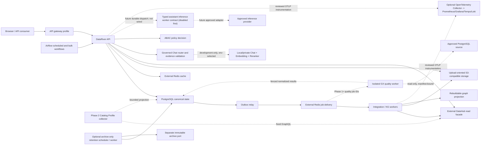
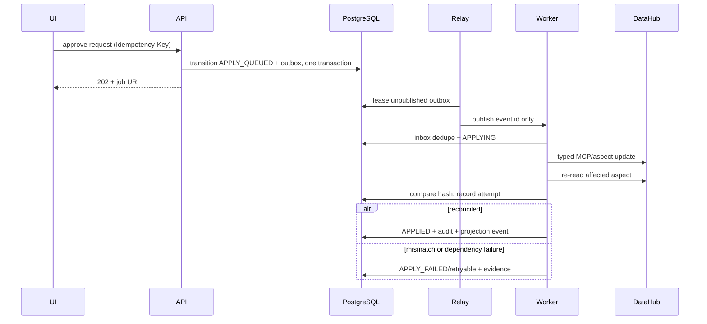

# Architecture definition

## Architectural style

The first production shape is a modular monolith with independent API, worker, outbox relay, and scheduler processes. Modules communicate through application ports and durable domain events, never by writing another module's tables. This is a deliberate precursor to MSA: extraction is possible without accepting distributed-system cost before boundaries and load are proven.

Code dependencies point inward:

```text
interfaces/http ─┐
workers/cli ─────┼─> application/use_cases ─> domain
infrastructure ──┘             │
                              └─> application/ports <─ infrastructure adapters
```

The domain imports no FastAPI, SQLAlchemy, Redis, DataHub, object-storage, graph, or LLM SDK. An architecture test enforces this rule.

## Runtime view



Only the gateway/UI ports are public. PostgreSQL, Redis, object storage, OPA, DataHub credentials,
graph protocols and telemetry backends stay on private or explicitly controlled connector networks.
The base Compose owns no Redis, MinIO or SeaweedFS process or data volume.

The checked-in Compose and hybrid host-development views are Single-node Pilot topologies. Multiple
processes on the same host improve process recovery but do not establish HA. ADR-0013 requires at
least three independent nodes plus off-host distributed storage and accepted failure drills before
an environment may claim HA.

## Bounded contexts

| Context | Responsibility | Canonical data |
|---|---|---|
| Platform & Identity | workspaces, external IdP-subject mapping and normalized Role assignment evidence | workspace, subject reference, membership, Role assignment/event |
| Authorization | ABAC resources, Role-version Policy Book rules, policies, bindings and decision evidence | Role data rule, policy and decision log |
| Catalog Facade | authorized index plus DataHub search/detail/lineage projection and snapshot-bound managed export | projection/cursor/export receipt; applied metadata remains in DataHub |
| Quality | immutable typed rule versions, independent activation, durable validation runs, sanitized results and authorization-pruned dashboard | rule/review/run/attempt/result/event evidence in PostgreSQL; DataHub profiles remain provider observations |
| Governance | registration/change-request workflow plus immutable governance documents and Templates | requests, approvals, document/version/review/object/projection receipts and audit |
| Integration | connections, job intents, outbox/inbox, retry/DLQ/reconcile | durable job and delivery state |
| Knowledge Studio | ontology, proposals, changesets, validation and releases | immutable graph releases/provenance |
| Assistant | sessions, messages, runs and authorized evidence | chat audit/evidence metadata |
| Sharing | release-pinned API products, subject/client-bound grants, exact replay bodies and quota evidence | product/version/grant plus immutable invocation/result/month aggregate |
| Retention & Erasure | approved retention versions, Legal Hold, erasure Maker-Checker review and optional archive-only execution; destructive execution remains absent | policy/hold/erasure aggregates, fenced execution claims, immutable receipts and append-only evidence in PostgreSQL |
| Operations | capability health and operator actions | connection/job snapshots, not raw telemetry |

The API gateway is a deployment boundary, not an authorization context. It validates identity and coarse quotas; each use case resolves resource attributes and performs ABAC again.

## Canonical ownership rules

- DataHub owns metadata after successful application. DataRiver stores a minimal authorized projection and a monotonic local projection version; a true DataHub source watermark remains an ingestion contract.
- DataRiver PostgreSQL owns intent, approvals, job state, graph release manifests, policy and audit.
- Graph projection data is disposable. Publishing first creates an immutable PostgreSQL/object snapshot, loads a shadow projection, verifies it, then switches the active pointer.
- Governance Document lifecycle, sanitized content hashes, reviews and exact object/projection
  receipts are PostgreSQL truth. MinIO version bytes and Neo4j document/chunk nodes are verified
  evidence/projections and cannot publish or archive a document.
- Redis owns nothing canonical. Cache loss changes latency, not correctness. Delivery-stream loss is recovered from the PostgreSQL outbox.
- Airflow task status is operational evidence, never the business job status.
- PostgreSQL, not an object provider, owns retention versions, Legal Hold state, erasure authority
  and archive verification receipts. Archive objects are evidence bytes referenced by those
  receipts; provider metadata does not activate deletion.
- External identifiers such as DataHub URNs map to internal UUIDs and are never primary keys.
- DataHub owns provider-produced profile observations. Catalog may keep a bounded rebuildable
  profile projection; PostgreSQL Quality owns rule and GX validation evidence. A profile, Airflow
  task or GX process response never substitutes for the canonical validation run/outcome.
- Policy Book Role rules add deny-capable No/Partial/Full, residency and purpose checks. They never
  replace membership ABAC or RLS; missing rules and unavailable partial-treatment adapters deny.

### Atomic Sharing execution boundary

The current Snapshot, Neighbors and deterministic local Chat API-product surfaces execute inside one
bounded PostgreSQL transaction. The application locks product → current version → exact
`SUBJECT_CLIENT_V2` grant, rechecks the active service Subject, issuer/client, ABAC fingerprint,
governed release lineage and active retention rule, then either returns the exact stored result or
builds one local bounded response. One security-definer completion capability inserts the immutable
ledger, classified result and UTC-month aggregate together. Any failure rolls back all three.

Redis, Neo4j, DataHub, Airflow, object storage and an external LLM are not participants in this unit
of work. A provider-backed Sharing surface requires a durable reserve/execute/settle worker and
cannot extend the database lock across a network call. Result routes are private/no-store; expired
or policy-drifted bodies are not disclosed. PostgreSQL remains canonical for quota and evidence,
while physical retention purge remains governed and disabled.

## Retention, Legal Hold and immutable archive boundary

The existing S3 port is upload-oriented: it supports multipart registration, quarantine cleanup and
accepted-object promotion. It is not a WORM boundary. The optional `ImmutableArchiveStore` is a separate
application port with a separate private endpoint, bucket and writer credential and no delete or
retention-bypass operation. The API, relay and upload workers do not receive that credential.

```text
approved policy version + eligible immutable audit range
→ active/release-pending Legal Hold check
→ deterministic export manifest and SHA-256
→ exact capability attestation committed under the live lease
→ conditional immutable archive create with attestation UUID and object version
→ full content and retention/Object-Lock read-back
→ verified PostgreSQL receipt
→ terminal archive-only evidence state
→ remain retained; destructive eligibility is a future, separately approved control plane
```

Provider names do not establish capability. The target provider must prove versioning, Object Lock,
compliance retention, checksum/version behavior, read-back and rejection of shortening/deletion.
Missing, expired or mismatched proof stops the workflow. Policy durations are approved runtime data,
not source defaults; a duration or expired timestamp never acts as a deletion switch.

Legal Hold always wins over expiry. A UI toggle issues typed place/release commands and immutable
history rather than editing a boolean. Explicit sensitive-data erasure is separate from automatic
expiry and binds maker, independent checker, canonical target version/owner/classification, active
policy ID/hash and a canonical payload hash. The archive-only scheduler may consume an exact
APPROVED Chat-session request once into a fenced command, revalidate current human
eligibility/hold/target/policy state and attach a verified receipt. It cannot delete, purge or detach
anything. An expired write lease first performs bounded read-only reconciliation against the exact
attestation UUID and provider write time; it never runs a probe or PutObject. A future destructive
executor requires a new ADR, separate approval and final
authorization/hold/version/archive checks. Raw bucket keys, table names or provider operations are
never client-supplied erasure commands.

Automatic deletion and monthly-partition detach/drop are currently `DISABLED_NOT_READY`. They remain
so until approved policy/hold/erasure workflows, verified archive receipts, target
restore/conformance evidence and a separately approved destructive design are accepted. A partition with
any applicable active hold is conservatively retained in full.

## Change application sequence



The worker may receive a message more than once. Inbox uniqueness and operation-specific idempotency make the business effect repeat-safe.

## Governed quality execution boundary

ADR-0077 adds a disabled-first Quality context. The API creates immutable typed Rule versions and
durable Run intents in PostgreSQL. Rule activation requires a distinct human reviewer, current
target authorization, optimistic concurrency, idempotency and hardware WebAuthn. The browser cannot
submit an external URN, relation name, GX configuration, query, datasource or credential.

Airflow calls only a fixed dispatch endpoint with a short-lived purpose-bound OIDC service identity.
PostgreSQL, rather than the DAG, calculates and reconciles bounded due windows so an Airflow outage
does not erase scheduled intent. Version-specific immutable
cadence/timezone/DST/evaluator/tzdb/missed-window/catch-up inputs and the mutable due cursor are
pinned in schedule history; a canonical UTC window key fences each scheduled Run. One receipt
transaction can represent no work or several unique scheduled-window Runs, but locks/creates no
more than the deployment-approved max-due/max-created caps pinned in its receipt. Airflow receives
neither GX nor a source credential. The receipt pins its DB-time cutoff; closed SKIP,
LATEST_ONLY or bounded OLDEST_FIRST catch-up semantics deterministically advance the due cursor and
record skipped-range evidence.

The delivery stream carries an ID only. A separately deployed NOBYPASSRLS quality worker claims with
database time, a monotonic lease epoch and token hash; resolves only the exact server-owned source
manifest binding; opens a read-only, timeout- and workload-bounded PostgreSQL transaction; compiles
the approved RuleKind through the pinned GX adapter; sanitizes the result; and completes only the
exact current claim. Its source secret and egress allowlist are unavailable to the API, browser,
relay and Airflow. Immediately before the full scan it freezes a DB-time source-start lease whose
remaining lifetime is strictly greater than the hard timeout for the complete GX source-access
window plus approved cancel/reconcile/completion margins. Lease renewal is forbidden until the
source transaction/connection closes. Every statement first revalidates the current epoch/token and
uses a source-server timeout inside the remaining deadline. Reclaim starts only after the frozen
lease expires and supersedes the old attempt, preventing overlapping full scans as well as stale
publication.

DataHub field profiles enter through a different Catalog port and fixed GraphQL contract. A
separate `catalog-profile-collector` identity has only a least-privilege DataHub read token,
`catalog.profile.collect` and a fixed Catalog projection function; it has neither source
credential nor Quality write authority. The projection preserves normalized
FULL/SAMPLE/PARTITION/QUERY/UNKNOWN provenance, provider/query contract and observed time without
raw partition text. A bounded raw partition is read only inside the fixed parser; PARTITION/QUERY
idempotency may retain only a deployment-keyed HMAC fingerprint/key ID. It does not invoke GX or
produce PASS/FAIL. Sample values, top/distinct values, raw GX unexpected values, generated SQL and
Data Docs are outside the v1 system.

Dashboard cards, scores, counts, trends and lists share one authorization-pruned local asset base
relation. The current snapshot first selects each visible Rule Set's latest terminal Run for its
current ACTIVE Version; a newly activated Version never inherits a superseded Version's result.
Only `SUCCEEDED` contributes Rule Definition counts, while a newer same-Version
failed/stale/cancelled Run or no same-Version terminal Run makes that Rule Set UNKNOWN. Object
storage is not a Quality result plane. Quality rows pin the applicable
`QUALITY_RULE/PROFILE/RESULT/AUDIT` retention policy and typed Legal Hold generation before source
execution can be enabled, while no physical deletion path exists in v1.

Catalog export is a separate disabled-first worker boundary. The API records an exact normalized
request plus permission, classification-policy, policy-code, CSV-safety and projection generations;
the worker does not call DataHub and cannot export RESTRICTED rows. It streams the local projection
into an attempt-unique private object, reconciles its receipt, and publishes completion only while
the original security/source snapshot and lease remain current. API and export worker do not share
DB or S3 credentials when the feature is enabled.

## Knowledge-graph lifecycle

```text
source snapshot
→ parsing/extraction run
→ entity resolution
→ proposal operations
→ draft changeset
→ ontology/provenance/ABAC validation
→ independent review
→ immutable release
→ shadow projection
→ count/hash/golden-query verification
→ active pointer switch
```

Graph types are `CATALOG_MIRROR`, `CURATED_KNOWLEDGE`, and `ANALYTIC_PRODUCT`. Ontology versions and content releases are independent. Every assertion includes source locator, extraction/model/prompt version where applicable, confidence, effective time, and security attributes.

## Search and Chat authorization

Filtering a DataHub page after retrieval leaks counts, pagination, and asset existence. A local `catalog.assets_projection` therefore stores searchable/base-detail metadata and security attributes. The API calculates the permitted asset set before DataHub enrichment. Literal search is normalized/escaped and backed by FTS/trigram/active-scope indexes. Search cache keys bind workspace, permission scope, policy version and projection watermark. Chat uses the same permitted set before retrieval; candidate decisions are grouped into request-level audit evidence, and citations include version and source locator.

ADR-0020 adds one deliberately narrow remediation view: after a durable human-security-administrator
decision, the local catalog reader may enumerate non-deleted quarantined projections in that same
workspace so those real DataHub assets can be classified. The decision bit is part of the cache and
cursor security scope. It never reaches export, Chat, attachment, provider, mutation or
cross-workspace paths, except for the existing typed DataHub metadata enrichment of its catalog
detail, and does not make DataHub a canonical authorization authority.

The optional DataHub lineage frame is not a generic external-URL feature. It is disabled by default;
after a local authorized asset lookup, the API alone constructs the configured exact-origin lineage
URL. CSP permits only that origin, the browser sends an opaque asset ID rather than a URN and the
frame is sandboxed with no referrer. DataHub's own SSO, authorization and framing headers remain a
separate external acceptance gate.

After retrieval/composition, Chat opens a separate final persistence transaction, applies workspace
and owner RLS context, serializes against retention-policy administration and binds the session to
the exact ACTIVE retention ID/hash and database-time deadline. This transaction is the only place
that writes Chat content. Missing policy, policy supersession, expiry or legacy-unbound evidence
fails closed; it does not invent a duration or authorize deletion.

The active classification-access snapshot is a versioned, workspace-scoped four-class policy. Its
rules and authorization generation bind cache/evaluation state; RESTRICTED Search additionally
requires an exact subject/resource, system or domain grant bound to the active policy ID and hash.
Missing, malformed, expired or revoked policy/provider/grant state falls back to the static
fail-closed floor. RESTRICTED Chat is always denied.

## Assistant inference boundary

Current Chat always remains an in-process authorization, routing, evidence-integrity, citation and
retention boundary. In development only, it may use the deployment-selected bounded Chat,
Embedding and Reranker adapters from ADR-0049; production keeps the deterministic composer and
makes no direct provider call. `GENERAL` uses authorized catalog search, `VECTOR` ranks a bounded
authorization-pruned catalog window, and `GRAPH` remains explicitly unavailable until the governed
asset-graph task supplies its typed adapter. Adapter failure yields `검증 불가` with no strategy or
model fallback. For an existing session, the canonical owner is read and matched before ABAC,
budget reservation, retrieval or any provider call. Before vector text leaves the process, the
classification snapshot is narrowed to rules whose stage-specific profile UUID and
route/provider/model/deployment identity exactly match every adapter the selected route can invoke.
The local vector window is capped at 20 candidates and 512 characters per candidate; its complete
worst-case UTF-8 request is added to the atomic request budget before retrieval, together with any
reranker and composer envelopes.
The citation gate then re-reads current membership attributes and canonical catalog/release
evidence, re-resolves the policy identity and re-runs resource ABAC; any drift refuses the answer.
When retrieval itself completes successfully but the authorized evidence set is empty, ADR-0056
permits a separately typed general-knowledge composer. It receives only the bounded question, never
hidden or rejected asset metadata, and cannot claim organization-specific facts. The server adds a
visible “사내 인용 근거 없음” disclosure and persists zero citations. Provider, retrieval,
reranker, policy, authorization and citation failures remain fail-closed and never enter this path.

The separate production assistant-inference source boundary is only a typed, disabled-first worker contract. Its
versioned package binds requested/selected provider identity and region, policy, attestations,
immutable URN-addressed evidence and a monthly workspace/user token-accounting decision. Internal
routes are monitor-only; an external route requires a durable hard-limit reservation. An exhausted
external budget can preselect an already approved internal route that passes the same classification,
jurisdiction and attestation eligibility predicates. The external denial and internal monitor-only
observation remain separate; the worker still executes one route and never falls back from an
exception.

Provider citations are passed through a separate server-side grounding-verifier port. Completion
requires exact package/route IDs, answer hash, cited chunk order and an evidence-bundle hash over
canonical source URN, source version and content hash. Metric, non-zero threshold and evaluator
identity come from an immutable grounding-policy snapshot. A structurally valid post-call draft
retains its usage metrics even when later refused; otherwise the result is
`보안 규정 및 근거 데이터 부족으로 답변할 수 없습니다`. Neither input nor output has SQL,
Cypher, arbitrary HTTP, tool or mutation fields. There is no production token ledger, grounding
adapter, API-to-worker dispatch, durable inference job, streaming transport or deployed inference
worker in this baseline. The direct development adapter is not evidence that those production
gates passed. Dotted worker edges in the runtime view remain future seams.

## External Redis topology

| Capability | Persistence | Eviction | Content |
|---|---|---|---|
| `REDIS_CACHE_URL` | none required | bounded evicting policy such as `allkeys-lfu` | bounded TTL search/detail/policy-derived results |
| `REDIS_DELIVERY_URL` | deployment-reviewed persistence and recovery | `noeviction` | job IDs and delivery metadata only |

The two URLs must identify distinct endpoints or databases and use distinct least-privilege
credentials. Cache keys include workspace, permission-scope hash, policy version, request parameters
and the local projection version. Tokens, credentials, presigned URLs, full uploads, canonical job
state and confidential prompts are prohibited. The checked-in client uses the Redis protocol; legacy
`VALKEY_*` environment names are accepted only as a migration alias.

The browser treats its selected Workspace as a tenant/RLS context, not an authorization fact. The
safe UUID selection is retained in the same-origin URL so an OIDC round-trip, reload or new tab can
restore the requested page; it is still sent on each typed request and the server always re-resolves
membership, RLS and ABAC. The OIDC user/token object plus verified `/auth/me` profile and roles stay
in React memory. Browser persistence is limited to the short-lived PKCE redirect transaction state,
which contains only a versioned intent and validated same-origin return path; no client-side role or
administrator flag exists.

That memory boundary is generation- and epoch-fenced. Only the newest `/auth/me` response whose
subject matches the OIDC `sub` may publish an identity snapshot. An opaque `securityEpoch` changes
on subject, provider-session or security-bearing profile transitions and is captured with Workspace
by each request/download; drift discards late bodies and prevents `401` retry across contexts. A
separate accepted-hydration revision suspends and rechecks Admin after ordinary same-session
renewal without recreating the API client or unrelated feature state. An unchanged returned Admin
context resumes the mounted subtree and preserves its draft state; an epoch or Admin-context
fingerprint change, mismatch or denial purges it. Neither counter is persisted, sent as authority or
trusted by the backend.

The browser-delivery edge has one canonical five-header policy: CSP, nosniff, no-referrer,
frame denial and a restricted Permissions Policy. Nginx `1.30.3` recursively merges those
server-level `always` rules into every location, including locations with their own cache header.
The `/api/` proxy removes only upstream copies of those five fields before emitting the canonical
edge values; application cache, authentication, retry, ETag, Vary, download and trace headers
remain upstream-owned. HSTS is not emitted by the inner HTTP container and remains owned by the
real TLS terminator.

The optional Keycloak identity-administration adapter is a narrow anti-corruption boundary, not a
generic IdP proxy. It owns only fixed user lookup/create, temporary-password and enable operations
using a dedicated `manage-users` service account. A user remains disabled while the canonical
PostgreSQL subject/membership, idempotency record and outbox event commit through the fixed
`iam.provision_workspace_identity` function. Provider enablement occurs last and is safe to retry.
Self-service password change uses a fixed provider-side application-initiated action and returns to
the original DataRiver route. The browser UI exposes neither the provider product name nor an admin
URL, and the replacement password never crosses the DataRiver API.

## Degradation model

| Dependency failure | Expected behavior |
|---|---|
| DataHub | concurrency bulkhead/circuit breaker; authorized local base detail or explicitly bounded stale enrichment, otherwise 503; queued changes retained and never marked applied |
| DataHub quality profile | prior authorized projection may be shown only with explicit stale/partial provenance; no activation, execution success or quality outcome is inferred |
| Redis cache | direct authorized DB/DataHub path; higher latency |
| Redis delivery | outbox accumulates and relay retries; writes remain durable |
| graph projection | catalog remains available; graph Chat/analytics clearly degraded |
| future inference provider/worker | deterministic evidence Chat remains; the disabled-first contract refuses with `검증 불가`; no provider call or graph mutation |
| Airflow | scheduled/bulk jobs delayed; synchronous core unaffected |
| quality worker or approved source | canonical Run remains queued/retryable/stale with a sanitized reason; no source fallback, implicit sample or false PASS/FAIL |
| object storage | upload/download unavailable; metadata/workflow state retained |
| immutable archive capability | export, explicit erasure that requires archive, automatic deletion and partition drop stop; ordinary authorized reads remain available |
| telemetry backend/collector | canonical workflows continue; bounded telemetry may buffer or drop according to deployment policy without exporting protected payloads |
| policy service | sensitive reads and all writes fail closed; public health remains available |

## Service extraction criteria

A context becomes a separate service only when it has an independent owner, demonstrably different scale/availability need, stable versioned events, no cross-context database writes, and an operational budget for deployment/on-call/data migration. Likely first candidates are Integration Worker, Assistant inference, and graph projection—not identity or governance aggregates.
