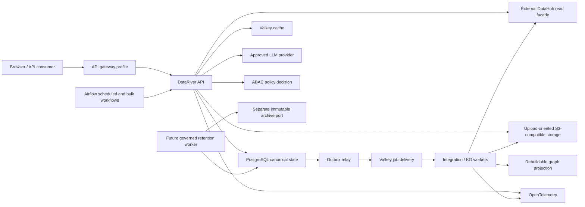
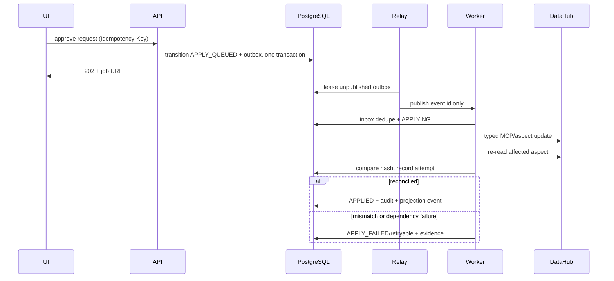

# Architecture definition

## Architectural style

The first production shape is a modular monolith with independent API, worker, outbox relay, and scheduler processes. Modules communicate through application ports and durable domain events, never by writing another module's tables. This is a deliberate precursor to MSA: extraction is possible without accepting distributed-system cost before boundaries and load are proven.

Code dependencies point inward:

```text
interfaces/http ─┐
workers/cli ─────┼─> application/use_cases ─> domain
infrastructure ──┘             │
                              └─> application/ports <─ infrastructure adapters
```

The domain imports no FastAPI, SQLAlchemy, Valkey, DataHub, object-storage, graph, or LLM SDK. An architecture test enforces this rule.

## Runtime view



Only the gateway/UI ports are public. PostgreSQL, Valkey, object storage, OPA, DataHub credentials, graph protocols, and telemetry backends stay on private networks.

## Bounded contexts

| Context | Responsibility | Canonical data |
|---|---|---|
| Platform & Identity | workspaces and external IdP-subject mapping | workspace, subject reference, membership |
| Authorization | ABAC resources, policies, bindings and decision evidence | policy and decision log |
| Catalog Facade | authorized index plus DataHub search/detail/lineage projection | projection/cursor; applied metadata remains in DataHub |
| Governance | registration and change-request aggregate/state machine | requests, approvals, transitions, audit |
| Integration | connections, job intents, outbox/inbox, retry/DLQ/reconcile | durable job and delivery state |
| Knowledge Studio | ontology, proposals, changesets, validation and releases | immutable graph releases/provenance |
| Assistant | sessions, messages, runs and authorized evidence | chat audit/evidence metadata |
| Sharing | release-pinned API products, contracts, grants and usage | sharing control plane |
| Retention & Erasure | approved retention versions, Legal Hold and non-executing erasure Maker-Checker review; target archive verification and destructive execution | policy/hold/erasure review aggregates and append-only history now; future immutable archive receipts and execution claims in PostgreSQL |
| Operations | capability health and operator actions | connection/job snapshots, not raw telemetry |

The API gateway is a deployment boundary, not an authorization context. It validates identity and coarse quotas; each use case resolves resource attributes and performs ABAC again.

## Canonical ownership rules

- DataHub owns metadata after successful application. DataRiver stores a minimal authorized projection and a monotonic local projection version; a true DataHub source watermark remains an ingestion contract.
- DataRiver PostgreSQL owns intent, approvals, job state, graph release manifests, policy and audit.
- Graph projection data is disposable. Publishing first creates an immutable PostgreSQL/object snapshot, loads a shadow projection, verifies it, then switches the active pointer.
- Valkey owns nothing durable. Cache loss changes latency, not correctness. Queue loss is recovered from the PostgreSQL outbox.
- Airflow task status is operational evidence, never the business job status.
- PostgreSQL, not an object provider, owns retention versions, Legal Hold state, erasure authority
  and archive verification receipts. Archive objects are evidence bytes referenced by those
  receipts; provider metadata does not activate deletion.
- External identifiers such as DataHub URNs map to internal UUIDs and are never primary keys.

## Retention, Legal Hold and immutable archive boundary

The existing S3 port is upload-oriented: it supports multipart registration, quarantine cleanup and
accepted-object promotion. It is not a WORM boundary. A future `ImmutableArchiveStore` is a separate
application port with a separate private endpoint, bucket and writer credential and no delete or
retention-bypass operation. The API, relay and upload workers do not receive that credential.

```text
approved policy version + eligible immutable audit range
→ active/release-pending Legal Hold check
→ deterministic export manifest and SHA-256
→ immutable archive write with object version
→ full content and retention/Object-Lock read-back
→ verified PostgreSQL receipt
→ destructive eligibility re-evaluation
→ maker-checker consume, or remain retained
```

Provider names do not establish capability. The target provider must prove versioning, Object Lock,
compliance retention, checksum/version behavior, read-back and rejection of shortening/deletion.
Missing, expired or mismatched proof stops the workflow. Policy durations are approved runtime data,
not source defaults; a duration or expired timestamp never acts as a deletion switch.

Legal Hold always wins over expiry. A UI toggle issues typed place/release commands and immutable
history rather than editing a boolean. Explicit sensitive-data erasure is separate from automatic
expiry and binds maker, independent checker, canonical target version/owner/classification, active
policy ID/hash and a canonical payload hash. The current aggregate records only APPROVED/REJECTED
review evidence and cannot be consumed or executed. A future executor additionally requires
one-time atomic consumption and final authorization/hold/version/archive checks. Raw bucket keys,
table names or provider operations are never client-supplied erasure commands.

Automatic deletion and monthly-partition detach/drop are currently `DISABLED_NOT_READY`. They remain
so until the dedicated least-privilege worker, approved policy aggregate, hold/erasure workflows,
verified archive receipts and target restore/conformance evidence are implemented. A partition with
any applicable active hold is conservatively retained in full.

## Change application sequence



The worker may receive a message more than once. Inbox uniqueness and operation-specific idempotency make the business effect repeat-safe.

## Knowledge-graph lifecycle

```text
source snapshot
→ parsing/extraction run
→ entity resolution
→ proposal operations
→ draft changeset
→ ontology/provenance/ABAC validation
→ independent review
→ immutable release
→ shadow projection
→ count/hash/golden-query verification
→ active pointer switch
```

Graph types are `CATALOG_MIRROR`, `CURATED_KNOWLEDGE`, and `ANALYTIC_PRODUCT`. Ontology versions and content releases are independent. Every assertion includes source locator, extraction/model/prompt version where applicable, confidence, effective time, and security attributes.

## Search and Chat authorization

Filtering a DataHub page after retrieval leaks counts, pagination, and asset existence. A local `catalog.assets_projection` therefore stores searchable/base-detail metadata and security attributes. The API calculates the permitted asset set before DataHub enrichment. Literal search is normalized/escaped and backed by FTS/trigram/active-scope indexes. Search cache keys bind workspace, permission scope, policy version and projection watermark. Chat uses the same permitted set before retrieval; candidate decisions are grouped into request-level audit evidence, and citations include version and source locator.

## Valkey topology

| Instance | Persistence | Eviction | Content |
|---|---|---|---|
| `valkey-cache` | none | `allkeys-lfu` | bounded TTL search/detail/policy-derived results |
| `valkey-queue` | AOF every second | `noeviction` | job IDs and delivery metadata only |

Cache keys include workspace, permission-scope hash, policy version, request parameters and the local projection version. Tokens, credentials, presigned URLs, full uploads, canonical job state and confidential prompts are prohibited.

## Degradation model

| Dependency failure | Expected behavior |
|---|---|
| DataHub | concurrency bulkhead/circuit breaker; authorized local base detail or explicitly bounded stale enrichment, otherwise 503; queued changes retained and never marked applied |
| cache Valkey | direct authorized DB/DataHub path; higher latency |
| queue Valkey | outbox accumulates and relay retries; writes remain durable |
| graph projection | catalog remains available; graph Chat/analytics clearly degraded |
| LLM | evidence search remains; answer generation 503; no graph mutation |
| Airflow | scheduled/bulk jobs delayed; synchronous core unaffected |
| object storage | upload/download unavailable; metadata/workflow state retained |
| immutable archive capability | export, explicit erasure that requires archive, automatic deletion and partition drop stop; ordinary authorized reads remain available |
| policy service | sensitive reads and all writes fail closed; public health remains available |

## Service extraction criteria

A context becomes a separate service only when it has an independent owner, demonstrably different scale/availability need, stable versioned events, no cross-context database writes, and an operational budget for deployment/on-call/data migration. Likely first candidates are Integration Worker, Assistant inference, and graph projection—not identity or governance aggregates.
