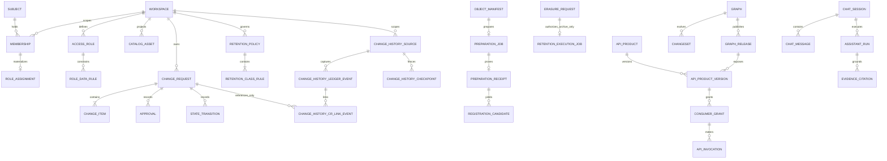
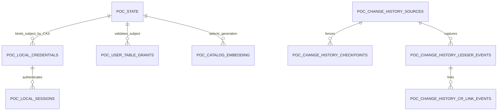
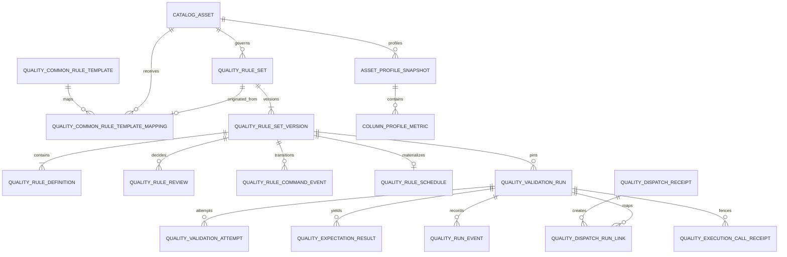

# Data and table specification

The SQLAlchemy metadata and generated `backend/alembic/versions/0001_initial_schema.py` are authoritative for implemented DDL. This document separates implemented tables from target/backlog tables.

## Current-source schema map and core ERD

This is a compact reconstruction map, not a substitute for the column/constraint inventory below.
All protected aggregates carry `workspace_id`; cross-Workspace parent/child references use composite
foreign keys and forced RLS. External provider IDs, object receipts and graph projections are
evidence or projections, never substitutes for PostgreSQL business truth.

| Schema | Ownership |
|---|---|
| `platform`, `iam`, `authz` | Workspace, System, identity, membership, Role/Policy Book and authorization evidence |
| `catalog` | bounded DataHub-derived discovery projection, vocabulary, sync watermark and export intent |
| `governance` | Change Request, approval/transition, Manual registration and attachment evidence |
| `integration` | durable jobs, outbox/inbox, idempotency, object manifests and typed Bulk preparation |
| `retention` | policy, class rule, Legal Hold, erasure review and archive-only execution evidence |
| `knowledge`, `assistant` | canonical graph releases/source jobs and retention-bound Chat/citation audits |
| `sharing` | API product versions, subject-bound grants and atomic invocation/quota/replay evidence |
| `change_history` | credential-free capture identity, normalized append-only ledger, fenced partition checkpoints and append-only CR link history |

The diagram deliberately shows aggregate ownership rather than every compatibility/evidence table.
The detailed tables below, SQLAlchemy metadata and deterministic Alembic schema define exact names,
types, PK/FK/UQ/CHECK/index/RLS rules. Backlog tables are explicitly separated and require a new
migration before use.

### Authoritative DEV Node POC `public` schema

The authoritative Node POC is a deliberately smaller runtime than the SQLAlchemy/FastAPI schema
described below. The following inventory was read from the actual DEV PostgreSQL catalog on
2026-08-16. It is the canonical current POC ERD; it does not make FastAPI IAM/Workspace tables a Node
startup dependency and it does not authorize deleting historical migrations or `UNKNOWN` tables.

| Table | Read by runtime | Written by runtime | Feature | FK/reference | Migration | Classification |
|---|---|---|---|---|---|---|
| `poc_state` | yes | yes, ETag/CAS | access/core/governance/knowledge/current receipt documents | scope key; protected access-to-core projection is application-enforced | `deploy/poc/postgres-init/001-poc-state.sql` | `ACTIVE`, state history references required |
| `poc_catalog_embedding` | yes | yes, fenced generation | current Catalog/vector projection | generation contract in `poc_state` | same idempotent SQL | `ACTIVE` |
| `poc_change_history_sources` | yes | insert-only operational identity | MCL source identity | parent of checkpoint/ledger | same idempotent SQL | `HISTORY_REQUIRED` |
| `poc_change_history_checkpoints` | yes | atomic advance with ledger | MCL exact boundary/resume | FK to source | same idempotent SQL | `HISTORY_REQUIRED` |
| `poc_change_history_ledger_events` | yes | append-only | normalized Change History | FK to source; parent of CR link history | same idempotent SQL | `HISTORY_REQUIRED` |
| `poc_change_history_cr_link_events` | yes | append-only | candidate/primary/unlink history | FK to ledger event | same idempotent SQL | `HISTORY_REQUIRED` |
| `poc_local_credentials` | login only | operator bootstrap/reset and bounded lock state | local authentication only; no role/System columns | `subject_id` references the access-document identity by application CAS | same additive idempotent SQL | `ACTIVE` |
| `poc_local_sessions` | every protected request | login/logout/revoke/expiry lifecycle | opaque server session; token hash only | FK to `poc_local_credentials.subject_id` | same additive idempotent SQL | `ACTIVE` |
| `poc_user_table_grants` | Admin account access management; PHASE 1D enforcement consumer | exact grant/remove active lifecycle | explicit User ↔ current DataHub Table relation only | `subject_id` and dataset URN are validated against the access document/current provider by the application | same additive idempotent SQL | `ACTIVE` |

`poc_state` also owns the bounded `table-system-mappings-v1` document introduced by ADR-0125.
It is an exact N:M relation between a current DataHub dataset URN (`dataset_kind=TABLE`) and an
existing access-document System ID. Pair rows retain active/version, authenticated actor,
server timestamp and bounded reason; the scope is written only through the `admin.manage` exact
route with `If-Match` CAS. It contains no User, Role, capability, responsibility or security-policy
authority and therefore does not replace the access document. Archived Systems make their pairs
ineffective without deleting lifecycle evidence. Legacy `system_schema_scopes` remain historical
CR-routing compatibility and are not a schema ACL or an inheritance source for this relation.

`poc_state` also owns the bounded `feature-security-policy-v1` document introduced by ADR-0126.
It contains one complete fixed `feature × role × security grade → boolean` matrix (8 × 5 × 3 =
120 cells), a server actor/timestamp, bounded reason and CAS version. Canonical keys are fixed in
source; Admin cells are immutable Allow and role-ineligible cells immutable Deny. The scope contains
no User grant, Table identity, System assignment, custom Role, inheritance or expression and is not a
generic permission database. PHASE 1C-3 manages this state; PHASE 1D owns cross-feature enforcement.

`poc_state` also owns the bounded `site-branding-v1` POC document. It stores one site name, optional
server-validated raster logo/favicon payloads under random server asset identities, update evidence,
and at most 32 hashed idempotency replay receipts. The anonymous projection omits update evidence and
receipts. The scope uses the existing row-level integer CAS/version contract, adds no PostgreSQL
object, and therefore does not change the Product-owned schema inventory, fingerprint, receipt
revision or clean/resume schema path. It does not overwrite frontend source assets; null state falls
back to the packaged Product mark and browser symbol.

The Catalog projection retains exact Table tag URN/name references. PHASE 1C-2 derives the strict
severity order `normal < credential < restricted` using exact normalized tag equality only, with
`restricted` precedence when both canonical tags exist. Each access-document user has one
`max_security_grade` scalar (existing users normalize to `normal`). Explicit User ↔ Table grants are
stored in `poc_user_table_grants`; the relation intentionally has no Role, capability, System, grade,
deny, schema inheritance or expression columns. Cross-feature retrieval-time enforcement remains
PHASE 1D so management-state introduction does not empty existing user views prematurely.

The current POC deployment still has two schema-application paths: clean volumes execute
`deploy/poc/postgres-init/001-poc-state.sql` once, while Node startup performs bounded additive
`CREATE ... IF NOT EXISTS`; existing volumes require documented manual SQL reapplication. There is no
ordered/checksummed migration ledger. ADR-0126 therefore keeps `POC_SCHEMA_MIGRATION_CONTRACT`
`PARTIAL` and reserves numbered migrations plus a minimal checksum ledger for a separate deployment
slice; no migration squash or schema reset is part of PHASE 1C-3.

The access document remains the only role/Responsible-System authority and owns user maximum grade.
Credential and session rows own only authentication material. `poc_user_table_grants` is a bounded
product-domain relation, not a generic ACL or second IAM. No current POC table is a deletion candidate in this Phase; migration
squash, workspace/IAM retirement and whole-schema normalization remain outside the Account/Auth
replacement slice.

## Standards

- Application-generated UUIDs (normally UUIDv7) and UTC `TIMESTAMPTZ`.
- Every protected row has `workspace_id`; mutable aggregates have integer `version`.
- PostgreSQL RLS is enabled and forced on every workspace table. API sets `app.workspace_id` and `app.subject_id` per transaction. Relay, upload and governance BYPASSRLS identities are separate and receive only the tables needed by their background responsibility.
- Every parent/child relationship between tenant tables carries `workspace_id` in a composite foreign key; application filtering is not the only tenant-integrity guard.
- Security selectors such as classification/system/domain/owner are typed columns. JSONB stores non-security documents/extensions.
- Passwords and tokens never have application columns. Retained development System Settings rows
  contain historical non-secret YAML/reference and SAVE/TEST/ACTIVATE evidence only; ADR-0048
  excludes them from runtime `Settings`. The selected environment plus mounted secret references
  is the sole live connector source.
- Outbox, approvals, transitions, decisions, releases and citations are append-only to ordinary application roles.

## Implemented schemas and tables

### Platform, identity and authorization

| Table | Key columns and constraints | Purpose |
|---|---|---|
| `platform.workspaces` | `id`, `slug UQ`, `name`, `status`, `settings`, `version`, timestamps | tenant boundary |
| `platform.data_systems` | workspace-scoped code/name UQ, description, active flag, version/timestamps | canonical business-system master; not a DataHub provider connection |
| `platform.system_schema_scopes` | workspace/platform/database/schema UQ, composite System FK, active/version/timestamps | server-derived, schema-wide DataHub projection locator to business-System assignment; Admin selects an active asset ID and never supplies the locator |
| `platform.system_assignees` | system/subject/responsibility UQ, `DEVELOPER` or `DATA_STEWARD`, priority `1..999`, active flag | accountable human system assignments; never browser-derived |
| `platform.external_service_profiles` | workspace/service-key UQ, historical YAML/version, nullable activated version, updater and bounded service vocabulary | retained pre-ADR-0048 development audit data; it is not loaded into API/worker runtime settings |
| `platform.external_service_profile_versions` | workspace/profile/configuration-version UQ, SHA-256 document hash, immutable historical YAML/endpoint, creator, TEST and activation evidence | retained historical SAVE → TEST → ACTIVATE evidence; no live Admin authoring or runtime overlay |
| `platform.monitoring_configurations` | Workspace PK, ordered bounded Dashboard JSON, SHA-256 payload hash, updater, optimistic version/timestamps, updater membership FK | non-secret Monitoring presentation only; Dashboard origins remain deployment-approved and iframe capability remains deployment-owned |
| `iam.subjects` | `id`, `issuer + external_subject UQ`, `display_name`, IdP email, ordinary last-login timestamp/IP, `active`, timestamps | external IdP mapping and profile audit; no credential or password |
| `iam.workspace_memberships` | PK `workspace_id + subject_id`, `department_id`, `job_function`, `clearance`, `attributes`, `active`, nullable `access_expires_at`, `version` | versioned ABAC attributes/grants; human expiry is authorization-bearing, service-account expiry is operator-managed `NULL`, and the optional default marker only chooses among active unexpired memberships |
| `iam.membership_renewal_requests` | workspace/target pending partial UQ, observed/requested expiries, requester/checker, reason/decision/policy/time and optimistic version | self-requested six-calendar-month extension with independent global-Admin decision and no self approval |
| `iam.access_roles` | workspace/key UQ, `HUMAN_ROLE | CANONICAL_ADMIN`, management source, optional catalog version, name/description, clearance, typed group/action/System/Domain scope documents, active flag, nullable server-owned updater/version | reusable administrator-managed human RBAC template plus at most one unassigned server-owned Canonical Admin definition per Workspace; assignment materializes only a human Role and the marker is not independent authority |
| `iam.access_role_data_rules` | Role/version/classification UQ, No/Partial/Full level, nullable typed treatment, residency/purpose JSON, SHA-256 payload hash, creator/time | immutable secret-free Policy Book rule; a missing classification rule denies |
| `iam.access_role_assignments` | workspace/subject UQ, fixed `HUMAN_ROLE` discriminator with composite Role FK, exact Role/version, membership version, access payload hash, actor, active/version/time | normalized current human-Role evidence; Canonical Admin is structurally rejected, bounded updates, no application delete |
| `iam.access_role_assignment_events` | subject, assigned/reassigned/removed, before/after Role versions, membership version, payload hash, actor/time | append-only Role-assignment history |
| `iam.canonical_admin_bindings` | Workspace/Subject PK, fixed Canonical Role kind/ID/version, catalog version/hash, membership version/full access hash, active/revoked state, local-bootstrap or governed-transition source, optimistic version/time | separate protected Canonical Admin evidence; never a generic assignment and never directly writable by the application role |
| `iam.profile_role_assignments` | Workspace/Subject PK, `VIEWER | ENGINEER_STEWARD | MANAGER`, fixed policy version/action hash, membership version, active/revoked state, actor/reason/assurance/version/time | current actions-only profile authority; Admin is derived from a VERIFIED Canonical binding and is never stored here |
| `iam.profile_role_assignment_events` | UUID, Workspace/Subject, assigned/changed/Admin promotion/demotion, previous/next tier, policy/membership/assignment versions, actor, non-null authorization decision ID, reason/assurance/time | append-only profile and protected Admin transition history correlated to the authorizing decision |
| `iam.admin_access_requests` | typed command/envelope, maker/target/checker, canonical hash, expiry/state/consume decision, `version`, timestamps | short-lived membership-access maker-checker aggregate; no arbitrary provider payload |
| `iam.admin_access_approvals` | request/actor, approve/reject, reason, policy decision, payload hash and request version | append-only independent checker evidence |
| `authz.resources` | `workspace_id + resource_type + resource_key UQ`, scope/classification/lifecycle columns, `attributes`, `version` | durable resource attribute registry |
| `authz.policy_decisions` | `id`, `workspace_id`, `subject_id`, `resource_id`, `action`, `effect`, reason/policy JSON, grouped `evaluation_context`, `request_id`, `decided_at` | immutable allow/deny/system-worker or bounded resource-set evidence |
| `authz.classification_access_policy_versions` | workspace/policy number UQ, required jurisdiction, grant maximum, payload hash, maker/checker/supersede state and optimistic version | independently approved four-class Search/Chat policy |
| `authz.classification_access_policy_rules` | workspace/policy/classification UQ, policy hash, typed Search/Chat modes, required composition profile FK for enabled Chat and optional stage-specific Embedding/Reranker profile FKs | exactly one immutable rule for each of the four classifications; every invoked inference stage must match its approved route/provider/model/deployment identity |
| `authz.restricted_search_grants` | active policy ID/hash, subject, typed resource/system/domain scope, validity, payload hash, maker/checker/revocation and optimistic version | explicit policy-bound RESTRICTED Search entitlement |
| `authz.restricted_search_grant_events` | grant/version UQ, action/actor/reason/policy decision/time/payload hash | append-only grant history |
| `authz.classification_access_generations` | workspace PK, monotonic generation and update time | transactional authorization/cache invalidation generation |

`iam.resolve_default_workspace(issuer, external_subject)` is a narrowly scoped database function,
not an IAM list API.  It may return only one active Workspace UUID for the already verified OIDC
subject during `/auth/me` hydration, prefers the optional membership default marker and otherwise
uses deterministic active-Workspace ordering.  It is executable by the application role but returns
no attributes, memberships, roles or cross-workspace data; normal IAM reads remain RLS-bound.

`iam.provision_workspace_identity(...)` is the only app-executable identity-creation function. It
is `SECURITY DEFINER`, has no dynamic SQL and independently requires matching transaction-local
Workspace/subject context plus an active, unexpired human `security-administrators` membership with
RESTRICTED clearance and `admin.manage`. Revision `0090` retains nullable `role_id` only for wire
compatibility and rejects a non-null value. It atomically inserts exactly one OIDC subject, a
six-month CONFIDENTIAL membership, a Viewer profile assignment and one append-only event. The
application role has execute-only access and no direct `INSERT` grant on the IAM authority tables.
No password or provider client credential is a function argument or database column.

Revision `0089` backfills only one unassigned, hash-pinned Canonical Admin definition for each
existing Workspace and installs the same definition trigger for future Workspaces. Subject,
membership, generic assignment, assignment-event and binding row counts are unchanged by upgrade.
The separate binding table retains hashes only for server-side exact-current comparison. HTTP
serialization omits the canonical Role UUID and both hashes. `datariver_app` has no direct binding
or profile `INSERT/UPDATE/DELETE`; only the exact governed profile functions may mutate these rows
after application and database rechecks. Generic Role/provisioning paths cannot call that binding
transition. Fixed-target
bootstrap policies are defense in depth, not an authority boundary for the privileged bootstrap
principal; the parameter-free caller checks `APP_ENV=development` before opening the database.
Downgrade is
blocked by any binding history or canonical reference, otherwise only unassigned definitions and
the 0089 schema are removed.

Revision `0090` does not backfill or infer an existing user tier and does not blanket-update human
clearance. Its downgrade is blocked by any profile or governed Admin history, restores the previous
provisioning function, and otherwise removes only the new profile authority schema/functions.

`iam.update_workspace_identity_profile(...)` is the only app-executable local identity-profile
projection update. It is `SECURITY DEFINER`, contains no dynamic SQL and independently requires the
matching transaction-local Workspace/subject context, an active unexpired human
`security-administrators` actor with RESTRICTED clearance and `admin.manage`, an active unexpired
human target and the exact expected membership version. It updates only subject display/email and
membership department/job-function/version. The application role has execute-only access; no
password, provider credential, session token or arbitrary provider document is accepted or stored.

The three policy-book tables use forced workspace RLS. The application may insert immutable Role
rules/events and may update only the current assignment's bounded state/version columns. There is no
application `DELETE` grant. Existing `datariver-role-*` membership markers are compatibility hints;
they are not backfilled with invented actor/hash evidence and require explicit reassignment.

The general ABAC decision engine remains code-versioned (`builtin-abac-v2`); generic database-authored
OPA policy/binding tables remain backlog. The narrower classification-access policy above is
implemented operating data and is evaluated together with ordinary ABAC, never as its replacement.
Missing or inconsistent active state falls back to the portable static floor.

Revision `0057` adds the stage-specific Embedding/Reranker bindings without rewriting existing
policy evidence. Its downgrade is allowed only while both additive binding columns are empty;
otherwise it refuses rather than discard immutable policy payload evidence or leave a payload hash
that no longer describes the stored rule.

### Catalog projection

| Table | Key columns and constraints | Purpose |
|---|---|---|
| `catalog.assets_projection` | `id`, `workspace_id + urn_hash UQ`, non-empty external URN `<= 4,096`, external identity/scope/classification/lifecycle, nullable typed-container `database_name`/`schema_name`, provider display projection with validated CHECK bounds (`description <= 10,000` characters, string-only tags/terms `<= 100` items, string-only `column_names <= 1,000` items), four explicit truncation-provenance flags, `owner_ref`, `domain_ref`, source-created time, stored `search_vector`, source version/owner, `last_seen_sync_id`, observed/deleted times | authorized search/tree/base-detail projection; projected values only power bounded discovery and DataHub remains canonical for detailed metadata |
| `catalog.vocabulary_entries` | stable local UUID, workspace/kind/provider-ref UQ, display name, `ACTIVE/INACTIVE`, provider-derived or managed source version, observation/update time and last-seen sync, optional membership-bound managed creator and optimistic version; provider identity and local UUID are immutable | server-only DOMAIN/TAG/TERM projection and canonical managed-domain master used to translate browser-safe local UUIDs into fixed provider references |
| `catalog.vocabulary_sync_runs` | PK workspace/sync/kind, one ACTIVE run per workspace/kind, ordered server cursor/offset, expected/seen totals, heartbeat and optional frozen snapshot evidence | bounded per-kind reconciliation; unseen entries become inactive only after a complete independently accepted snapshot |
| `catalog.metadata_recommendations` | workspace/local asset/optional field-path key/local TAG-or-TERM vocabulary/source-version semantic UQ; immutable current Catalog/DataHub Aspect hashes, bounded confidence/reason/evidence and provider/model/prompt/rule provenance; `NEEDS_DECISION/APPROVED/REJECTED` optimistic version; subject-bound decision key/request hash and optional governed Change Request FK | durable recommendation evidence only; provider output is restricted to supplied local vocabulary IDs, approval is atomically bound to one governed Change Request, and no provider-side mutation or automatic application exists |
| `catalog.metadata_recommendation_events` | workspace/recommendation/version UQ, `PREVIEWED/APPROVED/REJECTED`, membership-bound actor, bounded reason, canonical request hash, optional approved Change Request FK and DB time; update/delete rejected by trigger | append-only recommendation creation/decision audit whose version/state/actor/Change Request must match the current aggregate row |
| `catalog.sync_runs` | PK workspace/sync, state/public page ordinal, bounded server-owned nullable scroll cursor, nullable first-page expected total, non-negative distinct seen count, snapshot-consistent assertion, bounded evidence reference, configuration-contract SHA-256 and observed provider version, start/heartbeat/completion | single-writer ordered full reconciliation, run-pinned deletion authority, response-loss replay and stale/cursor-failure recovery |
| `catalog.projection_watermarks` | `workspace_id PK/FK`, non-negative `projection_version BIGINT` | transactional local read-model generation used for cache invalidation |
| `catalog.export_requests` | workspace/requester/job composite FKs, canonical request and security/source hashes, non-RESTRICTED classification ceiling, private artifact receipt, format-safety version and access deadline; owner-select plus forced workspace RLS | owner-scoped managed CSV/XLSX intent and verified artifact metadata; object content remains private storage state |

Recommendation preview authorizes the current local Catalog target before any DataHub/provider read,
rechecks the same bounded input after provider return and serializes the exact semantic key before
insert. Bulk approval preauthorizes every distinct target and the exact governed Change Request
collection before external reads or row locks. The recommendation rows, append-only decision events,
Change Request, Change Request idempotency receipt and outbox evidence share one request-scoped
PostgreSQL transaction through the Catalog-specific Governance extension; any finalizer or commit
failure rolls the whole unit back. Replay remains subject-bound and repeats current target and
collection authorization. Forced workspace RLS applies to both tables. Automatic application stays
disabled and approved recommendations remain governed Change Requests requiring later decision.

Projection page idempotency is recorded in `integration.idempotency_keys`, including the complete
prior result needed to replay a lost response without another provider call. Every committed page
advances the workspace projection version exactly once in the same transaction; replay, rejection
and rollback do not. Before any provider call, a workspace advisory transaction reserves the
corresponding ACTIVE run/page; this serializes provider snapshot acquisition and page application.
The same lock rechecks idempotency so a concurrent duplicate returns the committed result. A fixed
DataHub scroll freezes the first total, and every page must preserve the
same total, advance the server-owned cursor and add unique URNs. Terminal reconciliation requires
`seen_count == expected_total`. It tombstones missing `DATAHUB` rows only when the deployment's
point-in-time assertion has separately accepted operator evidence; otherwise completion is recorded
with deletion suppressed. A verified run freezes its evidence reference, provider-contract hash and
observed provider version on the first page and rejects drift on continuation. Seed-owned rows are
never tombstoned. Legacy active runs are abandoned by
`0045` because their cursor/total proof cannot be recovered. `sync_runs.state` records reconciliation
completeness, while the projection version records only a committed local generation. Active rows
have a workspace/scope/order partial index, GIN
full-text index, `pg_trgm` name index, a lower-name prefix index for two-character autocomplete and
a workspace/platform/database/schema/name partial index for lazy tree branches. Database/schema
values are nullable projections of typed DataHub `Database`/`Schema` browse containers; an absent
typed container stays absent and is never reconstructed from a URN. Facets and tree branches are
derived from the same authorization-prefiltered projection and cached by security and projection
generation. Facets use one PostgreSQL `GROUPING SETS` aggregation with server-side per-facet ranking;
a separate facet projection and a true incremental DataHub event cursor remain backlog.

The DataHub scan's `system_ref` is a provider platform URN, not the UUID of a canonical
`platform.data_systems` row. The DATAHUB projection writer uses its presence only with the provider
Domain to determine whether a non-PUBLIC row is complete enough for ACTIVE lifecycle, and stores
`assets_projection.system_id` as null. Every normal upsert therefore clears a legacy UUID that was
synthetically derived from `system_ref`, without changing the external URN, locator, Domain,
classification, lifecycle or source-version projection. Seed/manual writers that already hold an
explicit canonical System ID retain their existing contract.

Alembic `0019` adds only the bounded, non-authoritative display summary needed by dense catalog
results. Alembic `0045` adds the current string-only/count/identity constraints and provenance flags.
It is never an authorization selector, provider payload or browser mutation surface. Detail
continues to read the typed DataHub enrichment through the server anti-corruption layer.

### Governance

| Table | Key columns and constraints | Purpose |
|---|---|---|
| `governance.change_requests` | `id`, `workspace_id + number UQ`, type/title/description/state/requester/classification, nullable requested due date/priority/urgency vocabulary, `version`, timestamps | change aggregate/state machine |
| `governance.change_request_rounds` | workspace/request/round-number UQ, typed `LEGACY/INITIAL/EDITED` metadata snapshot, selected canonical System, one canonical `evidence_hash`, submitter/times | append-only revision authority; `LEGACY` preserves its old hash, while new INITIAL/EDITED hashes cover V2 metadata plus ordered item identities/contracts; only `closed_at` may be updated by the governed path |
| `governance.change_request_items` | workspace/request/item identity, legacy physical ordinal, typed provider or intake target/aspect/operation, before/after hashes/document, nullable historical target binding, canonical `routing_system_id` and nullable server-authored item-contract SHA-256 | immutable executable item or typed multi-target intake evidence; a new initial/edited round mints new item IDs and every new item routes workflow authority through an active canonical System |
| `governance.change_request_round_items` | composite round and item FKs, zero-based non-negative `(workspace, request, round, ordinal)` UQ, forced RLS | authoritative ordered item membership for each immutable round; legacy migration links every old round to its unchanged shared item set, and direct update/delete is not granted |
| `governance.registration_content_bindings` | candidate/hash UQ, Change Request UQ, change item UQ, request/item/creator composite workspace FKs, created time | append-only one-candidate/one-request/one-item provenance committed with the governed command; no ordinary update/delete grant |
| `governance.registration_metadata_content_bindings` | typed candidate/hash/profile/kind/Aspect, before/after/item-contract hashes, one candidate/request/item UQ, creator and composite content FKs | append-only V3 one-candidate/one-request/one-fixed-Aspect provenance; prevents browser-controlled Aspect/document and duplicate execution |
| `governance.manual_metadata_submissions` | workspace/asset/requester/lease-owner FKs, per-workspace serial UQ, catalog `source_version` plus mandatory 64-hex `provider_source_version`, immutable complete typed table/field payload, private bucket/key UQ, CSV SHA-256/size/row count, state, DB-time retry/lease epoch/token, at most 20 attempts, version/timestamps; one APPLYING row per workspace/asset | independent MANUAL registration intent/CSV receipt and lost-update evidence; ordinary writes may update only fenced execution columns after receipt verification |
| `governance.manual_metadata_apply_attempts` | submission/attempt and submission/lease-epoch UQ, worker membership FK, token hash, RUNNING→terminal shape, failure/report-root hashes and times | append-only attempt identity with one bounded terminal transition; INSERT is trigger-gated to RUNNING evidence matching the persisted current APPLYING lease, and APPLIED is trigger-gated on five matching aspect reports |
| `governance.manual_metadata_aspect_reports` | attempt/aspect UQ, fixed aspect ordinal/name mapping, optional before/expected/observed hashes, typed success/failure outcome, write flag, sanitized failure code and provider hashes/version | append-only reached-aspect DataHub evidence; `ALREADY_MATCHED`/`APPLIED_VERIFIED` require matching expected/observed hashes, failure retains only the reached ordered prefix, and only APPLIED requires exactly five verified rows |
| `governance.approvals` | `id`, `change_request_id + stage + actor_id UQ`, REVIEW/TEST/FINAL decision/reason/actor/policy/time and JSON authority snapshot | append-only decision plus immutable System Developer/Data Steward/global Admin authority evidence used by stage-completeness checks |
| `governance.state_transitions` | `id`, request, from/to, actor, reason, policy decision, occurrence | append-only state history |
| `governance.change_request_attachments` | workspace/request/current-round identity, globally unique `bucket + object_key`, kind/name/serial UQ, MIME/size/SHA-256 and uploader | finalized immutable private REQUEST/TEST evidence; bytes remain only in the configured object store |
| `governance.change_request_attachment_upload_intents` | attachment UUID, workspace/request/round/uploader FKs, globally unique object identity, expected size/SHA-256, monotonic `STARTED -> STORED -> FINALIZED` or proven create-rejection `FAILED` state, provider checksum/timestamps/version | precommitted upload authorization and queryable orphan/recovery ledger; current membership, Role-derived attributes, System assignment, target binding and CR round are locked and re-evaluated before STARTED/finalization, while ambiguous provider/DB outcomes remain STARTED or STORED and never trigger blind deletion |

### Integration, jobs and objects

| Table | Key columns and constraints | Purpose |
|---|---|---|
| `integration.jobs` | `id`, `job_type + causation_id UQ`, workspace/state/requester/progress/result, `lease_until`, `attempts`, `last_error_code`, `version`, timestamps | durable external-side-effect job |
| `integration.job_attempts` | `id`, `job_id + attempt_no UQ`, worker/state/error/external hash/start/finish | worker attempt evidence |
| `integration.outbox_events` | event PK, workspace/aggregate/type/schema/payload/time, publish/dead-letter/lease/attempt/error | transactional event recovery source and isolated poison-event evidence; relay deletion is revoked |
| `integration.inbox_messages` | PK `consumer + event_id`, workspace/received/completed/result hash | consumer deduplication; relay deletion is revoked |
| `integration.idempotency_keys` | PK `workspace + operation + key_hash`, request hash/result/expiry | HTTP/command replay control, including 24-hour Airflow Manual/BULK run-ID/call-ordinal response replay after fresh authentication/authorization |
| `integration.object_manifests` | `id`, `workspace + id UQ`, `bucket + object_key UQ`, declared/actual size-MIME-SHA, allowlisted content profile including server-selected `KNOWLEDGE_STUDIO_DOCUMENT_V1` (10 MiB) and `KNOWLEDGE_SOURCE_DOCUMENT_V1` (50 MiB), nullable server-owned `knowledge_source_graph_id` composite FK and `workspace + graph + id` UQ, migration-only `legacy_knowledge_source_eligible`, multipart/parts, state/classification/owner, validation evidence, expiry/retention, `version` | generic uploads keep both Knowledge bindings unset; graph-scoped ingress binds the exact PostgreSQL graph, only 0085 may mark evidence-complete pre-migration PDFs as legacy-compatible, and an unsnapshotted eligible legacy PDF is row-locked and bound exactly once by its first analysis transaction; historical manifests already referenced by a source snapshot inherit that exact unique graph during migration |
| `integration.upload_preparation_jobs` | upload/requester composite FKs, exact source-evidence identity UQ, source configuration UQ, typed state, DB-time retry schedule, lease token/time, attempts/progress/error, optimistic version | durable typed preparation claim with bounded retry/lease fencing |
| `integration.upload_preparation_receipts` | exact job source-evidence/upload composite FKs and UQs, source/accepted SHA equality, locator hash, optional ETag/VersionId, parser/scanner/schema/config versions, counts/root/receipt hashes | append-only full-input preparation receipt |
| `integration.upload_registration_candidates` | receipt/ordinal UQ, receipt/asset UQ, local asset ID, evidence version, submitted platform/database/schema/table plus identity hash, typed description operation/value and candidate hash | append-only server-prepared candidate; submitted evidence remains distinct from the current catalog target; no URN, Aspect, classification, provider document or object coordinate |
| `integration.catalog_metadata_rows` | receipt/profile/ordinal identity, submitted asset hierarchy, fixed record-kind/Aspect/operation XOR detail, optional local controlled-vocabulary UUID/kind, semantic-target and row hashes | immutable V3 wide-row evidence; no browser provider URN or arbitrary Aspect/document is accepted |
| `integration.catalog_metadata_candidates` | receipt/profile ordinal, fixed record/candidate/Aspect mapping, target asset ID, submitted identity hash, row span/root and candidate hash; one target/Aspect per receipt | immutable grouped metadata proposal evidence with bounded operation counts |
| `integration.catalog_metadata_candidate_rows` | candidate/row composite FKs, member/source ordinals and content hashes | immutable ordered membership proving exactly which rows produced one candidate |
| `integration.seed_runs` | `id`, `workspace + namespace + pack_version UQ`, content hash/state/counts/apply/remove time | optional pack ownership/audit |
| `integration.inference_provider_profile_versions` | workspace/profile key/version UQ, server route key, provider/model/deployment identities, kind, jurisdiction/region, classification ceiling, two bounded attestation snapshots, payload hash, maker/checker/revocation and optimistic version | immutable server-registered routing eligibility; no endpoint or credential |
| `integration.inference_provider_generations` | workspace PK, monotonic generation and update time | transactional provider-routing invalidation generation |

### Retention governance

| Table | Key columns and constraints | Purpose |
|---|---|---|
| `retention.policy_versions` | workspace/policy number UQ, legacy typed duration fields, V1/V2 contract discriminator, effective interval, execution-authorisation hours, canonical payload hash, maker/checker decisions, state and optimistic version; one ACTIVE row per workspace | independently approved operating retention policy; activation never authorizes deletion by itself |
| `retention.policy_class_rules` | exact policy ID/hash/number composite FK, one immutable row per governed data class, typed unit, minimum/maximum, archive disposition and canonical rule hash | complete `POLICY_BOOK_V2` class contract; legacy `SINGLE_DEADLINE_V1` policies have no fabricated rows and cannot produce execution commands |
| `retention.legal_holds` | typed data class/scope, canonical payload hash, creator, governed release fields, blocking state and optimistic version | Legal Hold canonical state; every state except RELEASED blocks destructive eligibility |
| `retention.legal_hold_events` | hold/version UQ, typed action, actor/reason/policy decision/time and action hash | append-only placement and release history |
| `retention.erasure_requests` | typed canonical target snapshot, classification, policy ID/hash, maker/checker, bounded expiry, payload hash, terminal review state and optimistic version | independently reviewed erasure intent; APPROVED never grants an execution capability |
| `retention.erasure_request_events` | request/version UQ, typed action, actor/reason/policy decision/time and request payload hash | append-only creation and decision history |
| `retention.archive_capability_attestations` | configuration/encryption/runtime-principal fingerprints, probe contract/challenge, bucket, bounded observation window, seven verified controls, state/failure and canonical payload hash | append-only target conformance evidence; a provider label alone cannot create VERIFIED state |
| `retention.immutable_archive_receipts` | exact source range and manifest, policy-active/effective-through-provider-write-interval ID/hash, typed full-object checksum, full content/retention read-back, object version, exact capability-attestation/encryption/principal binding and canonical payload hash | append-only proof for a verified archive object version; provider `LastModified` is the start of a conservative one-second interval that policy lifecycle, V2 effective interval, execution authorisation and the exact capability must fully cover; later policy supersession or capability expiry does not erase historical proof and never creates deletion authority |
| `retention.execution_jobs` | one row per exact erasure request, frozen request/target/policy/maker-checker/executor hashes, archive configuration/deadline, deterministic claim order, bounded write attempts, monotonic lease epoch/token hash and terminal/orphan receipt FK | archive-only one-time execution command; destructive state is constrained to `DISABLED_NOT_READY`; verified post-write failures are BLOCKED with a linked receipt |
| `retention.execution_attempts` | job/fence UQ, lease token hash, worker-principal fingerprint, bounded correlation/stage/failure, evidence hashes and destructive-effect count constrained to zero | fenced claim/reclaim history; every expired write attempt is superseded into read-only recovery before governance revalidation; recovery fences do not increment the write-attempt count and are bounded to three persisted attempt rows for the same write `attempt_no` |
| `retention.execution_events` | job/sequence UQ, bounded state/reason, attempt number, canonical evidence hash and database time | append-only command transition evidence |

All eleven tables use forced workspace RLS and composite membership/aggregate foreign keys. Retention
foreign keys do not cascade, the application role cannot delete these rows, and Legal Hold/erasure
or execution events cannot be updated. The application role has read-only access to archive and
execution evidence; only the dedicated archive role can append verified archive evidence. Scheduler
and archive roles are separate `NOBYPASSRLS` principals and receive no `DELETE` or `TRUNCATE`
privilege. No API or ordinary application unit of work can claim or complete execution.

### Knowledge graph

| Table | Key columns and constraints | Purpose |
|---|---|---|
| `knowledge.managed_graph_policies` | `graph_id` PK, name/status/classification, tbox/contract/proposal hashes | canonical graph update policy and schedule contract |
| `knowledge.refresh_runs` | `run_id` PK, `graph_id` FK, status/source/mapping/manifest hashes, active pointer, times/error | durable execution and idempotency receipt for exact pins |
| `knowledge.graphs` | `id`, `workspace + slug UQ`, name/type, `DRAFT/REVIEW/PUBLISHED/ARCHIVED`, classification, separate active instance and Studio Release pointers, nullable legacy-safe domain UUID/kind/source-version, creator/editor provenance, archive actor/time, `version`, timestamps | consumable graph aggregate; Archive hides the aggregate without deleting immutable release evidence, and Studio schema/mapping activation never fabricates or changes the active instance release |
| `knowledge.ontology_versions` | `id`, graph/version/schema/checksum/status, nullable schema-contract/base-ontology/creator provenance, timestamps | immutable typed ontology versions |
| `knowledge.studio_drafts` | `id`, workspace/author, CREATE/EDIT, `DRAFT/REVIEW/PUBLISHED/DISCARDED`, current step, name, canonical endpoint alias plus bounded alias array, exact DOMAIN UUID/source version, classification, optional EDIT base pins, exact submitted receipt/reviewer/materialized graph/ontology/Studio Release references, autosave/review/publish/discard times, optimistic version | full-screen Studio aggregate; mutable author scope in DRAFT, reviewer-readable and locked in REVIEW, immutable evidence after Publish/Discard |
| `knowledge.tbox_draft_blocks` | workspace/draft ordinal, `DIRECT/DOCUMENT_SCHEMA/CATALOG_METADATA/ASSET_RELEASE/LLM_ASSISTANT`, weight, collapsed state, optional typed source reference, version | ordered T-Box authoring layers; a block never contains executable provider query text |
| `knowledge.tbox_draft_elements` | workspace/draft/block-scoped stable ID UQ, `CLASS/PROPERTY/RELATION`, canonical/display name, definition/aliases, bounded layout and deterministic ordinal/version | common folded identity and block-ownership registry; subtype shape is normalized below, editor text is not canonical and A-Box writes cannot edit it |
| `knowledge.tbox_classes` | workspace/draft/stable Class UQ, optional single parent Class, named hierarchy relation, nullable opaque metadata reference ID/URN, version; parent lookup index also carries child stable ID | canonical named Class hierarchy; `SUBCLASS_OF` is the default parent-edge label and cycles are rejected by the domain service |
| `knowledge.tbox_properties` | workspace/draft/stable Property UQ, exact owner Class, datatype/nullability/unit/vector target flag, nullable opaque metadata reference ID/URN, version | normalized Class-owned Property schema; future rich metadata management resolves the reference instead of expanding Graph Builder |
| `knowledge.tbox_relationships` | workspace/draft/stable Relationship UQ, exact source/target Classes, fixed `ASSOCIATION` kind, nullable opaque metadata reference ID/URN, version | normalized non-taxonomic Class relationship schema |
| `knowledge.tbox_proposals` | exact Draft/base version and optional target block, typed proposal/conflict documents, model binding, redacted source evidence, safe human-review label, `READY/APPLIED/REJECTED/FAILED`, merge strategy and timestamps | model output remains a Proposal until an authorized, version-fenced acceptance command applies it; raw prompt/document/provider payload and object coordinates are forbidden |
| `knowledge.tbox_proposal_jobs` | owner/Draft/block/mode, exact base T-Box and requester-authorization hashes, accepted-manifest or bounded Catalog V1/V2 pin, parser/model/request/pin hashes, eight-state/seven-stage lifecycle, optimistic version, lease fence, terminal Proposal result and optional predecessor | PostgreSQL-canonical durable document/Catalog schema inference request; V2 stores an enqueue-time immutable, authorization-pruned asset/field description/type/tag/term snapshot plus canonical metadata fingerprint in the existing JSON document, while the API can enqueue/read/cancel/retry but cannot claim or succeed it |
| `knowledge.tbox_proposal_attempts` | job/attempt/lease-epoch UQ, token hash, exact worker fingerprint, state/stage/times, bounded output/failure evidence | append-preserving, fenced provider-attempt history; raw token, prompt, excerpt and provider response are absent |
| `knowledge.tbox_proposal_events` | job/monotonic sequence UQ, optional attempt, state/stage, human/service actor, reason, bounded details/evidence hash and database time | append-only transition evidence with no source bytes or provider payload |
| `knowledge.studio_ingestion_jobs` | immutable PUBLISHED Studio Release/graph/ontology/base Release, manifest/pin/request/requester-authorization hashes, vector binding, `PENDING/RUNNING/RETRY_WAIT/CANCEL_REQUESTED/SUCCESS/FAILED/STALE/CANCELLED`, fenced current attempt/lease and reciprocal result Changeset | durable A-Box materialization command; API requests and worker transitions are function-owned, versioned and idempotent |
| `knowledge.studio_ingestion_binding_pins` | job/ordinal and released binding UQ, exact source reference/Asset/version/selection/profile/mapping hashes plus bounded typed rule document | immutable released Class/Property mapping and deployment source-profile evidence; the profile hash covers the bounded workload contract and the row contains no endpoint, username, secret reference or raw row |
| `knowledge.studio_ingestion_attempts` | job/attempt number and lease epoch UQ, token hash, exact worker fingerprint, state/stage/times, source/materialization/result hashes and bounded failure evidence | worker claim identity and fenced retry/crash evidence; identity is immutable and state transition is function controlled |
| `knowledge.studio_ingestion_events` | job/sequence UQ, same-job optional attempt, state/reason/actor/evidence hash/details/database time | append-only human/service transition ledger |
| `knowledge.studio_ingestion_vector_receipts` | job/Changeset/entity/released Property UQ, ontology element, content/embedding/vector hashes, dimension and bounded finite vector document | canonical embedding preparation evidence for every released vector-enabled mapped text Property; not a Neo4j verification claim |
| `knowledge.source_references` | immutable local catalog asset UUID, exact provider schema version, exact catalog projection version, classification, typed selected-field document/hash and creator | provider-opaque physical Dataset snapshot pin; no external URN, query, endpoint or credential |
| `knowledge.abox_binding_drafts` | one row per draft + accepted Class/Relation stable ID, immutable source-reference FK, `DRAFT/VALIDATED/STALE`, accepted T-Box version, author/editor and optimistic version | mutable A-Box mapping header; it is not an ingestion job or published assertion |
| `knowledge.abox_mapping_rule_drafts` | binding/ordinal UQ, typed `SUBJECT_ID/PROPERTY/EDGE_LINK/EDGE_PROPERTY`, selected source field path, accepted T-Box target and fixed `IDENTITY@1` transform | normalized target-scoped mapping contract; arbitrary SQL/Cypher/provider expressions are not accepted |
| `knowledge.studio_preflight_checks` | draft/version/contract hash, `PASS/FAIL/UNAVAILABLE`, validation contract version, bounded evidence document/hash, checker/time | append-only exact pre-flight receipt; only a PASS from the eventual independent reviewer can support publication |
| `knowledge.studio_releases` | graph/release number UQ, source Draft/version UQ, `ACTIVE/ARCHIVED`, ontology/exact receipt/supersedes references, contract/T-Box/A-Box hashes, author/reviewer/reason/publisher/times | immutable Studio schema/mapping manifest and single active contract history; composite FK fixes receipt Draft/version/hash/checker, separate from instance `knowledge.releases` |
| `knowledge.ontology_elements` | immutable ontology-version stable ID and ordinal UQ, kind/name/document/hash | deterministic typed element index derived and read back in the publication transaction |
| `knowledge.property_profiles` | workspace/graph/active Studio Release/ontology version/exact `PROPERTY` element and stable-ID references, description, unit, `ACTIVE/ARCHIVED`, actor/time/version; partial UQ permits one active row per released Property | mutable PostgreSQL semantic profile that never rewrites the immutable ontology element; archive retains history and allows a later new active profile |
| `knowledge.property_profile_synonyms` | workspace/profile/value, NFC case-folded normalized value UQ, created time | bounded normalized synonym values owned by one Property Profile aggregate |
| `knowledge.delivery_policies` | one row per workspace/graph, API and Chat enable flags, bounded priority, normalized literal ANY/ALL/excluded term arrays, creator/editor/time/version | owner-managed typed alias delivery and Chat graph-scope policy; terms are data and cannot contain SQL/Cypher/regex execution |
| `knowledge.abox_binding_versions` | Studio Release/target ordinal UQ, exact ontology element/source reference and mapping hash | immutable published A-Box binding headers |
| `knowledge.abox_mapping_rule_versions` | immutable binding-version/ordinal UQ, ontology target, typed method/source field and `IDENTITY@1` transform | immutable published mapping-rule whitelist |
| `knowledge.changesets` | `id`, graph/base release/ontology/title/state/author/reviewer/published release, mutually exclusive nullable `source_analysis_job_id`/`studio_ingestion_job_id`, `version`, timestamps | incremental author/review/publish aggregate; a durable worker-created DRAFT is reciprocally bound to exactly one source job |
| `knowledge.change_operations` | `id`, `changeset_id + sequence UQ`, operation/kind/stable ID/document/provenance/confidence | ordered typed node/edge edits; model-proposed provenance includes verified excerpt/excerpt hash/page hash |
| `knowledge.validation_results` | `id`, changeset/validator/version/severity/code/location/message/time | persisted submission validation evidence |
| `knowledge.releases` | `id`, `graph_id + release_no UQ`, ontology/content hash/counts/publisher/time | immutable release manifest |
| `knowledge.release_nodes` | composite release/entity identity, type/properties/classification/provenance | immutable assertion snapshot |
| `knowledge.release_edges` | composite release/edge identity, endpoints/type/properties/classification/provenance | immutable relationship snapshot |
| `knowledge.projection_deployments` | `id`, graph/release/job, adapter/target/state/content and verification hashes/counts/verified time/error | exact canonical PostgreSQL or Neo4j shadow read-back evidence; verified state requires adapter-specific target, reconstructed content-hash and count equality |
| `knowledge.source_snapshots` | graph/upload UQ, workspace/graph/id UQ, composite manifest graph FK, private object coordinate/version, exact governed media vocabulary, size/hash/classification/state/creator | immutable integrity-verified source binding; never an external URL. Revision `0082` admits PDF, UTF-8 CSV/TXT, JSON, safe XML/HTML/XHTML and macro-free DOCX/XLSX/PPTX canonical MIME values; legacy DOC/XLS/PPT, macro-enabled OpenXML and generic binary MIME remain invalid. Package/content safety is established by the accepted upload/parser contract before this immutable row is created. |
| `knowledge.source_pages` | source/evidence-segment PK, content hash and parsed text | reviewer-visible page/segment-aware grounding source |
| `knowledge.source_page_embeddings` | source/page/provider/model UQ, dimension `1..16384`, bounded JSON vector and page hash | source-scoped semantic evidence for the exact parsed page; PostgreSQL JSON is the current canonical storage contract, not pgvector or an external vector database claim |
| `knowledge.source_analysis_jobs` | workspace/source UQ; composite graph/source snapshot and requester FKs; request/auth/source/base/graph/ontology/parser/model pins; immutable `source_content_profile` and `source_validation_evidence_hash`; state/stage/progress; retry counters; DB-time lease epoch and token hash; cancellation/result/failure/version/timestamps | new profile jobs use V2 aggregate pins; historical PDF jobs retain their V1 `pin_hash` while separately pinning accepted validation evidence; enqueue, worker and relational constraints reject profile, evidence, owner or graph drift |
| `knowledge.source_analysis_attempts` | workspace/job/attempt and job/lease-epoch UQ; token hash, worker fingerprint, state/stage, input/output/external-response hashes, retry/failure and DB times | immutable attempt identity plus fenced terminal evidence; current/expired attempt state must agree with its parent job at commit |
| `knowledge.source_analysis_events` | workspace/job/sequence UQ; optional same-job attempt, typed event/actor/reason, evidence hash, server-authored details and DB time | append-only API/worker transition ledger |
| `knowledge.extraction_runs` | source/changeset, nullable durable job/attempt FKs, `LEGACY_SYNC_V1|DURABLE_SOURCE_V1`, parser hash, embedding/extraction bindings, input/output hashes/state/error | reproducible typed extraction evidence; `DURABLE_SOURCE_V1` requires both job and attempt while legacy synchronous rows require neither |
| `knowledge.graphrag_audits` | graph/release/request UQ, actor, question hash, retrieved/cited IDs, model/prompt/tool and configuration source/version/hash, token counts | immutable citation-bounded inference audit without storing the raw question |

The API supports changeset author/submit/independent-review/publish, governed document extraction into a
DRAFT changeset, optional Neo4j shadow verification and citation-bound GraphRAG. Publication locks
the graph and changeset and atomically commits the immutable release/content, canonical PostgreSQL
read-back receipt, published-changeset lineage, outbox and idempotency result; it never activates the
graph. A consumable release has exactly one valid independently reviewed published lineage and an
exact adapter-specific verified receipt. The old complete-snapshot HTTP publication route is `410`,
and unlineaged legacy releases are hidden from list/snapshot/export/projection/GraphRAG, general
Chat evidence and release-pinned Sharing. Neo4j result properties are never canonical inputs:
selected identifiers are rehydrated from these immutable PostgreSQL rows before prompt composition.

`knowledge.studio_drafts` and its T-Box/A-Box child aggregate have forced workspace RLS plus
restrictive command-specific actor policies. The author owns DRAFT writes and can only submit or
Discard the same aggregate; a different active human with the required workspace attributes can
read REVIEW/PUBLISHED rows, while publication additionally requires `kg.publish`. The application
service enforces fresh Hardware WebAuthn for the high-risk command. The Draft cannot be deleted.
T-Box block and element mutation is permitted only through server-validated Typed Operations.
Element replacement uses owner-restricted insert/delete on the common registry and normalized subtype
tables; the application role has no raw SQL/Cypher or subtype update path. Source references
are immutable after insert, A-Box binding headers have a column-bounded update grant, and only Draft
mapping-rule rows can be deleted so one selected target can be atomically replaced. All child
foreign keys are `RESTRICT`, and a locked Draft ETag serializes target updates.

Revision `0076` adds Property Profiles as a separate mutable aggregate around immutable active
Studio Release Properties. Composite references prove that the selected Studio Release carries the
same ontology version and that the referenced element has the exact `PROPERTY` kind and stable ID.
Both tables have forced workspace RLS; service reads additionally prune by graph clearance/domain
and mutations authorize `kg.edit` against that exact graph. The application role can select/insert,
update only profile value/lifecycle/audit/version columns and replace synonym children; it cannot
delete a profile row. A partial active-row index retains archived predecessors while preventing two
active profiles for one released Property.

Revision `0080` adds one forced-RLS Delivery Policy per Knowledge graph. The graph FK cascades only
when the parent aggregate is physically removed by a privileged retention workflow; normal Archive
retains the policy and its version. The application role can select/insert and update only enable
flags, priority, normalized term arrays, updater/time and version. It has no DELETE privilege.
Service reads still apply graph classification/domain pruning, and mutations authorize `kg.edit`
against the exact graph resource. An enabled Chat policy must contain a positive literal condition;
raw expressions, provider queries and credentials are not stored.

Revision `0081` replaces the legacy reservation-only ingestion row with an immutable
Studio-Release-pinned execution aggregate and adds Binding pins, attempts, events and vector
receipts. Upgrade refuses while any legacy row exists because no exact Release, authorization,
manifest or attempt evidence can be reconstructed. All five tables use forced Workspace RLS.
`datariver_app` receives only requester-visible reads and exact request/cancel/retry functions;
the dedicated NOBYPASSRLS `datariver_knowledge_ingestion` login receives only the exact
claim/freeze/fence/renew/materialize/fail functions. It has no table UPDATE/DELETE/TRUNCATE grant.
Every post-claim call carries the job, attempt, lease epoch, raw one-time lease token and exact
worker fingerprint. Request, claim and completion lock and revalidate the Workspace, graph,
Studio Release, ontology/base Release and current requester membership/authorization hash.

Successful completion atomically creates one provenance-bound DRAFT Changeset and contiguous typed
node UPSERT operations; it never publishes an instance Release or writes Neo4j. The reciprocal
job/Changeset foreign keys prohibit source-analysis dual provenance. Vector receipt count and exact
entity/Property set must equal the released vector-enabled PROPERTY mappings materialized in those
operations. Jobs and attempt states may transition only through fixed functions; Binding pins,
events and vector receipts remain append-only. No retention duration is invented: activation
requires an operator-approved retention/Legal Hold binding reference.

Pre-flight receipts and published ontology/binding/rule versions are append-only. The application
role can insert or archive `studio_releases` only as the current independently authorized publisher;
it has no DELETE privilege on publication evidence. A composite FK binds each Release to the exact
receipt Draft ID/version, canonical contract hash and reviewer. Publish writes the ontology, element index,
mapping versions, Studio Release, graph pointer, PUBLISHED Draft evidence, outbox and idempotency
result in one transaction and verifies the canonical T-Box/A-Box hashes before commit. The
`graphs.active_studio_release_id` pointer is intentionally independent from
`graphs.active_release_id`: no instance assertion, Neo4j projection or ingestion state is implied.

The source reference deliberately pins both the authorization-pruned local projection version and
the detailed DataHub schema version. The former detects catalog-scope/lifecycle drift and the latter
identifies the exact field schema shown to the mapper. A binding stores only server-returned field
paths and accepted stable T-Box IDs. No actual Dataset row enters PostgreSQL graph assertions,
Neo4j, or a release during this flow.

The live `(workspace, endpoint_alias)` partial unique index prevents two DRAFT/REVIEW Studio
drafts from claiming the same API identity while allowing immutable PUBLISHED history and a later
EDIT draft. Cross-table collision with an already materialized
`knowledge.graphs.slug` remains a locked application/materialization invariant because PostgreSQL
cannot express a foreign-table unique constraint. CREATE drafts have no graph/ontology/release FK;
EDIT drafts pin exact graph and ontology versions.

Revision `0062` seeds five deterministic, workspace-scoped DOMAIN vocabulary rows (`General`,
`Data Governance`, `R&D`, `Finance`, `Space System`) for existing workspaces. The same UUID derivation
is used by local bootstrap and the empty-table API safety net; choosing a fallback inserts/reactivates
that exact canonical vocabulary row before a Draft FK is written. Non-PUBLIC options remain filtered
by the Subject's `allowed_domain_ids`, plus the narrow ADR-0073 author-bootstrap scope for an active
DataRiver-managed domain whose membership-bound creator is that Subject. The creator exception is
matched against the exact pinned source version, does not mutate membership scope and does not apply
to another Subject or governed review/publish. The revision also adds the graph `ARCHIVED` lifecycle shape:
`archived_at` and `archived_by` must be set together only in that state, the actor is membership-bound,
and downgrade refuses while archive evidence exists.

Revision `0063` assigns every existing Studio Draft a deterministic direct-definition block, extends
the folded element index with semantic metadata, layout and a text-only vector target policy, and
adds proposal and ingestion ledgers. All three new tables use forced workspace RLS. Parent-Draft RLS
governs reviewer reads; only the author of a mutable DRAFT can create or change blocks/proposals, and
the browser role cannot update ingestion progress. Downgrade refuses while proposal, ingestion,
non-default block or semantic/vector evidence would be lost.

Revision `0064` deterministically backfills the 0063 union-shaped element rows into
`tbox_classes`, `tbox_properties` and `tbox_relationships`, then reduces
`tbox_draft_elements` to common identity, ownership and presentation fields. Composite
Workspace/Draft foreign keys enforce Class parent, Property owner and Relationship endpoints with
`RESTRICT`; Class hierarchy is the single parent reference and `SUBCLASS_OF` remains derived.
Every subtype has forced Workspace RLS and owner-restricted insert/delete grants without an update
grant. Downgrade refuses while hierarchy or external metadata-reference evidence would be lost.

Revision `0065` adds the NFC Unicode-safe named `hierarchy_relation` to every normalized Class
detail, backfills `SUBCLASS_OF`, and expands the parent lookup index to
`workspace + draft + parent + stable child`. The parent column remains the only topology truth;
the relation name is edge semantics and is never duplicated in `tbox_relationships`. Downgrade
refuses while a non-default hierarchy label would be lost.

Revision `0066` adds a bounded one-to-ten endpoint-alias JSON array to Studio Drafts, backfilled
from the canonical alias and covered by a live-Draft GIN lookup used with per-alias transaction
locks. The first array value remains the publication slug. It also adds membership-bound creator
and optimistic version fields to the existing vocabulary master for managed DOMAIN CRUD, while
archiving rather than deleting referenced rows. T-Box Proposals gain an optional exact document
source reference so create-only filefolder bytes, upload identity and SHA-256 remain auditable.
All mutations retain the existing workspace RLS, idempotency and ETag boundaries.

Revision `0087` replaces only the existing Knowledge Studio Proposal request function so its
idempotency-key digest has a distinct local name and every replay column is table-alias qualified.
It adds no table, column, role, grant or RLS change; the accepted upload/Catalog pin, Draft version,
request hash, `If-Match`, single job/outbox and exact idempotent replay contracts remain unchanged.

Revision `0088` restores the final request function as the composition of the strict Catalog Pin
V1/V2 union from `0086` and the qualified idempotency lookup from `0087`; a later function-only
revision can therefore no longer silently replace the V2 branch with the legacy request body. It
also replaces text matching over Proposal source evidence with a recursive JSON object/array key
walk. Exact retained-input keys (`bucket`, `object_key`, `excerpt`, `prompt`, `provider_body`, and
`content`) remain forbidden at every depth, while typed evidence keys such as `content_sha256`
remain valid. Prompt labels, control-character and size bounds, RLS, Draft/authorization pins,
single job/outbox and safe typed T-Box validation are unchanged. Downgrade reinstalls the exact
`0087` request and prior text guard only after refusing evidence that would not satisfy that guard;
it never deletes or rewrites Proposal evidence.

PostgreSQL releases remain canonical; Neo4j can be deleted and rebuilt. Graph classification is a
maximum envelope enforced on changeset operations, complete submission/review, publication,
immutable source preparation, model-output persistence and release reads. Model operations inherit
the immutable source classification exactly. Durable document analysis is implemented as a
separately credentialed worker for PUBLIC/INTERNAL sources. ADR-0093 extends the original PDF
contract to CSV/TXT/JSON/XML/HTML and macro-free DOCX/XLSX/PPTX without changing the DRAFT-only
completion boundary. Enqueue pins the accepted manifest, graph/base,
active ontology, parser and secret-free model bindings loaded from the validated deployment
environment or orchestrator; the former database-activated System Configuration path is historical
and superseded by ADR-0048. Finalization locks and rechecks those
pins plus current requester authority before one transaction creates pages, JSON embeddings,
`DURABLE_SOURCE_V1` extraction evidence, typed operations and a source-job-bound DRAFT. This is not
evidence that a target WSL host or a production external model provider has passed acceptance.

All three source-analysis ledger tables use forced workspace RLS. `datariver_app` can select only
jobs/events owned by `app.subject_id`, can enqueue, and can perform only the column-bounded
version-fenced cancellation transition; it cannot claim, create attempts or persist extraction
results. The separate `datariver_knowledge` role must be `NOBYPASSRLS`. A worker-only
`SECURITY DEFINER` function discovers at most 10,000 workspaces that contain currently eligible or
expired work, after which ordinary workspace RLS is set for claim processing. Claim and finalization
set a transaction-local raw lease token only long enough for PostgreSQL trigger checks; only its
SHA-256 is stored. Triggers bind pages, embeddings, extraction runs, DRAFT/operations, source state,
policy decisions and outbox rows to the current live job/attempt and reject an expired or
superseded writer.

Model-authored evidence text is never canonical input. The server whitespace-normalizes each parsed
page into stable bounded evidence units, supplies only their opaque IDs to the model and resolves a
selected ID back to the server-owned excerpt/page/hash. Unknown IDs are rejected and edges whose
endpoints are absent from the same typed response are discarded before domain validation.

### API sharing

| Table | Key columns and constraints | Purpose |
|---|---|---|
| `sharing.api_products` | workspace/slug UQ, graph/classification/owner/state/current version, optimistic version | stable managed product identity |
| `sharing.api_product_versions` | workspace/product/version UQ, graph/release composite FK, surface/contract/bounds/state/publisher | immutable release-pinned contract version |
| `sharing.consumer_grants` | V2: workspace service-Subject FK + issuer + client + product version partial UQ; legacy/V2 shape CHECK; scopes/classification/RPM/month quota/validity/state/revocation/version | secret-free, subject-bound consumer entitlement; active legacy grants upgrade in place |
| `sharing.api_invocations` | workspace/id UQ, grant/key-hash UQ, actor membership and product-version FKs; complete binding/request/result-body retention plus separate `AUDIT_EVIDENCE` policy/hash/deadline; legacy/V2 shape CHECK | immutable usage, replay binding and quota ledger |
| `sharing.api_invocation_results` | one workspace/invocation PK+FK, actor/client/result type, canonical JSON text/hash/byte size, classification and exact retention binding | immutable replay body, limited to 1 MiB and disclosed only through the fixed functions |
| `sharing.api_invocation_monthly_usage` | workspace/grant/UTC-month PK, positive units | transactionally locked monthly quota aggregate |

Revision `0055` makes invocation completion the only quota-consuming event. The application role
has no direct privilege on the three evidence tables; it can execute only
`sharing.prepare_api_invocation_v2` and `sharing.complete_api_invocation_v2`. Both functions use
database time, a pinned UTC/search-path context and current membership, Subject, grant, product,
version, release-lineage and retention-policy locks. The completion function inserts ledger,
result and monthly usage in one transaction after locking both the body-class rule and the
`AUDIT_EVIDENCE` rule. Immutable triggers and an initially deferred exact
result trigger reject mutation or an orphan V2 ledger. Canonical and additive migration paths
validate the exact columns, constraints, indexes, RLS policies, triggers and function security
attributes rather than accepting same-name objects.

### Assistant

| Table | Key columns and constraints | Purpose |
|---|---|---|
| `assistant.chat_sessions` | `id`, workspace/owner/title/scope, owner-mutable `is_favorite`/`is_archived`, retention policy ID/hash/basis/deadline/binding version, `version`, timestamps; composite policy FK and immutable binding trigger | owner-scoped, active-policy-bound session; archived rows disappear from the owner's Chat history while retained content/evidence remains governed; legacy/superseded/expired/archived sessions are append-closed |
| `assistant.chat_messages` | `id`, workspace/session/actor/content/created time | append-only messages |
| `assistant.assistant_runs` | `id`, workspace/session/request message/provider/model/template/policy/state/metrics/timestamps; metrics include provider-profile UUID and classification policy ID/hash/version/generation when external composition actually runs | answer execution audit |
| `assistant.evidence_citations` | `id`, workspace/run/chunk/resource, classification, typed system/domain/owner scope, type/locator/version, SHA-256 content hash, effective interval, extraction method, positive unique rank, display name/description | append-only immutable authorized evidence snapshot; legacy rows without reconstructable display data are not fabricated in history |

All four Assistant tables retain forced workspace RLS. Restrictive `FOR ALL TO datariver_app`
policies additionally require the current `app.subject_id` to own the session, directly or through
the session/run foreign-key chain. The ordinary application role therefore cannot read or write
another user's history even if an HTTP owner predicate is accidentally omitted.

### DataHub change-history persistence (T03)

Revision `0096` implements only the ADR-0123 persistence foundation. It does not start an MCL
consumer, decode provider payloads, add reconciliation, expose an API, or change Monitoring/UI.
There is no separate source-event inbox: semantic fan-out and replay use the ledger uniqueness key
`(workspace_id, source_id, source_event_identity, deterministic_ordinal)`.

| Table | Key columns and constraints | Purpose |
|---|---|---|
| `change_history.sources` | workspace/source identity SHA-256 UQ, positive source generation, provider/version/schema-contract identity, closed capture state, nullable history/exact/MCL watermarks, optimistic version | credential- and endpoint-free identity for one DataHub capture source; source identity fields cannot be rewritten |
| `change_history.ledger_events` | workspace/event identity UQ, source-event/ordinal UQ, normalized transaction identity, nullable MCL partition/offset, asset/entity/System coordinates, five-category aspect allowlist, closed operation/precision enums, bounded before/after JSON and source metadata, three UTC timestamps, nullable KST week, tombstone | indefinitely retained normalized append-only history; raw `schemaMetadata`, aspect, previous-aspect, payload and arbitrary provider documents are not persisted |
| `change_history.checkpoints` | source/topic-contract/partition UQ, non-negative first/next offsets, last contiguous event/time, status/error, optimistic version, owner/token SHA-256, lease interval and monotonic fence epoch | PostgreSQL materialization authority; `next_offset` cannot decrease and only the current unexpired lease/fence can advance it |
| `change_history.cr_link_events` | ledger event plus monotonic link version/hash chain, CR/round composite FK, `PRIMARY/CANDIDATE`, typed link/unlink action, active result, resulting primary CR/round, reason/policy/basis/actor/time | append-only candidate/primary history; every event records the single resulting primary and never changes CR state, round, approval, transition or target binding |

All four relations use forced Workspace RLS and tenant-composite foreign keys. `datariver_app` has
no `UPDATE` or `DELETE` privilege on them. It may append source, normalized ledger and governed CR
link evidence; checkpoint writes are available only through the fixed
`claim_checkpoint_v1`/`advance_checkpoint_v1` functions, which verify Workspace context, offset,
optimistic version, lease token and fence. Lease acquisition and expiry use the PostgreSQL server
clock plus a caller-supplied positive duration; callers cannot supply absolute lease timestamps.
Database triggers independently reject ledger/link
mutation, source identity replacement, checkpoint decrease/stale advancement and a stale CR-link
hash chain. A downgrade is reversible only while all four tables are empty; once evidence exists it
fails before destructive DDL.

The ledger keyset indexes are Workspace-first for global and asset history, bounded
category/precision/System filtering and normalized transaction lookup. CR reverse lookup and
latest link-version indexes are also Workspace-first. No TTL, expiry, pruning, partition detach or
delete automation exists for the ledger or CR-link history.

Alembic `0011` adds the classification policy/rule/generation, RESTRICTED grant/event and inference
profile/generation tables with forced workspace RLS, composite workspace foreign keys, immutable
rule/event/profile payloads and no application delete path. The assistant inference package/result
contract is source-only: it adds no durable inference job, provider endpoint/secret or execution table.
Alembic `0012` adds only the active lower-name prefix index used by the governed two-character
suggestion contract; no new source-of-truth or cross-workspace table is introduced.
Alembic `0013` adds nullable database/schema hierarchy projection columns and the active hierarchy
partial index. It changes no canonical ownership: DataHub remains the applied metadata source.
Alembic `0014` adds `catalog.export_requests`, owner-select and workspace RLS, immutable request and
security/source snapshot bindings, non-RESTRICTED classification ceiling, artifact-shape/hash
constraints and only the API grants needed to insert/read owner records and create jobs. It does not
provision an export DB role or S3 identity; runtime enablement remains a separate operator action.
Alembic `0015` adds nullable all-or-none governance target-binding evidence and its bounded lookup
index. It performs no historical backfill: existing unbound items cannot be presented as if current
projection values were their creation-time evidence. New domain creation requires a complete,
server-generated binding. The authorization fingerprint covers identity and scope attributes;
source version and observation time remain separate evidence. No foreign key points to the
rebuildable catalog projection.
Alembic `0016` adds the disabled-first typed BULK preparation foundation from ADR-0016: existing
manifests default to non-executable `FORMAT_ONLY_V1`, preparation jobs have lease/state constraints,
and completed receipts, candidates and candidate-to-change bindings are append-only to ordinary
roles. All relationships carry workspace, all new tables use forced RLS, and every new foreign key
uses `RESTRICT`. The manifest content profile is immutable after insert. Because the catalog projection
is rebuildable, candidate target IDs are historical evidence rather than physical foreign keys and
must be re-resolved under the same workspace before proposal creation. The existing BYPASSRLS upload
role receives no access to the new tables; a workspace/correlation-bound execution boundary remains
an activation prerequisite. The API now persists and reads authorized `upload_preparation_jobs`
through ordinary forced-RLS sessions after locking and verifying the exact accepted manifest,
immutable content profile, promoted-byte SHA-256 evidence and server configuration hash. At revision
`0016` it could not claim a lease, write a receipt/candidate or create candidate provenance; those
disabled-first activation prerequisites are implemented by `0036` and fenced further by `0046`.

Alembic `0017` closes the submitted-identity evidence gap without rewriting history. Existing
candidate rows become `LEGACY_V1` with no fabricated hierarchy; new rows must be
`DATASET_DESCRIPTION_CANDIDATE_V2` and carry all four submitted hierarchy values plus their identity
hash. Parser/configuration and ordered-root contracts advance to V2, and a trigger rejects new legacy
rows plus every candidate update/delete. No new role grant is introduced. The read-only candidate
API accepts only READY receipt evidence, recomputes V2 identity/candidate invariants and resolves a
page through one current authorization-pruned ACTIVE DATASET lookup. It never reads object storage or
DataHub and exposes no raw provider/object coordinates. At revision `0017`, publication, preview and
proposal creation remained disabled; `0036` and `0046` later provide the fenced worker and
ADR-0041 one-candidate/one-Change-Request command.

Alembic `0018` removes the fixed Chat retention duration. Existing sessions are honestly marked
`LEGACY_UNBOUND_V1`; new sessions require an exact `ACTIVE_POLICY_V1` binding to the workspace's
active policy ID/hash, database transaction time and calculated `chat_content_days` deadline.
PostgreSQL triggers reject fabricated deadlines, inactive policy bindings, non-owner message
appends and mutation of retention evidence. The application role retains only session
`version`/`updated_at` update privilege and no Chat delete privilege. Clean installations validate
the canonical `0001` contract, upgrades install it atomically, and partial schemas fail closed.

## Governed Quality schema (user-centric common Rules implemented through revision `0074`)

ADR-0077 defines the `quality` bounded context and the bounded Catalog Profile projection.
Revision `0067` implements the 13 Quality control-plane tables below in SQLAlchemy and Alembic,
together with `QUALITY_RULE/QUALITY_RESULT/QUALITY_AUDIT` retention classes, typed RuleSet/Run
Legal Hold targets, forced RLS, least-privilege grants and fixed lifecycle functions. This Phase 1
schema does not itself claim a GX execution worker, DataHub Profile projection, API or dashboard.
Phase 2 owns the separate additive Catalog Profile and `QUALITY_PROFILE` retention-target revision
refined by ADR-0078. Phase 3 adds only the service execution plane: authenticated due dispatch,
fenced claim/source execution and sanitized terminal completion through fixed functions. Phase 4
adds an authorization-pruned human read model over the existing canonical rows; it introduces no
parallel Quality truth. Revision `0071` adds no table: it introduces ADR-0079's server-derived
review/activation/manual-Run wrappers after the V2 field directory and deployment-readiness
attestations exist. Scheduling remains capability-closed until a governed schedule profile exists.
`POLICY_BOOK_V3` remains the valid exact Phase 1 contract;
`POLICY_BOOK_V4 = POLICY_BOOK_V3 + QUALITY_PROFILE`.

| Target table | Required key columns and constraints | Purpose |
|---|---|---|
| `quality.common_rule_templates` | workspace/name UQ, one to 100 closed typed Rule documents, bounded description, creator membership FK and DB times; forced RLS; app has no update/delete grant | reusable non-executable authoring intent for `NOT_NULL/RANGE`; never canonical execution state |
| `quality.common_rule_template_mappings` | workspace/template/asset UQ and workspace/rule-set UQ; composite tenant FKs to Template, Catalog asset, canonical Rule Set and mapping actor; forced RLS; app has no update/delete grant | atomic lineage from one reusable Template application to the per-asset immutable Rule Set it created |
| `quality.rule_sets` | workspace/local asset composite binding, stable name, `ACTIVE/ARCHIVED`, optimistic version, creator/updater and times; exact `QUALITY_RULE` policy ID/version/hash/deadline and RuleSet Legal Hold generation/hash; no DELETE | logical rule aggregate and typed hold root |
| `quality.rule_set_versions` | workspace/rule-set/version-number UQ, `PROPOSED/APPROVED/REJECTED/ACTIVE/SUPERSEDED/REVOKED`, immutable target/schema/source-connection/workload-profile/compiler/GX/score-policy plus `MANUAL_ONLY` or approved schedule-profile ID/version/hash documents and SHA-256 hashes; exact `QUALITY_RULE` policy ID/version/hash/deadline and Legal Hold generation/hash; at most one ACTIVE version per rule set | immutable executable suite contract; lifecycle columns change only through fixed transition functions |
| `quality.rule_definitions` | workspace/version/ordinal UQ, server-owned field identifier, execution-enabled `NOT_NULL/RANGE` only, `BLOCKING/ADVISORY`, exact closed typed parameters and canonical hash; composite FK inherits the Version's `QUALITY_RULE` binding | compiler input; no raw GX/SQL/query document; `REGEX` remains rejected until its later safety gate |
| `quality.rule_reviews` | workspace/version/decision/version UQs, distinct human actor, closed `APPROVE/REJECT` decision, assurance/policy/target hashes, exact `QUALITY_AUDIT` policy ID/version/hash/deadline and Legal Hold generation/hash, DB time; append-only | maker-checker review evidence; activation/revocation use separate fixed commands |
| `quality.rule_command_events` | workspace/rule-set/sequence UQ, exact version, `ACTIVATE/REVOKE/ARCHIVE/SUPERSEDE`, human/service actor, server-derived WebAuthn/authorization plus target/schedule/retention hashes, canonical request hash and idempotency-key hash, exact `QUALITY_AUDIT` policy ID/version/hash/deadline and Legal Hold generation/hash, DB time; append-only | immutable lifecycle-command evidence written by fixed transition functions; an exact replay returns the prior command ID and a same-key/different-request replay fails closed |
| `quality.rule_schedules` | workspace/rule-set-version UQ; immutable schedule-profile ID/version/hash and normalized cadence payload/hash with closed cadence grammar, IANA timezone, anchor, DST ambiguous/nonexistent policy, evaluator/tzdb contract versions, bounded non-negative late grace, closed `SKIP_MISSED_V1/LATEST_ONLY_V1/CATCH_UP_OLDEST_FIRST_V1` and catch-up cap; mutable `ACTIVE/INACTIVE`, `next_due_at`, current window, optimistic version and DB times; one partial-UQ ACTIVE row per workspace/rule-set; inherits the Version's `QUALITY_RULE` binding by composite FK | versioned canonical scheduler input/history; fixed functions alone transition state/due cursor, clients cannot supply cron and Airflow is not the schedule ledger |
| `quality.validation_runs` | exact rule version/target/source-connection/security/DataHub-profile-context/score-policy pins; `retry_of_run_id`; manual/scheduled trigger and authority; scheduled rows pin schedule ID/version, canonical UTC window key, due time and late flag; execution state, separate quality outcome and score/count summary; current attempt ID, DB-time `next_attempt_at`, lease epoch/token hash/owner/`lease_until`/heartbeat/`source_started_at`/`source_access_deadline`, pinned hard-timeout/margin contract hash; exact `QUALITY_RESULT` and `QUALITY_AUDIT` policy IDs/versions/hashes/deadlines and Legal Hold generation/hash; optimistic version/times; workspace/schedule-version/canonical-window-key UQ | canonical durable validation job; DataHub profile is context, never GX decision evidence |
| `quality.validation_attempts` | workspace/run/attempt and run/lease-epoch UQs, token hash, worker fingerprint, claim/lease/source-start/source-access-deadline/terminal DB times, closed `RUNNING/SUCCEEDED/RETRYABLE_FAILED/FAILED/STALE/CANCELLED/SUPERSEDED`, compiler/GX/result hashes and sanitized failure code; composite FK inherits Run retention pins | fenced execution evidence; whole source-access hard timeout plus cancel/reconcile/completion margin fits inside the frozen lease, every statement rechecks the fence and has its own source-server timeout |
| `quality.expectation_results` | workspace/run/rule-definition UQ, exact Rule Set Version and current successful attempt/run-state binding, normalized `PASS/ADVISORY_FAIL/BLOCKING_FAIL`, evaluated/missing/unexpected counts/ratios, duration/result hash; deferred composite FKs inherit the Run's `QUALITY_RESULT` binding; append-only | sanitized per-rule outcome with no raw value, row, SQL or exception |
| `quality.run_events` | workspace/run/sequence UQ, state/reason/actor/evidence hash and DB time; composite FK inherits the Run's `QUALITY_AUDIT` binding; append-only | canonical run transition history |
| `quality.dispatch_call_receipts` | workspace/service Subject/call-ID hash UQ, canonical request/result/idempotency hashes, DB-time cutoff, pinned dispatch evaluator/tzdb/max-due/max-created contract ID/version/hash, bounded created/skipped counts and run-list/skipped-range hashes, exact workspace-scoped `QUALITY_AUDIT` policy ID/version/hash/deadline and Legal Hold resolution generation/hash, DB times; no Run FK or raw token | authenticated Airflow replay fence for no-work, one-run and multi-run dispatch |
| `quality.dispatch_run_links` | workspace/dispatch-receipt/ordinal UQ plus validation-run UQ; composite FKs inherit receipt AUDIT and Run RESULT/AUDIT bindings | bounded immutable dispatch-to-Run mapping |
| `quality.execution_call_receipts` | workspace/service Subject/run/call hash UQs, canonical request/result/idempotency hashes and exact claim/attempt binding; composite FK inherits the Run's `QUALITY_AUDIT` binding; raw token absent | authenticated worker replay fence for one current claim |
| `catalog.asset_profile_snapshots` | workspace/local asset FK and `(workspace, asset, snapshot_identity_hash)` UQ; exact `asset_source_version`; normalized `FULL/SAMPLE/PARTITION/QUERY/UNKNOWN` and `COMPLETE/PARTIAL`; profiled/first-observed/last-observed/stale times; nullable non-negative row/column/byte counts; nullable PARTITION/QUERY-only HMAC-SHA-256 key ID/fingerprint without raw partition text; bounded provider version and provider-contract/query/config/local-source-watermark/normalized-payload SHA-256 hashes; copied classification/System/Domain and target-scope hash; exact `QUALITY_PROFILE` policy ID/number/hash/basis/deadline and Legal Hold generation/hash; latest and retention indexes | rebuildable DataHub table-profile projection; the local Catalog `source_version` is the canonical watermark input, and an exact identity replay advances only `last_observed_at` through the fixed collector function |
| `catalog.column_profile_metrics` | `(workspace, snapshot, field_path)` UQ; bounded non-blank field path; nullable non-negative null/unique counts and fixed-precision proportions with an explicit availability flag per metric; copied classification/target-scope and exact `QUALITY_PROFILE` policy/deadline/hold binding inherited through one composite snapshot FK; snapshot/field index | rebuildable field-profile allowlist containing no sample values, raw partitions, top values or distribution statistics |

Revision `0070` adds only read-path indexes: descending workspace/time keysets for Rule Sets and
Runs, plus a partial descending failure-result index for the server-side Quality Issue aggregate.
Every card, trend, list and issue query first joins the same authorization-pruned Catalog asset
relation used by Catalog search, with quarantine review explicitly disabled. Cursors bind the
workspace, caller permission/classification scope, resource kind and page size; PostgreSQL RLS
remains an independent lower-bound check.

Revision `0071` adds fixed wrappers, not tables. Review resolves current assurance and
`QUALITY_AUDIT` retention inside PostgreSQL. `MANUAL_ONLY` activation derives authorization,
schedule and retention hashes server-side before calling the existing immutable lifecycle
function. Manual Run creation revalidates the active version/current target and atomically inserts
the canonical `validation_runs`, first `run_events` row and
`quality.validation_run.queued.v1` outbox event. The application passes the exact current policy
decision ID; it cannot search for or substitute an older authorization decision.

All protected rows require `workspace_id`, composite tenant foreign keys and forced RLS. Rebuildable
profile rows reference the local Catalog asset; immutable Quality evidence additionally stores the
server-authored historical target binding so later projection replacement cannot rewrite history.
Ordinary application roles cannot directly update/delete versions or update/delete reviews,
results, events or call receipts. Fixed `SECURITY DEFINER` functions with pinned `search_path`,
current authorization/RLS, live Catalog target revalidation, server-derived decision evidence,
optimistic concurrency and canonical-request idempotency are the only lifecycle write path.
Activation atomically supersedes the prior ACTIVE version, emits a server-derived `SUPERSEDE`
event, activates the approved candidate and appends decision/audit evidence. Phase 1 activation
accepts `MANUAL_ONLY` versions only. Revision `0069` can dispatch an already governed, materialized
schedule, but human scheduled activation and schedule materialization remain capability-closed
until Phase 4. The NOBYPASSRLS quality-worker role has no direct table DML and can execute exactly
the five fixed dispatch/claim/freeze/fence/complete-or-fail functions; it receives no cross-context
mutation right. The separate Phase 2 `catalog-profile-collector` has only
`catalog.profile.collect`, a different NOBYPASSRLS role and one fixed Catalog projection-write
function; it has no Quality write grant or source-database credential.

Run state is `QUEUED/RUNNING/RETRY_WAIT/CANCEL_REQUESTED/SUCCEEDED/FAILED/STALE/CANCELLED`.
Attempt state is
`RUNNING/SUCCEEDED/RETRYABLE_FAILED/FAILED/STALE/CANCELLED/SUPERSEDED`. Activation requires at
least one Rule Definition, and `SUCCEEDED` requires exactly one sanitized result per Definition. A
successful Run's Quality outcome is `PASS/WARN/FAIL`; non-success Runs and aggregates without a
contributing successful result use `UNKNOWN`. `SUCCEEDED` therefore does not imply `PASS`.

The Run/current-attempt link is a deferred workspace/run/attempt composite foreign key backed by
a deferred state-shape trigger, rather than an informational UUID. The pairing is constrained as
follows: `QUEUED` has no current attempt;
`RUNNING` and in-flight `CANCEL_REQUESTED` point to `RUNNING`; `RETRY_WAIT` points to
`RETRYABLE_FAILED`; `SUCCEEDED/FAILED/STALE` point to the matching current attempt. `CANCELLED`
points to no attempt before first claim, `CANCELLED` after in-flight cancellation, or
`RETRYABLE_FAILED` after retry-wait cancellation. A reclaimed `SUPERSEDED` attempt is never
current, and only a `SUCCEEDED` current attempt has expectation results.

Legal Hold resolution uses a closed semantic mapping: `QUALITY_RULE` targets
`QUALITY_RULE_SET`, `QUALITY_RESULT` targets `QUALITY_VALIDATION_RUN`, and `QUALITY_AUDIT` targets
either Quality resource type. A resolver invoked for a newly created Workspace atomically creates
generation `1` with the canonical empty-set hash before locking and returning it. Domain validation,
DDL checks and the retention resolver all reject cross-type combinations.

The deterministic Profile snapshot identity is the canonical hash of workspace/local asset,
profiled time, normalized kind, provider-contract/query/config/source-watermark hashes, normalized
allowlisted payload hash, and—only for PARTITION/QUERY—the HMAC key ID/fingerprint. The collector
computes HMAC-SHA-256 with a deployment-owned `file:` key, stores only key ID/fingerprint, and
discards raw partition text before DTO construction; an unkeyed raw-partition digest is prohibited.
A same-identity observation may update only `last_observed_at`; changed metrics or a deliberate HMAC
key rotation create a different immutable snapshot.

The Profile `source_watermark_hash` is not a fabricated DataHub cursor. It is the existing canonical
JSON SHA-256 of contract `CATALOG_ASSET_SOURCE_WATERMARK_V1`, workspace ID, local asset ID and the
exact current `catalog.assets_projection.source_version`; the snapshot stores that source version
alongside the hash. The projection revalidates the current active local asset and exact source
version before writing. A missing or changed version makes collection unavailable rather than
falling back to the profile timestamp or payload hash.

The source endpoint and secret are not modeled here. A deployment-owned immutable manifest maps the
pinned non-secret source-connection-profile identity/version/hash to an allowlisted source and
mounted `file:` secret available only to the quality worker. The independent
DataHub-profile-context ID/source watermark records freshness context and is never a GX evaluation
input. A separate deployment-approved workload-profile ID/version/hash pins the full-source-access
hard timeout, per-statement timeout, cancellation/close margins, pool/concurrency and scan budgets;
changing it requires a new Rule Set Version. The Phase 3 worker opens a PostgreSQL
`REPEATABLE READ`, read-only source transaction, accepts only exact manifest-pinned literal IPs and
approved base relations, rechecks the lease fence before every aggregate statement, and closes the
source transaction/connection before publishing a sanitized result. DNS endpoints remain
fail-closed until a pinned resolver contract is approved.

Phase 1 added the Quality SQLAlchemy metadata and
revision `0067` from head `0066`, plus the
`QUALITY_RULE/QUALITY_RESULT/QUALITY_AUDIT` retention kinds and typed RuleSet/Run hold targets in
the same revision. Phase 2 adds the two Catalog tables,
`QUALITY_PROFILE` kind and typed `PROFILE_SNAPSHOT` hold target in its own additive revision.
Phase 3 revision `0069` adds no tables and no raw execution evidence: it installs the fixed
service-only execution functions and grants the quality worker exactly that function allowlist.
Revision `0071` adds the human authoring/manual wrappers and grants the application role execute
only; it adds no direct lifecycle DML grant.
`POLICY_BOOK_V3` stays frozen and valid for the Phase 1 classes; Profile creation requires an
explicit active `POLICY_BOOK_V4` policy with the exact added `QUALITY_PROFILE` class. Existing
Phase 1 Quality classes remain valid under V3 or V4. Each revision
must regenerate deterministic `0001`, update this document and pass PostgreSQL 17
blank/current-head/canonical re-entry/RLS/grant/drift tests. Downgrade must refuse to drop a Quality
or Profile schema containing immutable evidence; destructive rollback is permitted only for a
provably empty development schema.

Ordinary application and collector roles have no direct Profile-table DML. The separate
disabled-by-default one-shot collector writes only through a fixed `SECURITY DEFINER` Catalog
projection function with a pinned `search_path`; the function revalidates service-only
`catalog.profile.collect`, workspace, current target/source version, V4 retention, typed hold,
scope and deterministic identity. Missing target deployment identity, recipe/configuration hash,
capacity/timeouts, freshness SLA, HMAC material or active V4 binding is an enablement failure, not
a portable default.

Revision `0067` also pins a PostgreSQL 17 semantic catalog fingerprint covering Quality tables and
their governed retention policy/rule/hold dependencies: managed columns by name, constraints,
indexes, forced-RLS flags and policies, non-internal triggers and enabled state, function bodies,
owners/security/search paths, all table/column/function/schema grants, schema owners, the
`datariver_quality` role and its memberships. Canonical and additive physical column ordinals may
differ and are deliberately not part of this logical/security fingerprint; any same-name object
with different semantics fails canonical re-entry. The historical Phase 1 fingerprint remains
accepted for an additive `0067` upgrade, while the deterministic canonical baseline is pinned to
the current head fingerprint after the `0071` authoring/manual-command functions are installed.

The minimum access-path contract is: partial unique ACTIVE version and partial unique ACTIVE
schedule per Rule Set; immutable schedule history unique per Rule Set Version; due schedules on
`(workspace_id, state, next_due_at, id)`; runnable/reclaimable Runs on
`(workspace_id, state, next_attempt_at, lease_until, id)`; terminal dashboard keysets on
`(workspace_id, rule_set_version_id, completed_at DESC, id DESC)` with a terminal-state predicate;
the dashboard joins through the Rule Set's current ACTIVE Version and never reuses a superseded
Version's Run; and latest Profiles on
`(workspace_id, asset_id, profiled_at DESC, id DESC)`. Phase 1/2 must validate
these paths with representative `EXPLAIN (ANALYZE, BUFFERS)` evidence rather than merely checking
that an index exists.

## Governance Document schema (implemented through revision `0079`)

ADR-0080 and ADR-0082 add a document bounded context inside the existing `governance` schema.
PostgreSQL owns all lifecycle and authorization state; MinIO and Neo4j are verified, rebuildable
projections.

| Table | Canonical role |
|---|---|
| `governance.documents` | tenant-scoped document/Template aggregate, classification and current published version |
| `governance.document_versions` | immutable sanitized HTML/plain-text versions and projection lease/status |
| `governance.document_reviews` | one independent approve/reject judgment per version |
| `governance.document_events` | append-only command/audit sequence |
| `governance.document_artifact_receipts` | exact MinIO body/manifest keys, VersionIds, checksums and verification time |
| `governance.document_attachments` | immutable version-owned attachment metadata and exact object receipt |
| `governance.document_knowledge_chunks` | bounded published text chunks, immutable JSON audit shadow and provider/model-bound pgvector value |
| `governance.document_projection_receipts` | relational/Neo4j projection hashes and verified chunk count |

`documents.current_published_version_id`, `document_versions.source_template_version_id` and
`document_versions.parent_document_id` are explicit deferred/self-referential foreign keys.
Every child also carries a composite `(workspace_id, parent_id)` foreign key. A partial unique
index permits at most one live `DRAFT`/`IN_REVIEW` candidate per document; version number and tag
are unique per document. Parent linkage belongs to the immutable version, must reference an
accessible non-archived `DOCUMENT` in the same Workspace, and rejects self-links and cycles.
`DocumentVersion` content/hierarchy, Review/Event/receipt/attachment/chunk evidence and every
physical identity are immutable.

The aggregate states are `DRAFT`, `ACTIVE`, `ARCHIVED`; Archive requires actor/time/reason and does
not remove the current version or any child. Version states are `DRAFT`, `IN_REVIEW`, `PUBLISHED`,
`REJECTED`, `SUPERSEDED`; author and reviewer must differ. Only the dedicated projector may update
artifact/knowledge lease fields, and it cannot change content or publication fields.

MinIO object keys are not caller input. Version body/manifest and attachment keys are derived from
non-zero Workspace/Document/Version/Attachment UUIDs below `governance/documents/v1/`. Revision
`0079` adds server-derived readable basenames:
`doc_governance_<normalized-title>_<YYYYMMDD>_<version-serial>.html` for document bodies and
`ref_governance_<normalized-title>_<YYYYMMDD>_<attachment-serial>.<safe-ext>` for attachments.
UUID directories remain the collision and tenant isolation boundary. Attachment serial is
immutable, unique per version and bounded to 1–25; legacy attachment `storage_filename` may remain
null and continues to resolve through its recorded receipt. Exact provider VersionIds, ETags and
SHA-256 receipts are stored; there is no DB or application physical delete path.

Knowledge chunks store an immutable bounded JSON audit shadow and an identical pgvector value with
exact dimension, provider/model and content hash. Revision `0075` installs the `vector` extension,
backfills existing JSON values and enforces `vector_dims(embedding_vector) =
embedding_dimension`. Retrieval applies tenant, ABAC scope, active-document, current-version and
provider/model predicates before exact PostgreSQL cosine ordering. No ANN index or production
latency/recall claim is implied.

Revision `0077` changes no data or model semantics. It normalizes the physical name of the
dimension check created by the additive `0075` path to
`ck_document_knowledge_chunks_embedding_vector_dimension_matches`, which is the same name emitted
by SQLAlchemy metadata and canonical `0001`; migration fails closed if neither expected constraint
identity exists.

Revision `0079` adds immutable version-owned parent links plus attachment serial/readable filename
metadata. Existing attachments are deterministically numbered by creation time and ID. A database
trigger prevents parent mutation even by a role that later gains a broader column grant, and the
application rejects cross-Workspace, unauthorized, archived, self and cyclic relationships before
insert.

## Constraints enforced outside DDL

- Domain code owns legal change/upload/graph transitions and optimistic-version checks.
- Confidential/restricted apply requires two distinct final approvers; requester final approval is denied.
- `APPLIED` requires aggregate expected/observed hash equality after DataHub re-read.
- `COMPLETED` is permitted only for a non-executable typed change intake after independent final
  approval; it has no DataHub provider claim or reconciliation hash.
- Graph release publication validates ontology, endpoints, classification and non-empty provenance before insert.
- Object acceptance requires full streamed source SHA-256/size equality and format policy, an
  attempt-scoped destination, a full promoted-byte SHA-256/size read-back and a committed
  version-fenced manifest receipt before quarantine cleanup. Provider Object VersionId and
  conditional-copy evidence remain target-environment gates.
- Search and snapshot queries prefilter classification and scope before enrichment/serialization.
- Direct administrator membership access requires recent hardware WebAuthn. The optional password
  path applies only an approved typed request and rechecks maker/checker eligibility, target version
  and the two-human-security-administrator invariant under a workspace transaction lock.

## Backlog schema (not implemented)

Versioned general ABAC policies/bindings, catalog relationships/normalized hierarchy, connection registry,
general audit export, durable inference jobs beyond the implemented document-to-DRAFT capability, saved-query templates
beyond the built-in surfaces, embedding partitions and the approved Phase 0 Quality tables above
remain target tables. Governed retention
policy versions, per-class minimum/maximum rules, Legal Hold history, typed Maker-Checker erasure
requests/decisions, archive-only execution jobs/attempts/events and immutable archive
capability/receipt evidence are implemented. General archive-range jobs and destructive completion
records remain target tables.
These future records remain PostgreSQL canonical state; object-store metadata is not a policy, hold
or deletion authority. They require a later Alembic revision and updated API/retention/security
tests; their mention in PRD/architecture is not permission to create ad-hoc columns.

Alembic `0035` adds CR revision rounds and immutable TEST attachment/hash evidence. `0036` adds the
typed XLSX profile and fenced Bulk publication grants. `0037` adds the Knowledge PDF source/page/
embedding/extraction, projection verification and GraphRAG audit tables. `0038` expands persisted
connection-test scopes to actual model execution/authenticated Neo4j query evidence and records the
non-secret System Configuration/deployment binding on GraphRAG audits. Alembic `0039` installs the
fixed governed identity-provisioning function and execute-only application grant; it adds no
credential column or direct IAM-table write grant. SQLAlchemy metadata, the regenerated `0001`
baseline and these incremental migrations must remain deterministic equivalents.

Alembic `0083` adds the fixed governed identity-profile projection function and execute-only
application grant. It creates no table or column and does not change the canonical ownership of
identity-provider profile fields or credentials.

Alembic `0040` extends only the bounded external-service and probe vocabularies for separate Redis
cache/delivery profiles, `redis://`/`rediss://` endpoints and authenticated `REDIS_POLICY`
evidence. S3 connector tests persist `S3_HEAD_BUCKET`; `REDIS_PING` remains a read-compatible
legacy evidence value for revisions created before migration `0043`. It
adds no credential column: profiles continue to persist only mounted-secret references and immutable
version/test/activation history.

Alembic `0041` adds the three workspace-scoped Policy Book Role rule/assignment/evidence tables,
forced RLS, append-only rule/event grants, bounded current-assignment and Role-column updates, and a
post-repair schema fingerprint. Its downgrade is intentionally non-destructive; rollback of
application code does not erase access-policy evidence.

Alembic `0042` adds the `POLICY_BOOK_V2` contract columns and four-class rule table plus the
archive-only execution job, fenced attempt and append-only event tables. It creates separate
`datariver_retention_scheduler` and `datariver_archive` `NOBYPASSRLS` grants, forces workspace RLS,
constrains destructive effects to zero and has no delete state or privilege. Existing V1 policies
remain unchanged. The compatibility migration accepts a complete legacy `0008` table with later
additive columns, repairs only absent `0042` objects and rejects partial/malformed Phase 2 state.
It compares exact PostgreSQL 17 semantic catalog fingerprints for the independently rehearsed
original fresh baseline, stripped-`0041` additive path and current canonical baseline containing
only the reviewed `0044` Legal-Hold/erasure cursor indexes; physical column ordinal is not treated
as a logical API and arbitrary future indexes are not accepted.
The archive source CHECK is widened only from the exact validated legacy definition, so a same-token
`OR TRUE`, unvalidated or otherwise malformed constraint is rejected.

Alembic `0043` aligns the persisted connector TEST-scope vocabulary with the fixed Redis policy and
S3 bucket-head probes. It no-ops only on the exact current PostgreSQL CHECK definition, replaces only
the exact legacy definition and rejects a missing or malformed same-name constraint. This preserves
existing evidence while preventing a compatibility migration from normalizing arbitrary drift.

Alembic `0044` adds only the missing physical indexes for the bounded administrator keyset
contracts. The membership directory follows `lower(display_name), id`; System assignees follow
`workspace_id, system_id, id`; Legal Hold, erasure and RESTRICTED-grant histories follow
`workspace_id, created_at DESC, id`; and inference profiles follow
`workspace_id, profile_key, profile_version DESC, id`. Renewal, fallback-request, Role and System
histories already use their workspace/UUID uniqueness indexes, while retention and classification
policy histories already use their workspace/policy-number indexes. Optional status and subject
filters remain cursor-bound and page-limited; `0044` deliberately does not add a combinatorial
index for every filter permutation. The regenerated canonical `0001` already owns the same six
indexes. Revision `0044` therefore reads each same-name PostgreSQL catalog object before acting and
accepts only the exact valid/ready, plain non-unique B-tree definition: canonical key terms and sort
options, default opclasses/collation, no predicate, INCLUDE columns, primary/exclusion/constraint
ownership or alternate access method. A mismatched same-name object fails closed. An exact but
invalid interrupted build is dropped and rebuilt with PostgreSQL `CONCURRENTLY` inside an Alembic
autocommit block, then rechecked as valid/ready before the revision stamps. The non-atomic operation
must still be rehearsed for target lock, disk and elapsed-time impact. Downgrade never removes an
index that may have been created by the canonical baseline.

Alembic `0045` bounds the provider-controlled catalog projection, records truncation/provenance
facts and adds server-owned DataHub scroll reconciliation evidence. Its deletion inference remains
disabled unless the exact point-in-time provider contract is independently accepted under
ADR-0040.

Alembic `0046` implements ADR-0041. It adds Manual retry scheduling and monotonic claim fields,
append-only apply-attempt/five-aspect report tables, preparation retry scheduling,
one-Change-Request-per-typed-candidate binding uniqueness and Change Request keyset indexes. The two
new evidence tables use forced workspace RLS plus restrictive owner/Admin/purpose-bound-worker read
policies. Ordinary application grants cannot broadly update or delete them; an APPLIED attempt
requires five matching aspect reports. Upgrade fails when the contract is partial, definition
drifted or Manual rows remain `QUEUED`/`APPLYING`. The same installer is idempotent for a canonical generated
baseline and the additive `0045 -> 0046` path.

Alembic `0047` adds `integration.registration_worker_call_receipts`. It stores only hashed
run-call/request identities. RUNNING is created with the canonical Manual/Bulk claim, terminal
result is completed in the same transaction as canonical state, and no-work calls are also durable.
Forced workspace/worker RLS, column-limited grants, immutable completion and raw-token trigger
fencing protect the receipt; raw run ids and claim tokens are never persisted.

Alembic `0049` enforces the finalized attachment table's global bucket/object-key identity.
Alembic `0050` adds the forced-RLS attachment upload-intent ledger, restrictive uploader policy,
zero direct upload-role table privileges and database transition/identity guards. The application
may insert only a current STARTED precommit using the browser's exact upload UUID and has no direct
UPDATE or finalized-attachment INSERT grant. The BYPASSRLS upload role can obtain only one due row
through a SECURITY DEFINER `FOR UPDATE SKIP LOCKED` claim, then records STORED only after HEAD and
full-byte SHA-256 read-back. The current human is reauthorized before the typed function atomically
inserts the finalized attachment plus FINALIZED state. A finalized replay returns the same row
immediately after the current workspace/uploader/intent and immutable attachment identity match;
it does not re-evaluate CR state or mutable authority for an effect that already committed. Provider
success followed by HEAD/readback failure,
cancellation or ambiguous commit remains operator-queryable evidence and is never converted into
an automatic object delete.

Alembic `0091` replaces only the attachment-finalization function so its database authorization
matches current server-managed profile and ADR-0109 routing authority. The function locks and
rechecks the current profile or Canonical Admin binding, active System responsibilities, effective
schema mapping/native System, classification policy and RESTRICTED grants before the existing
atomic STORED-to-FINALIZED insert/update. Managed profiles derive Systems from active
`platform.system_assignees`; legacy actors without any profile or Canonical binding retain the
`0050` membership scope only as a compatibility boundary. Non-RESTRICTED targets do not require a
Domain intersection, while RESTRICTED targets retain current Domain plus explicit grant. Downgrade
restores the exact `0050` function and changes no table, data or grant.

Alembic `0092` implements ADR-0110 with typed round snapshots and the additive
`change_request_round_items` association. Upgrade marks existing rounds `LEGACY`, copies only the
root metadata needed for an honest snapshot, links every old round to the unchanged old item set,
preserves every old item ID/document/hash and removes only the obsolete request-wide ordinal UQ.
The original entered request date was not persisted before 0092, so LEGACY `request_date` remains
NULL rather than being inferred from creation time. The association ordinal remains zero-based and
becomes authoritative per round. New INITIAL/EDITED rows use new item IDs;
root request columns remain a current compatibility mirror. The forward-replaced attachment
finalizer authorizes only items linked to `current_round_id` on its STORED path and preserves the
0091 FINALIZED early replay. Downgrade refuses before DDL when EDITED evidence exists or the legacy
request/ordinal uniqueness cannot be restored, then restores the exact 0091 function.

Alembic `0051` implements ADR-0042's typed catalog-metadata evidence boundary. It adds the local
DOMAIN/TAG/TERM vocabulary projection and durable kind-scoped reconciliation cursor, immutable
wide-row/group/membership tables and the one-candidate/one-Change-Request metadata binding. Every
table has forced Workspace RLS and composite tenant foreign keys. The application may update only
the mutable vocabulary projection/sync state; row, candidate, membership and binding evidence is
append-only. A verified full DataHub snapshot may inactivate unseen vocabulary entries, while an
unverified or incomplete scan records suppression and cannot infer deletion. The generated
canonical `0001` including this model is deterministic at SHA-256
`5ba6583738b074d7ee2ed008a63d9a6e91aec75b59e8fe6e7f9ad12efc5c5694`.

Alembic `0052` installs the two fail-closed apply-time authorization functions. The preparation
function accepts only the current V3 job attempt, worker receipt/lease, initiating human and exact
target set before any row/candidate is persisted. Publication performs an early check, obtains
target/vocabulary row locks, then repeats the function; its successful path locks the exact current
membership/subject, System/asset, active policy/rules/generation and applicable Restricted-grant
rows through transaction completion. This makes concurrent revocation and evidence publication
linearizable. The governance function accepts only a current
`BULK_CATALOG_METADATA` item and typed binding plus the exact running apply job/attempt/worker lease,
then rechecks the initiating human, current target, classification/scope policy and records the
decision. Both functions are `SECURITY DEFINER` with fixed search paths, are executable only by the
least-privilege process role and replace no generic Change Request authorization.

Alembic `0053` extends the persisted external-service TEST-scope CHECK by exactly
`RERANKING_INFERENCE`. It accepts only the exact `0052` or already-current constraint definition,
does not rewrite historical rows and refuses downgrade while reranking inference evidence exists.
The canonical `0001` contains the same vocabulary. A reranking TEST is connection evidence only;
there is no reranker runtime activation or Chat consumer in this revision.

Alembic `0054` implements ADR-0044's durable PDF-to-typed-DRAFT boundary. It adds the
source-analysis job/attempt/event ledgers, the changeset job FK and the extraction
`LEGACY_SYNC_V1|DURABLE_SOURCE_V1` discriminator/job/attempt FKs; installs forced RLS,
owner-restrictive reads, a NOBYPASSRLS worker discovery function, DB-clock lease/token-hash/epoch
fencing, deferred attempt/job terminal pairing and claim-scoped canonical/evidence triggers; and
uses column-limited application/worker grants. Migration rejects a privileged worker or any
membership that permits `SET ROLE`, revokes prior direct privileges across application schemas and
reapplies the exact allowlist; DELETE fences remain even if a future grant drifts. The worker
creates no release or governance
approval. Downgrade refuses to erase durable job evidence. The generated `0001` must contain the
same current schema and security objects; production provider-profile execution and target-host
acceptance are separate gates.

Alembic `0055` implements ADR-0045's atomic release-pinned Sharing boundary. It binds new grants to
an active non-expiring service Subject, issuer and OIDC client; preserves active legacy grant IDs
only through an explicit in-place V2 upgrade; and adds immutable result/month aggregates plus
least-privilege fixed functions. Existing legacy usage remains evidence but has no replayable
result. The revision verifies its complete security contract on canonical and additive paths,
refuses downgrade while V2 grants/evidence exist and otherwise restores the exact legacy schema
and privileges. Physical result purge and production retention conformance are deliberately not
claimed.

`EVENT_RETENTION_DAYS` is a target online-retention input, not a deletion switch. The Phase 2 worker
archives only minimal erasure approval/execution evidence and stops at
`ARCHIVE_VERIFIED_DESTRUCTIVE_DISABLED`; automatic event/content deletion remains disabled.

## Authentication-free POC state (isolated)

ADR-0115 defines a separate Compose-only `poc_state` table with `scope text` as its primary key,
`value jsonb`, an incrementing `version` and `updated_at`. It belongs only to
`deploy/poc/docker-compose.poc.yaml`; it is not part of the canonical DataRiver ORM or Alembic
history and production processes must not connect to it. The current `core` document contains
POC-created users, Change Requests and System directory state. No DataHub asset or dummy business
record is copied into this table. Redis holds only expiring DataHub response projections.

## Retention and deletion

An approved database policy version distinguishes legal audit, Chat content, completed delivery
events, accepted data, quarantine and telemetry. Installation-specific durations are operating
inputs to that version and not portable schema, migration or source defaults. Activating a policy
version does not by itself enable deletion.

Chat persistence is the narrower exception to the last sentence: activation authorizes only the
calculation and immutable recording of a content deadline. It does not authorize expiry deletion,
partition detach/drop, object lifecycle action or WORM export. Policy supersession immediately
append-closes sessions bound to the prior version; it does not rewrite or delete their evidence.

Legal Hold is a versioned aggregate with typed place and governed release commands plus append-only
history, not a mutable object-manifest boolean. It takes precedence over ordinary expiry and blocks
explicit erasure, row pruning and partition detach/drop. A release-pending hold is treated as active.
The first partition implementation over-retains a whole partition when any applicable hold exists.
Quality hold generations advance with one atomic PostgreSQL upsert and a previous-hash/event-hash
chain; concurrent hold events serialize on the workspace/data-class row and cannot lose an
increment through snapshot recomputation.

Future object deletion must follow canonical manifest/session state through a retryable typed erasure workflow.
The request binds workspace, target kind and UUID, target version/owner/classification, policy
version ID and payload hash, request reason/decision evidence and canonical payload hash.
Approval requires an independent checker, current policy and authorization plus a current
hold/version check. The Phase 2 archive-only executor creates one command per approval and rechecks
the current maker/checker Role evidence, target, policy and holds before claim, before archive write
and before receipt commit. A future destructive executor requires a separate approval gate and final
authorization/hold/version check. Requests never carry raw
SQL, table names, object keys or provider operations. Immutable audit/release evidence is
pseudonymized where legally allowed rather than edited; a completion receipt preserves only the
minimum legally permitted evidence. Seed removal remains fixed namespace/run scoped and cannot match
non-seed resources.

The current implementation may consume an APPROVED Chat-session request only into an archive-only
command. It can verify an immutable evidence receipt and then stops at
`ARCHIVE_VERIFIED_DESTRUCTIVE_DISABLED`. APPROVED and every execution state retain
`DISABLED_NOT_READY` for destructive effects: there is no provider delete or partition operation.

Immutable archive storage is accessed through a port separate from the registration object store.
The exact capability attestation is committed before a conditional object create and its UUID is
stored in object metadata. Every expired write lease reconciles that exact provider version before
governance revalidation; three recovery fences per write attempt are derived from persisted attempt
rows without increasing the write-attempt count. The canonical receipt records deterministic
manifest hash, row/byte counts, SHA-256, object version,
retention mode and deadline, provider/configuration fingerprint and content/retention read-back time.
A product name or S3-compatible response is insufficient: versioning, Object Lock, compliance-mode
retention, checksum/version behavior and shortening/delete denial need target conformance evidence.
Missing, stale or mismatched evidence prevents a VERIFIED receipt.

Monthly partition schemas are not implemented. Their future primary and unique keys must include the
partition time, with foreign keys and late events designed explicitly, at least two future partitions
prepared and the default partition alerted. Automatic deletion and partition detach/drop remain
`DISABLED_NOT_READY` until approved policy, Legal Hold, maker-checker erasure, verified immutable
archive and restore evidence are all present.

## DataHub-managed Knowledge projection V2 (DEV/Product)

ADR-0130 refines the isolated POC managed graph model without changing the canonical Knowledge
Studio aggregates. DataHub Dataset, Schema Field, Glossary Term/Group, Tag, Domain, Container and
Platform Instance URNs are the provider identities. The managed Metadata Master uses typed hub
relations (`CONTAINS_COLUMN`, assigned Term/Tag, Domain, Container and Platform Instance) and never
materializes Table-to-Table cliques for shared metadata. Description and documentation are node
properties and semantic documents, not token nodes.

Every managed relation stores the DataHub source/aspect, explicit-or-inferred classification,
confidence, source entity, provider audit time when present, projection model version and shared
source snapshot ID. Explicit aliases and units can come from canonical custom/structured metadata;
deterministic normalized aliases and bounded unit candidates retain derivation evidence and are not
written back to DataHub. No business-domain vocabulary is part of the projection contract.

Default Lineage projects the supported DataHub Dataset and fine-grained Schema Field lineage APIs.
The relation retains provider type, audit actors/times, manual flag, degree, lineage paths and
transformation evidence when provided. PostgreSQL remains the policy/run/active-pointer authority;
each new Neo4j namespace is read-back/hash validated before atomic pointer promotion, and failure
preserves the prior active release. The Catalog embedding active generation is fenced to the same
DataHub Catalog generation before either managed projection can publish.
