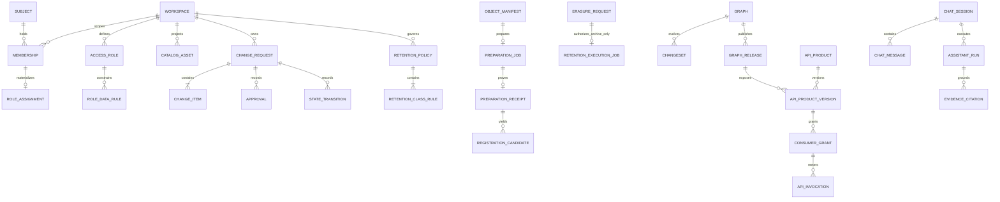

# Data and table specification

The SQLAlchemy metadata and generated `backend/alembic/versions/0001_initial_schema.py` are authoritative for implemented DDL. This document separates implemented tables from target/backlog tables.

## Current-source schema map and core ERD

This is a compact reconstruction map, not a substitute for the column/constraint inventory below.
All protected aggregates carry `workspace_id`; cross-Workspace parent/child references use composite
foreign keys and forced RLS. External provider IDs, object receipts and graph projections are
evidence or projections, never substitutes for PostgreSQL business truth.

| Schema | Ownership |
|---|---|
| `platform`, `iam`, `authz` | Workspace, System, identity, membership, Role/Policy Book and authorization evidence |
| `catalog` | bounded DataHub-derived discovery projection, vocabulary, sync watermark and export intent |
| `governance` | Change Request, approval/transition, Manual registration and attachment evidence |
| `integration` | durable jobs, outbox/inbox, idempotency, object manifests and typed Bulk preparation |
| `retention` | policy, class rule, Legal Hold, erasure review and archive-only execution evidence |
| `knowledge`, `assistant` | canonical graph releases/source jobs and retention-bound Chat/citation audits |
| `sharing` | API product versions, subject-bound grants and atomic invocation/quota/replay evidence |

The diagram deliberately shows aggregate ownership rather than every compatibility/evidence table.
The detailed tables below, SQLAlchemy metadata and deterministic Alembic schema define exact names,
types, PK/FK/UQ/CHECK/index/RLS rules. Backlog tables are explicitly separated and require a new
migration before use.

## Standards

- Application-generated UUIDs (normally UUIDv7) and UTC `TIMESTAMPTZ`.
- Every protected row has `workspace_id`; mutable aggregates have integer `version`.
- PostgreSQL RLS is enabled and forced on every workspace table. API sets `app.workspace_id` and `app.subject_id` per transaction. Relay, upload and governance BYPASSRLS identities are separate and receive only the tables needed by their background responsibility.
- Every parent/child relationship between tenant tables carries `workspace_id` in a composite foreign key; application filtering is not the only tenant-integrity guard.
- Security selectors such as classification/system/domain/owner are typed columns. JSONB stores non-security documents/extensions.
- Passwords and tokens never have application columns. Development System Settings store only
  validated non-secret YAML and `file:/run/secrets/<name>` reference names; exact revision,
  TEST and activation evidence is workspace-scoped and disabled outside development.
- Outbox, approvals, transitions, decisions, releases and citations are append-only to ordinary application roles.

## Implemented schemas and tables

### Platform, identity and authorization

| Table | Key columns and constraints | Purpose |
|---|---|---|
| `platform.workspaces` | `id`, `slug UQ`, `name`, `status`, `settings`, `version`, timestamps | tenant boundary |
| `platform.data_systems` | workspace-scoped code/name UQ, description, active flag, version/timestamps | canonical business-system master; not a DataHub provider connection |
| `platform.system_schema_scopes` | workspace/platform/database/schema UQ, composite system FK, active flag | explicit DataHub projection scope to business-system assignment |
| `platform.system_assignees` | system/subject/responsibility UQ, `DEVELOPER` or `DATA_STEWARD`, priority `1..999`, active flag | accountable human system assignments; never browser-derived |
| `platform.external_service_profiles` | workspace/service-key UQ, current YAML/version, nullable activated version, updater and bounded service vocabulary including separate `REDIS_CACHE`, `REDIS_DELIVERY` and `S3_STORAGE` connectors | development-only current draft and pointer to the revision selected for next startup; production runtime settings remain deployment/provider controlled |
| `platform.external_service_profile_versions` | workspace/profile/configuration-version UQ, SHA-256 document hash, immutable YAML/endpoint, creator, TEST status/scope/latency/actor/time and activation actor/time | exact SAVE → TEST → ACTIVATE evidence; RLS-scoped reads are granted to each consuming process's existing least-privilege DB role |
| `iam.subjects` | `id`, `issuer + external_subject UQ`, `display_name`, IdP email, ordinary last-login timestamp/IP, `active`, timestamps | external IdP mapping and profile audit; no credential or password |
| `iam.workspace_memberships` | PK `workspace_id + subject_id`, `department_id`, `job_function`, `clearance`, `attributes`, `active`, nullable `access_expires_at`, `version` | versioned ABAC attributes/grants; human expiry is authorization-bearing, service-account expiry is operator-managed `NULL`, and the optional default marker only chooses among active unexpired memberships |
| `iam.membership_renewal_requests` | workspace/target pending partial UQ, observed/requested expiries, requester/checker, reason/decision/policy/time and optimistic version | self-requested six-calendar-month extension with independent global-Admin decision and no self approval |
| `iam.access_roles` | workspace/key UQ, name/description, clearance, typed group/action/System/Domain scope documents, active flag, updater/version | reusable administrator-managed RBAC template; assignment materializes the existing membership ABAC document and the role marker is not independent authority |
| `iam.access_role_data_rules` | Role/version/classification UQ, No/Partial/Full level, nullable typed treatment, residency/purpose JSON, SHA-256 payload hash, creator/time | immutable secret-free Policy Book rule; a missing classification rule denies |
| `iam.access_role_assignments` | workspace/subject UQ, exact Role/version, membership version, access payload hash, actor, active/version/time | normalized current Role evidence; bounded updates, no application delete |
| `iam.access_role_assignment_events` | subject, assigned/reassigned/removed, before/after Role versions, membership version, payload hash, actor/time | append-only Role-assignment history |
| `iam.admin_access_requests` | typed command/envelope, maker/target/checker, canonical hash, expiry/state/consume decision, `version`, timestamps | short-lived membership-access maker-checker aggregate; no arbitrary provider payload |
| `iam.admin_access_approvals` | request/actor, approve/reject, reason, policy decision, payload hash and request version | append-only independent checker evidence |
| `authz.resources` | `workspace_id + resource_type + resource_key UQ`, scope/classification/lifecycle columns, `attributes`, `version` | durable resource attribute registry |
| `authz.policy_decisions` | `id`, `workspace_id`, `subject_id`, `resource_id`, `action`, `effect`, reason/policy JSON, grouped `evaluation_context`, `request_id`, `decided_at` | immutable allow/deny/system-worker or bounded resource-set evidence |
| `authz.classification_access_policy_versions` | workspace/policy number UQ, required jurisdiction, grant maximum, payload hash, maker/checker/supersede state and optimistic version | independently approved four-class Search/Chat policy |
| `authz.classification_access_policy_rules` | workspace/policy/classification UQ, policy hash, typed Search/Chat modes and optional immutable provider-profile version FK | exactly one immutable rule for each of the four classifications |
| `authz.restricted_search_grants` | active policy ID/hash, subject, typed resource/system/domain scope, validity, payload hash, maker/checker/revocation and optimistic version | explicit policy-bound RESTRICTED Search entitlement |
| `authz.restricted_search_grant_events` | grant/version UQ, action/actor/reason/policy decision/time/payload hash | append-only grant history |
| `authz.classification_access_generations` | workspace PK, monotonic generation and update time | transactional authorization/cache invalidation generation |

`iam.resolve_default_workspace(issuer, external_subject)` is a narrowly scoped database function,
not an IAM list API.  It may return only one active Workspace UUID for the already verified OIDC
subject during `/auth/me` hydration, prefers the optional membership default marker and otherwise
uses deterministic active-Workspace ordering.  It is executable by the application role but returns
no attributes, memberships, roles or cross-workspace data; normal IAM reads remain RLS-bound.

`iam.provision_workspace_identity(...)` is the only app-executable identity-creation function. It
is `SECURITY DEFINER`, has no dynamic SQL and independently requires matching transaction-local
Workspace/subject context plus an active, unexpired human `security-administrators` membership with
RESTRICTED clearance and `admin.manage`. It reads an optional active `iam.access_roles` row and
atomically inserts exactly one OIDC subject and six-month membership. When a Role is selected, the
repository also records the normalized assignment and event in the same transaction. The
application role has execute-only access and still has no direct `INSERT` grant on either IAM table.
No password or provider client credential is a function argument or database column.

The three policy-book tables use forced workspace RLS. The application may insert immutable Role
rules/events and may update only the current assignment's bounded state/version columns. There is no
application `DELETE` grant. Existing `datariver-role-*` membership markers are compatibility hints;
they are not backfilled with invented actor/hash evidence and require explicit reassignment.

The general ABAC decision engine remains code-versioned (`builtin-abac-v2`); generic database-authored
OPA policy/binding tables remain backlog. The narrower classification-access policy above is
implemented operating data and is evaluated together with ordinary ABAC, never as its replacement.
Missing or inconsistent active state falls back to the portable static floor.

### Catalog projection

| Table | Key columns and constraints | Purpose |
|---|---|---|
| `catalog.assets_projection` | `id`, `workspace_id + urn_hash UQ`, non-empty external URN `<= 4,096`, external identity/scope/classification/lifecycle, nullable typed-container `database_name`/`schema_name`, provider display projection with validated CHECK bounds (`description <= 10,000` characters, string-only tags/terms `<= 100` items, string-only `column_names <= 1,000` items), four explicit truncation-provenance flags, `owner_ref`, `domain_ref`, source-created time, stored `search_vector`, source version/owner, `last_seen_sync_id`, observed/deleted times | authorized search/tree/base-detail projection; projected values only power bounded discovery and DataHub remains canonical for detailed metadata |
| `catalog.vocabulary_entries` | stable local UUID, workspace/kind/provider-ref UQ, display name, `ACTIVE/INACTIVE`, provider-derived source version, observation/update time and last-seen sync; provider identity and local UUID are immutable | server-only DOMAIN/TAG/TERM projection used to translate browser-safe local UUIDs into fixed DataHub references |
| `catalog.vocabulary_sync_runs` | PK workspace/sync/kind, one ACTIVE run per workspace/kind, ordered server cursor/offset, expected/seen totals, heartbeat and optional frozen snapshot evidence | bounded per-kind reconciliation; unseen entries become inactive only after a complete independently accepted snapshot |
| `catalog.sync_runs` | PK workspace/sync, state/public page ordinal, bounded server-owned nullable scroll cursor, nullable first-page expected total, non-negative distinct seen count, snapshot-consistent assertion, bounded evidence reference, configuration-contract SHA-256 and observed provider version, start/heartbeat/completion | single-writer ordered full reconciliation, run-pinned deletion authority, response-loss replay and stale/cursor-failure recovery |
| `catalog.projection_watermarks` | `workspace_id PK/FK`, non-negative `projection_version BIGINT` | transactional local read-model generation used for cache invalidation |
| `catalog.export_requests` | workspace/requester/job composite FKs, canonical request and security/source hashes, non-RESTRICTED classification ceiling, private artifact receipt, format-safety version and access deadline; owner-select plus forced workspace RLS | owner-scoped managed CSV/XLSX intent and verified artifact metadata; object content remains private storage state |

Projection page idempotency is recorded in `integration.idempotency_keys`, including the complete
prior result needed to replay a lost response without another provider call. Every committed page
advances the workspace projection version exactly once in the same transaction; replay, rejection
and rollback do not. Before any provider call, a workspace advisory transaction reserves the
corresponding ACTIVE run/page; this serializes provider snapshot acquisition and page application.
The same lock rechecks idempotency so a concurrent duplicate returns the committed result. A fixed
DataHub scroll freezes the first total, and every page must preserve the
same total, advance the server-owned cursor and add unique URNs. Terminal reconciliation requires
`seen_count == expected_total`. It tombstones missing `DATAHUB` rows only when the deployment's
point-in-time assertion has separately accepted operator evidence; otherwise completion is recorded
with deletion suppressed. A verified run freezes its evidence reference, provider-contract hash and
observed provider version on the first page and rejects drift on continuation. Seed-owned rows are
never tombstoned. Legacy active runs are abandoned by
`0045` because their cursor/total proof cannot be recovered. `sync_runs.state` records reconciliation
completeness, while the projection version records only a committed local generation. Active rows
have a workspace/scope/order partial index, GIN
full-text index, `pg_trgm` name index, a lower-name prefix index for two-character autocomplete and
a workspace/platform/database/schema/name partial index for lazy tree branches. Database/schema
values are nullable projections of typed DataHub `Database`/`Schema` browse containers; an absent
typed container stays absent and is never reconstructed from a URN. Facets and tree branches are
derived from the same authorization-prefiltered projection and cached by security and projection
generation. Facets use one PostgreSQL `GROUPING SETS` aggregation with server-side per-facet ranking;
a separate facet projection and a true incremental DataHub event cursor remain backlog.
Alembic `0019` adds only the bounded, non-authoritative display summary needed by dense catalog
results. Alembic `0045` adds the current string-only/count/identity constraints and provenance flags.
It is never an authorization selector, provider payload or browser mutation surface. Detail
continues to read the typed DataHub enrichment through the server anti-corruption layer.

### Governance

| Table | Key columns and constraints | Purpose |
|---|---|---|
| `governance.change_requests` | `id`, `workspace_id + number UQ`, type/title/description/state/requester/classification, nullable requested due date/priority/urgency vocabulary, `version`, timestamps | change aggregate/state machine |
| `governance.change_request_items` | `id`, `change_request_id + ordinal UQ`, typed provider or intake target/aspect/operation, before/after hashes/document, nullable historical target binding, canonical `routing_system_id` and nullable server-authored item-contract SHA-256 | immutable executable item or typed multi-target intake evidence; every new item routes workflow authority through an active canonical System |
| `governance.registration_content_bindings` | candidate/hash UQ, Change Request UQ, change item UQ, request/item/creator composite workspace FKs, created time | append-only one-candidate/one-request/one-item provenance committed with the governed command; no ordinary update/delete grant |
| `governance.registration_metadata_content_bindings` | typed candidate/hash/profile/kind/Aspect, before/after/item-contract hashes, one candidate/request/item UQ, creator and composite content FKs | append-only V3 one-candidate/one-request/one-fixed-Aspect provenance; prevents browser-controlled Aspect/document and duplicate execution |
| `governance.manual_metadata_submissions` | workspace/asset/requester/lease-owner FKs, per-workspace serial UQ, catalog `source_version` plus mandatory 64-hex `provider_source_version`, immutable complete typed table/field payload, private bucket/key UQ, CSV SHA-256/size/row count, state, DB-time retry/lease epoch/token, at most 20 attempts, version/timestamps; one APPLYING row per workspace/asset | independent MANUAL registration intent/CSV receipt and lost-update evidence; ordinary writes may update only fenced execution columns after receipt verification |
| `governance.manual_metadata_apply_attempts` | submission/attempt and submission/lease-epoch UQ, worker membership FK, token hash, RUNNING→terminal shape, failure/report-root hashes and times | append-only attempt identity with one bounded terminal transition; INSERT is trigger-gated to RUNNING evidence matching the persisted current APPLYING lease, and APPLIED is trigger-gated on five matching aspect reports |
| `governance.manual_metadata_aspect_reports` | attempt/aspect UQ, fixed aspect ordinal/name mapping, optional before/expected/observed hashes, typed success/failure outcome, write flag, sanitized failure code and provider hashes/version | append-only reached-aspect DataHub evidence; `ALREADY_MATCHED`/`APPLIED_VERIFIED` require matching expected/observed hashes, failure retains only the reached ordered prefix, and only APPLIED requires exactly five verified rows |
| `governance.approvals` | `id`, `change_request_id + stage + actor_id UQ`, REVIEW/TEST/FINAL decision/reason/actor/policy/time and JSON authority snapshot | append-only decision plus immutable System Developer/Data Steward/global Admin authority evidence used by stage-completeness checks |
| `governance.state_transitions` | `id`, request, from/to, actor, reason, policy decision, occurrence | append-only state history |
| `governance.change_request_attachments` | workspace/request/current-round identity, globally unique `bucket + object_key`, kind/name/serial UQ, MIME/size/SHA-256 and uploader | finalized immutable private REQUEST/TEST evidence; bytes remain only in the configured object store |
| `governance.change_request_attachment_upload_intents` | attachment UUID, workspace/request/round/uploader FKs, globally unique object identity, expected size/SHA-256, monotonic `STARTED -> STORED -> FINALIZED` or proven create-rejection `FAILED` state, provider checksum/timestamps/version | precommitted upload authorization and queryable orphan/recovery ledger; current membership, Role-derived attributes, System assignment, target binding and CR round are locked and re-evaluated before STARTED/finalization, while ambiguous provider/DB outcomes remain STARTED or STORED and never trigger blind deletion |

### Integration, jobs and objects

| Table | Key columns and constraints | Purpose |
|---|---|---|
| `integration.jobs` | `id`, `job_type + causation_id UQ`, workspace/state/requester/progress/result, `lease_until`, `attempts`, `last_error_code`, `version`, timestamps | durable external-side-effect job |
| `integration.job_attempts` | `id`, `job_id + attempt_no UQ`, worker/state/error/external hash/start/finish | worker attempt evidence |
| `integration.outbox_events` | event PK, workspace/aggregate/type/schema/payload/time, publish/dead-letter/lease/attempt/error | transactional event recovery source and isolated poison-event evidence; relay deletion is revoked |
| `integration.inbox_messages` | PK `consumer + event_id`, workspace/received/completed/result hash | consumer deduplication; relay deletion is revoked |
| `integration.idempotency_keys` | PK `workspace + operation + key_hash`, request hash/result/expiry | HTTP/command replay control, including 24-hour Airflow Manual/BULK run-ID/call-ordinal response replay after fresh authentication/authorization |
| `integration.object_manifests` | `id`, `workspace + id UQ`, `bucket + object_key UQ`, declared/actual size-MIME-SHA, explicit allowlisted content profile, multipart/parts, state/classification/owner, completion/validation attempts, lease/error/summary, expiry/retention, `version`, timestamps | quarantine-to-accepted lifecycle; filename/MIME never implies proposal capability |
| `integration.upload_preparation_jobs` | upload/requester composite FKs, exact source-evidence identity UQ, source configuration UQ, typed state, DB-time retry schedule, lease token/time, attempts/progress/error, optimistic version | durable typed preparation claim with bounded retry/lease fencing |
| `integration.upload_preparation_receipts` | exact job source-evidence/upload composite FKs and UQs, source/accepted SHA equality, locator hash, optional ETag/VersionId, parser/scanner/schema/config versions, counts/root/receipt hashes | append-only full-input preparation receipt |
| `integration.upload_registration_candidates` | receipt/ordinal UQ, receipt/asset UQ, local asset ID, evidence version, submitted platform/database/schema/table plus identity hash, typed description operation/value and candidate hash | append-only server-prepared candidate; submitted evidence remains distinct from the current catalog target; no URN, Aspect, classification, provider document or object coordinate |
| `integration.catalog_metadata_rows` | receipt/profile/ordinal identity, submitted asset hierarchy, fixed record-kind/Aspect/operation XOR detail, optional local controlled-vocabulary UUID/kind, semantic-target and row hashes | immutable V3 wide-row evidence; no browser provider URN or arbitrary Aspect/document is accepted |
| `integration.catalog_metadata_candidates` | receipt/profile ordinal, fixed record/candidate/Aspect mapping, target asset ID, submitted identity hash, row span/root and candidate hash; one target/Aspect per receipt | immutable grouped metadata proposal evidence with bounded operation counts |
| `integration.catalog_metadata_candidate_rows` | candidate/row composite FKs, member/source ordinals and content hashes | immutable ordered membership proving exactly which rows produced one candidate |
| `integration.seed_runs` | `id`, `workspace + namespace + pack_version UQ`, content hash/state/counts/apply/remove time | optional pack ownership/audit |
| `integration.inference_provider_profile_versions` | workspace/profile key/version UQ, server route key, provider/model/deployment identities, kind, jurisdiction/region, classification ceiling, two bounded attestation snapshots, payload hash, maker/checker/revocation and optimistic version | immutable server-registered routing eligibility; no endpoint or credential |
| `integration.inference_provider_generations` | workspace PK, monotonic generation and update time | transactional provider-routing invalidation generation |

### Retention governance

| Table | Key columns and constraints | Purpose |
|---|---|---|
| `retention.policy_versions` | workspace/policy number UQ, legacy typed duration fields, V1/V2 contract discriminator, effective interval, execution-authorisation hours, canonical payload hash, maker/checker decisions, state and optimistic version; one ACTIVE row per workspace | independently approved operating retention policy; activation never authorizes deletion by itself |
| `retention.policy_class_rules` | exact policy ID/hash/number composite FK, one immutable row per governed data class, typed unit, minimum/maximum, archive disposition and canonical rule hash | complete `POLICY_BOOK_V2` class contract; legacy `SINGLE_DEADLINE_V1` policies have no fabricated rows and cannot produce execution commands |
| `retention.legal_holds` | typed data class/scope, canonical payload hash, creator, governed release fields, blocking state and optimistic version | Legal Hold canonical state; every state except RELEASED blocks destructive eligibility |
| `retention.legal_hold_events` | hold/version UQ, typed action, actor/reason/policy decision/time and action hash | append-only placement and release history |
| `retention.erasure_requests` | typed canonical target snapshot, classification, policy ID/hash, maker/checker, bounded expiry, payload hash, terminal review state and optimistic version | independently reviewed erasure intent; APPROVED never grants an execution capability |
| `retention.erasure_request_events` | request/version UQ, typed action, actor/reason/policy decision/time and request payload hash | append-only creation and decision history |
| `retention.archive_capability_attestations` | configuration/encryption/runtime-principal fingerprints, probe contract/challenge, bucket, bounded observation window, seven verified controls, state/failure and canonical payload hash | append-only target conformance evidence; a provider label alone cannot create VERIFIED state |
| `retention.immutable_archive_receipts` | exact source range and manifest, policy-active/effective-through-provider-write-interval ID/hash, typed full-object checksum, full content/retention read-back, object version, exact capability-attestation/encryption/principal binding and canonical payload hash | append-only proof for a verified archive object version; provider `LastModified` is the start of a conservative one-second interval that policy lifecycle, V2 effective interval, execution authorisation and the exact capability must fully cover; later policy supersession or capability expiry does not erase historical proof and never creates deletion authority |
| `retention.execution_jobs` | one row per exact erasure request, frozen request/target/policy/maker-checker/executor hashes, archive configuration/deadline, deterministic claim order, bounded write attempts, monotonic lease epoch/token hash and terminal/orphan receipt FK | archive-only one-time execution command; destructive state is constrained to `DISABLED_NOT_READY`; verified post-write failures are BLOCKED with a linked receipt |
| `retention.execution_attempts` | job/fence UQ, lease token hash, worker-principal fingerprint, bounded correlation/stage/failure, evidence hashes and destructive-effect count constrained to zero | fenced claim/reclaim history; every expired write attempt is superseded into read-only recovery before governance revalidation; recovery fences do not increment the write-attempt count and are bounded to three persisted attempt rows for the same write `attempt_no` |
| `retention.execution_events` | job/sequence UQ, bounded state/reason, attempt number, canonical evidence hash and database time | append-only command transition evidence |

All eleven tables use forced workspace RLS and composite membership/aggregate foreign keys. Retention
foreign keys do not cascade, the application role cannot delete these rows, and Legal Hold/erasure
or execution events cannot be updated. The application role has read-only access to archive and
execution evidence; only the dedicated archive role can append verified archive evidence. Scheduler
and archive roles are separate `NOBYPASSRLS` principals and receive no `DELETE` or `TRUNCATE`
privilege. No API or ordinary application unit of work can claim or complete execution.

### Knowledge graph

| Table | Key columns and constraints | Purpose |
|---|---|---|
| `knowledge.graphs` | `id`, `workspace + slug UQ`, name/type/status/classification/active release, `version`, timestamps | graph aggregate and active pointer |
| `knowledge.ontology_versions` | `id`, graph/version/schema/checksum/status, timestamps | typed ontology versions |
| `knowledge.changesets` | `id`, graph/base release/ontology/title/state/author/reviewer/published release, nullable `source_analysis_job_id`, `version`, timestamps | incremental author/review/publish aggregate; a durable worker-created DRAFT is bound to exactly one source-analysis job |
| `knowledge.change_operations` | `id`, `changeset_id + sequence UQ`, operation/kind/stable ID/document/provenance/confidence | ordered typed node/edge edits; model-proposed provenance includes verified excerpt/excerpt hash/page hash |
| `knowledge.validation_results` | `id`, changeset/validator/version/severity/code/location/message/time | persisted submission validation evidence |
| `knowledge.releases` | `id`, `graph_id + release_no UQ`, ontology/content hash/counts/publisher/time | immutable release manifest |
| `knowledge.release_nodes` | composite release/entity identity, type/properties/classification/provenance | immutable assertion snapshot |
| `knowledge.release_edges` | composite release/edge identity, endpoints/type/properties/classification/provenance | immutable relationship snapshot |
| `knowledge.projection_deployments` | `id`, graph/release/job, adapter/target/state/content and verification hashes/counts/verified time/error | exact canonical PostgreSQL or Neo4j shadow read-back evidence; verified state requires adapter-specific target, reconstructed content-hash and count equality |
| `knowledge.source_snapshots` | graph/upload UQ, private object coordinate/version, PDF media/size/hash/classification/state/creator | immutable integrity-verified source binding; never an external URL |
| `knowledge.source_pages` | source/page PK, page content hash and parsed text | reviewer-visible page-aware grounding source |
| `knowledge.source_page_embeddings` | source/page/provider/model UQ, dimension `1..16384`, bounded JSON vector and page hash | source-scoped semantic evidence for the exact parsed page; PostgreSQL JSON is the current canonical storage contract, not pgvector or an external vector database claim |
| `knowledge.source_analysis_jobs` | workspace/source UQ; graph/source/requester FKs; request/auth/source/base/graph/ontology/parser/model pin documents and hashes; state/stage/progress; retry counters; DB-time lease epoch and token hash; cancellation/result/failure/version/timestamps | durable PDF-to-DRAFT aggregate; one immutable source has at most one job and raw lease tokens, endpoints, credentials and private provider responses are not persisted |
| `knowledge.source_analysis_attempts` | workspace/job/attempt and job/lease-epoch UQ; token hash, worker fingerprint, state/stage, input/output/external-response hashes, retry/failure and DB times | immutable attempt identity plus fenced terminal evidence; current/expired attempt state must agree with its parent job at commit |
| `knowledge.source_analysis_events` | workspace/job/sequence UQ; optional same-job attempt, typed event/actor/reason, evidence hash, server-authored details and DB time | append-only API/worker transition ledger |
| `knowledge.extraction_runs` | source/changeset, nullable durable job/attempt FKs, `LEGACY_SYNC_V1|DURABLE_SOURCE_V1`, parser hash, embedding/extraction bindings, input/output hashes/state/error | reproducible typed extraction evidence; `DURABLE_SOURCE_V1` requires both job and attempt while legacy synchronous rows require neither |
| `knowledge.graphrag_audits` | graph/release/request UQ, actor, question hash, retrieved/cited IDs, model/prompt/tool and configuration source/version/hash, token counts | immutable citation-bounded inference audit without storing the raw question |

The API supports changeset author/submit/independent-review/publish, PDF source extraction into a
DRAFT changeset, optional Neo4j shadow verification and citation-bound GraphRAG. Publication locks
the graph and changeset and atomically commits the immutable release/content, canonical PostgreSQL
read-back receipt, published-changeset lineage, outbox and idempotency result; it never activates the
graph. A consumable release has exactly one valid independently reviewed published lineage and an
exact adapter-specific verified receipt. The old complete-snapshot HTTP publication route is `410`,
and unlineaged legacy releases are hidden from list/snapshot/export/projection/GraphRAG, general
Chat evidence and release-pinned Sharing. Neo4j result properties are never canonical inputs:
selected identifiers are rehydrated from these immutable PostgreSQL rows before prompt composition.

PostgreSQL releases remain canonical; Neo4j can be deleted and rebuilt. Graph classification is a
maximum envelope enforced on changeset operations, complete submission/review, publication,
immutable source preparation, model-output persistence and release reads. Model operations inherit
the immutable source classification exactly. Durable PDF analysis is implemented as a separately
credentialed worker for PUBLIC/INTERNAL sources. Enqueue pins the accepted manifest, graph/base,
active ontology, parser and secret-free loaded deployment or activated System Configuration model
bindings; finalization locks and rechecks those
pins plus current requester authority before one transaction creates pages, JSON embeddings,
`DURABLE_SOURCE_V1` extraction evidence, typed operations and a source-job-bound DRAFT. This is not
evidence that a target WSL host or a production external model provider has passed acceptance.

All three source-analysis ledger tables use forced workspace RLS. `datariver_app` can select only
jobs/events owned by `app.subject_id`, can enqueue, and can perform only the column-bounded
version-fenced cancellation transition; it cannot claim, create attempts or persist extraction
results. The separate `datariver_knowledge` role must be `NOBYPASSRLS`. A worker-only
`SECURITY DEFINER` function discovers at most 10,000 workspaces that contain currently eligible or
expired work, after which ordinary workspace RLS is set for claim processing. Claim and finalization
set a transaction-local raw lease token only long enough for PostgreSQL trigger checks; only its
SHA-256 is stored. Triggers bind pages, embeddings, extraction runs, DRAFT/operations, source state,
policy decisions and outbox rows to the current live job/attempt and reject an expired or
superseded writer.

Model-authored evidence text is never canonical input. The server whitespace-normalizes each parsed
page into stable bounded evidence units, supplies only their opaque IDs to the model and resolves a
selected ID back to the server-owned excerpt/page/hash. Unknown IDs are rejected and edges whose
endpoints are absent from the same typed response are discarded before domain validation.

### API sharing

| Table | Key columns and constraints | Purpose |
|---|---|---|
| `sharing.api_products` | workspace/slug UQ, graph/classification/owner/state/current version, optimistic version | stable managed product identity |
| `sharing.api_product_versions` | workspace/product/version UQ, graph/release composite FK, surface/contract/bounds/state/publisher | immutable release-pinned contract version |
| `sharing.consumer_grants` | V2: workspace service-Subject FK + issuer + client + product version partial UQ; legacy/V2 shape CHECK; scopes/classification/RPM/month quota/validity/state/revocation/version | secret-free, subject-bound consumer entitlement; active legacy grants upgrade in place |
| `sharing.api_invocations` | workspace/id UQ, grant/key-hash UQ, actor membership and product-version FKs; complete binding/request/result-body retention plus separate `AUDIT_EVIDENCE` policy/hash/deadline; legacy/V2 shape CHECK | immutable usage, replay binding and quota ledger |
| `sharing.api_invocation_results` | one workspace/invocation PK+FK, actor/client/result type, canonical JSON text/hash/byte size, classification and exact retention binding | immutable replay body, limited to 1 MiB and disclosed only through the fixed functions |
| `sharing.api_invocation_monthly_usage` | workspace/grant/UTC-month PK, positive units | transactionally locked monthly quota aggregate |

Revision `0055` makes invocation completion the only quota-consuming event. The application role
has no direct privilege on the three evidence tables; it can execute only
`sharing.prepare_api_invocation_v2` and `sharing.complete_api_invocation_v2`. Both functions use
database time, a pinned UTC/search-path context and current membership, Subject, grant, product,
version, release-lineage and retention-policy locks. The completion function inserts ledger,
result and monthly usage in one transaction after locking both the body-class rule and the
`AUDIT_EVIDENCE` rule. Immutable triggers and an initially deferred exact
result trigger reject mutation or an orphan V2 ledger. Canonical and additive migration paths
validate the exact columns, constraints, indexes, RLS policies, triggers and function security
attributes rather than accepting same-name objects.

### Assistant

| Table | Key columns and constraints | Purpose |
|---|---|---|
| `assistant.chat_sessions` | `id`, workspace/owner/title/scope, retention policy ID/hash/basis/deadline/binding version, `version`, timestamps; composite policy FK and immutable binding trigger | owner-scoped, active-policy-bound session; legacy/superseded/expired sessions are append-closed |
| `assistant.chat_messages` | `id`, workspace/session/actor/content/created time | append-only messages |
| `assistant.assistant_runs` | `id`, workspace/session/request message/provider/model/template/policy/state/metrics/timestamps | answer execution audit |
| `assistant.evidence_citations` | `id`, workspace/run/chunk/resource, classification, typed system/domain/owner scope, type/locator/version, SHA-256 content hash, effective interval, extraction method, positive unique rank | append-only immutable authorized evidence snapshot |

Alembic `0011` adds the classification policy/rule/generation, RESTRICTED grant/event and inference
profile/generation tables with forced workspace RLS, composite workspace foreign keys, immutable
rule/event/profile payloads and no application delete path. The assistant inference package/result
contract is source-only: it adds no durable inference job, provider endpoint/secret or execution table.
Alembic `0012` adds only the active lower-name prefix index used by the governed two-character
suggestion contract; no new source-of-truth or cross-workspace table is introduced.
Alembic `0013` adds nullable database/schema hierarchy projection columns and the active hierarchy
partial index. It changes no canonical ownership: DataHub remains the applied metadata source.
Alembic `0014` adds `catalog.export_requests`, owner-select and workspace RLS, immutable request and
security/source snapshot bindings, non-RESTRICTED classification ceiling, artifact-shape/hash
constraints and only the API grants needed to insert/read owner records and create jobs. It does not
provision an export DB role or S3 identity; runtime enablement remains a separate operator action.
Alembic `0015` adds nullable all-or-none governance target-binding evidence and its bounded lookup
index. It performs no historical backfill: existing unbound items cannot be presented as if current
projection values were their creation-time evidence. New domain creation requires a complete,
server-generated binding. The authorization fingerprint covers identity and scope attributes;
source version and observation time remain separate evidence. No foreign key points to the
rebuildable catalog projection.
Alembic `0016` adds the disabled-first typed BULK preparation foundation from ADR-0016: existing
manifests default to non-executable `FORMAT_ONLY_V1`, preparation jobs have lease/state constraints,
and completed receipts, candidates and candidate-to-change bindings are append-only to ordinary
roles. All relationships carry workspace, all new tables use forced RLS, and every new foreign key
uses `RESTRICT`. The manifest content profile is immutable after insert. Because the catalog projection
is rebuildable, candidate target IDs are historical evidence rather than physical foreign keys and
must be re-resolved under the same workspace before proposal creation. The existing BYPASSRLS upload
role receives no access to the new tables; a workspace/correlation-bound execution boundary remains
an activation prerequisite. The API now persists and reads authorized `upload_preparation_jobs`
through ordinary forced-RLS sessions after locking and verifying the exact accepted manifest,
immutable content profile, promoted-byte SHA-256 evidence and server configuration hash. At revision
`0016` it could not claim a lease, write a receipt/candidate or create candidate provenance; those
disabled-first activation prerequisites are implemented by `0036` and fenced further by `0046`.

Alembic `0017` closes the submitted-identity evidence gap without rewriting history. Existing
candidate rows become `LEGACY_V1` with no fabricated hierarchy; new rows must be
`DATASET_DESCRIPTION_CANDIDATE_V2` and carry all four submitted hierarchy values plus their identity
hash. Parser/configuration and ordered-root contracts advance to V2, and a trigger rejects new legacy
rows plus every candidate update/delete. No new role grant is introduced. The read-only candidate
API accepts only READY receipt evidence, recomputes V2 identity/candidate invariants and resolves a
page through one current authorization-pruned ACTIVE DATASET lookup. It never reads object storage or
DataHub and exposes no raw provider/object coordinates. At revision `0017`, publication, preview and
proposal creation remained disabled; `0036` and `0046` later provide the fenced worker and
ADR-0041 one-candidate/one-Change-Request command.

Alembic `0018` removes the fixed Chat retention duration. Existing sessions are honestly marked
`LEGACY_UNBOUND_V1`; new sessions require an exact `ACTIVE_POLICY_V1` binding to the workspace's
active policy ID/hash, database transaction time and calculated `chat_content_days` deadline.
PostgreSQL triggers reject fabricated deadlines, inactive policy bindings, non-owner message
appends and mutation of retention evidence. The application role retains only session
`version`/`updated_at` update privilege and no Chat delete privilege. Clean installations validate
the canonical `0001` contract, upgrades install it atomically, and partial schemas fail closed.

## Constraints enforced outside DDL

- Domain code owns legal change/upload/graph transitions and optimistic-version checks.
- Confidential/restricted apply requires two distinct final approvers; requester final approval is denied.
- `APPLIED` requires aggregate expected/observed hash equality after DataHub re-read.
- `COMPLETED` is permitted only for a non-executable typed change intake after independent final
  approval; it has no DataHub provider claim or reconciliation hash.
- Graph release publication validates ontology, endpoints, classification and non-empty provenance before insert.
- Object acceptance requires full streamed source SHA-256/size equality and format policy, an
  attempt-scoped destination, a full promoted-byte SHA-256/size read-back and a committed
  version-fenced manifest receipt before quarantine cleanup. Provider Object VersionId and
  conditional-copy evidence remain target-environment gates.
- Search and snapshot queries prefilter classification and scope before enrichment/serialization.
- Direct administrator membership access requires recent hardware WebAuthn. The optional password
  path applies only an approved typed request and rechecks maker/checker eligibility, target version
  and the two-human-security-administrator invariant under a workspace transaction lock.

## Backlog schema (not implemented)

Versioned general ABAC policies/bindings, catalog relationships/normalized hierarchy, connection registry,
general audit export, durable inference jobs beyond the implemented PDF-to-DRAFT capability, saved-query templates
beyond the built-in surfaces and embedding partitions remain target tables. Governed retention
policy versions, per-class minimum/maximum rules, Legal Hold history, typed Maker-Checker erasure
requests/decisions, archive-only execution jobs/attempts/events and immutable archive
capability/receipt evidence are implemented. General archive-range jobs and destructive completion
records remain target tables.
These future records remain PostgreSQL canonical state; object-store metadata is not a policy, hold
or deletion authority. They require a later Alembic revision and updated API/retention/security
tests; their mention in PRD/architecture is not permission to create ad-hoc columns.

Alembic `0035` adds CR revision rounds and immutable TEST attachment/hash evidence. `0036` adds the
typed XLSX profile and fenced Bulk publication grants. `0037` adds the Knowledge PDF source/page/
embedding/extraction, projection verification and GraphRAG audit tables. `0038` expands persisted
connection-test scopes to actual model execution/authenticated Neo4j query evidence and records the
non-secret System Configuration/deployment binding on GraphRAG audits. Alembic `0039` installs the
fixed governed identity-provisioning function and execute-only application grant; it adds no
credential column or direct IAM-table write grant. SQLAlchemy metadata, the regenerated `0001`
baseline and these incremental migrations must remain deterministic equivalents.

Alembic `0040` extends only the bounded external-service and probe vocabularies for separate Redis
cache/delivery profiles, `redis://`/`rediss://` endpoints and authenticated `REDIS_POLICY`
evidence. S3 connector tests persist `S3_HEAD_BUCKET`; `REDIS_PING` remains a read-compatible
legacy evidence value for revisions created before migration `0043`. It
adds no credential column: profiles continue to persist only mounted-secret references and immutable
version/test/activation history.

Alembic `0041` adds the three workspace-scoped Policy Book Role rule/assignment/evidence tables,
forced RLS, append-only rule/event grants, bounded current-assignment and Role-column updates, and a
post-repair schema fingerprint. Its downgrade is intentionally non-destructive; rollback of
application code does not erase access-policy evidence.

Alembic `0042` adds the `POLICY_BOOK_V2` contract columns and four-class rule table plus the
archive-only execution job, fenced attempt and append-only event tables. It creates separate
`datariver_retention_scheduler` and `datariver_archive` `NOBYPASSRLS` grants, forces workspace RLS,
constrains destructive effects to zero and has no delete state or privilege. Existing V1 policies
remain unchanged. The compatibility migration accepts a complete legacy `0008` table with later
additive columns, repairs only absent `0042` objects and rejects partial/malformed Phase 2 state.
It compares exact PostgreSQL 17 semantic catalog fingerprints for the independently rehearsed
original fresh baseline, stripped-`0041` additive path and current canonical baseline containing
only the reviewed `0044` Legal-Hold/erasure cursor indexes; physical column ordinal is not treated
as a logical API and arbitrary future indexes are not accepted.
The archive source CHECK is widened only from the exact validated legacy definition, so a same-token
`OR TRUE`, unvalidated or otherwise malformed constraint is rejected.

Alembic `0043` aligns the persisted connector TEST-scope vocabulary with the fixed Redis policy and
S3 bucket-head probes. It no-ops only on the exact current PostgreSQL CHECK definition, replaces only
the exact legacy definition and rejects a missing or malformed same-name constraint. This preserves
existing evidence while preventing a compatibility migration from normalizing arbitrary drift.

Alembic `0044` adds only the missing physical indexes for the bounded administrator keyset
contracts. The membership directory follows `lower(display_name), id`; System assignees follow
`workspace_id, system_id, id`; Legal Hold, erasure and RESTRICTED-grant histories follow
`workspace_id, created_at DESC, id`; and inference profiles follow
`workspace_id, profile_key, profile_version DESC, id`. Renewal, fallback-request, Role and System
histories already use their workspace/UUID uniqueness indexes, while retention and classification
policy histories already use their workspace/policy-number indexes. Optional status and subject
filters remain cursor-bound and page-limited; `0044` deliberately does not add a combinatorial
index for every filter permutation. The regenerated canonical `0001` already owns the same six
indexes. Revision `0044` therefore reads each same-name PostgreSQL catalog object before acting and
accepts only the exact valid/ready, plain non-unique B-tree definition: canonical key terms and sort
options, default opclasses/collation, no predicate, INCLUDE columns, primary/exclusion/constraint
ownership or alternate access method. A mismatched same-name object fails closed. An exact but
invalid interrupted build is dropped and rebuilt with PostgreSQL `CONCURRENTLY` inside an Alembic
autocommit block, then rechecked as valid/ready before the revision stamps. The non-atomic operation
must still be rehearsed for target lock, disk and elapsed-time impact. Downgrade never removes an
index that may have been created by the canonical baseline.

Alembic `0045` bounds the provider-controlled catalog projection, records truncation/provenance
facts and adds server-owned DataHub scroll reconciliation evidence. Its deletion inference remains
disabled unless the exact point-in-time provider contract is independently accepted under
ADR-0040.

Alembic `0046` implements ADR-0041. It adds Manual retry scheduling and monotonic claim fields,
append-only apply-attempt/five-aspect report tables, preparation retry scheduling,
one-Change-Request-per-typed-candidate binding uniqueness and Change Request keyset indexes. The two
new evidence tables use forced workspace RLS plus restrictive owner/Admin/purpose-bound-worker read
policies. Ordinary application grants cannot broadly update or delete them; an APPLIED attempt
requires five matching aspect reports. Upgrade fails when the contract is partial, definition
drifted or Manual rows remain `QUEUED`/`APPLYING`. The same installer is idempotent for a canonical generated
baseline and the additive `0045 -> 0046` path.

Alembic `0047` adds `integration.registration_worker_call_receipts`. It stores only hashed
run-call/request identities. RUNNING is created with the canonical Manual/Bulk claim, terminal
result is completed in the same transaction as canonical state, and no-work calls are also durable.
Forced workspace/worker RLS, column-limited grants, immutable completion and raw-token trigger
fencing protect the receipt; raw run ids and claim tokens are never persisted.

Alembic `0049` enforces the finalized attachment table's global bucket/object-key identity.
Alembic `0050` adds the forced-RLS attachment upload-intent ledger, restrictive uploader policy,
zero direct upload-role table privileges and database transition/identity guards. The application
may insert only a current STARTED precommit using the browser's exact upload UUID and has no direct
UPDATE or finalized-attachment INSERT grant. The BYPASSRLS upload role can obtain only one due row
through a SECURITY DEFINER `FOR UPDATE SKIP LOCKED` claim, then records STORED only after HEAD and
full-byte SHA-256 read-back. The current human is reauthorized before the typed function atomically
inserts the finalized attachment plus FINALIZED state; a finalized replay returns the same row
after the same current authorization check. Provider success followed by HEAD/readback failure,
cancellation or ambiguous commit remains operator-queryable evidence and is never converted into
an automatic object delete.

Alembic `0051` implements ADR-0042's typed catalog-metadata evidence boundary. It adds the local
DOMAIN/TAG/TERM vocabulary projection and durable kind-scoped reconciliation cursor, immutable
wide-row/group/membership tables and the one-candidate/one-Change-Request metadata binding. Every
table has forced Workspace RLS and composite tenant foreign keys. The application may update only
the mutable vocabulary projection/sync state; row, candidate, membership and binding evidence is
append-only. A verified full DataHub snapshot may inactivate unseen vocabulary entries, while an
unverified or incomplete scan records suppression and cannot infer deletion. The generated
canonical `0001` including this model is deterministic at SHA-256
`5ba6583738b074d7ee2ed008a63d9a6e91aec75b59e8fe6e7f9ad12efc5c5694`.

Alembic `0052` installs the two fail-closed apply-time authorization functions. The preparation
function accepts only the current V3 job attempt, worker receipt/lease, initiating human and exact
target set before any row/candidate is persisted. Publication performs an early check, obtains
target/vocabulary row locks, then repeats the function; its successful path locks the exact current
membership/subject, System/asset, active policy/rules/generation and applicable Restricted-grant
rows through transaction completion. This makes concurrent revocation and evidence publication
linearizable. The governance function accepts only a current
`BULK_CATALOG_METADATA` item and typed binding plus the exact running apply job/attempt/worker lease,
then rechecks the initiating human, current target, classification/scope policy and records the
decision. Both functions are `SECURITY DEFINER` with fixed search paths, are executable only by the
least-privilege process role and replace no generic Change Request authorization.

Alembic `0053` extends the persisted external-service TEST-scope CHECK by exactly
`RERANKING_INFERENCE`. It accepts only the exact `0052` or already-current constraint definition,
does not rewrite historical rows and refuses downgrade while reranking inference evidence exists.
The canonical `0001` contains the same vocabulary. A reranking TEST is connection evidence only;
there is no reranker runtime activation or Chat consumer in this revision.

Alembic `0054` implements ADR-0044's durable PDF-to-typed-DRAFT boundary. It adds the
source-analysis job/attempt/event ledgers, the changeset job FK and the extraction
`LEGACY_SYNC_V1|DURABLE_SOURCE_V1` discriminator/job/attempt FKs; installs forced RLS,
owner-restrictive reads, a NOBYPASSRLS worker discovery function, DB-clock lease/token-hash/epoch
fencing, deferred attempt/job terminal pairing and claim-scoped canonical/evidence triggers; and
uses column-limited application/worker grants. Migration rejects a privileged worker or any
membership that permits `SET ROLE`, revokes prior direct privileges across application schemas and
reapplies the exact allowlist; DELETE fences remain even if a future grant drifts. The worker
creates no release or governance
approval. Downgrade refuses to erase durable job evidence. The generated `0001` must contain the
same current schema and security objects; production provider-profile execution and target-host
acceptance are separate gates.

Alembic `0055` implements ADR-0045's atomic release-pinned Sharing boundary. It binds new grants to
an active non-expiring service Subject, issuer and OIDC client; preserves active legacy grant IDs
only through an explicit in-place V2 upgrade; and adds immutable result/month aggregates plus
least-privilege fixed functions. Existing legacy usage remains evidence but has no replayable
result. The revision verifies its complete security contract on canonical and additive paths,
refuses downgrade while V2 grants/evidence exist and otherwise restores the exact legacy schema
and privileges. Physical result purge and production retention conformance are deliberately not
claimed.

`EVENT_RETENTION_DAYS` is a target online-retention input, not a deletion switch. The Phase 2 worker
archives only minimal erasure approval/execution evidence and stops at
`ARCHIVE_VERIFIED_DESTRUCTIVE_DISABLED`; automatic event/content deletion remains disabled.

## Retention and deletion

An approved database policy version distinguishes legal audit, Chat content, completed delivery
events, accepted data, quarantine and telemetry. Installation-specific durations are operating
inputs to that version and not portable schema, migration or source defaults. Activating a policy
version does not by itself enable deletion.

Chat persistence is the narrower exception to the last sentence: activation authorizes only the
calculation and immutable recording of a content deadline. It does not authorize expiry deletion,
partition detach/drop, object lifecycle action or WORM export. Policy supersession immediately
append-closes sessions bound to the prior version; it does not rewrite or delete their evidence.

Legal Hold is a versioned aggregate with typed place and governed release commands plus append-only
history, not a mutable object-manifest boolean. It takes precedence over ordinary expiry and blocks
explicit erasure, row pruning and partition detach/drop. A release-pending hold is treated as active.
The first partition implementation over-retains a whole partition when any applicable hold exists.

Future object deletion must follow canonical manifest/session state through a retryable typed erasure workflow.
The request binds workspace, target kind and UUID, target version/owner/classification, policy
version ID and payload hash, request reason/decision evidence and canonical payload hash.
Approval requires an independent checker, current policy and authorization plus a current
hold/version check. The Phase 2 archive-only executor creates one command per approval and rechecks
the current maker/checker Role evidence, target, policy and holds before claim, before archive write
and before receipt commit. A future destructive executor requires a separate approval gate and final
authorization/hold/version check. Requests never carry raw
SQL, table names, object keys or provider operations. Immutable audit/release evidence is
pseudonymized where legally allowed rather than edited; a completion receipt preserves only the
minimum legally permitted evidence. Seed removal remains fixed namespace/run scoped and cannot match
non-seed resources.

The current implementation may consume an APPROVED Chat-session request only into an archive-only
command. It can verify an immutable evidence receipt and then stops at
`ARCHIVE_VERIFIED_DESTRUCTIVE_DISABLED`. APPROVED and every execution state retain
`DISABLED_NOT_READY` for destructive effects: there is no provider delete or partition operation.

Immutable archive storage is accessed through a port separate from the registration object store.
The exact capability attestation is committed before a conditional object create and its UUID is
stored in object metadata. Every expired write lease reconciles that exact provider version before
governance revalidation; three recovery fences per write attempt are derived from persisted attempt
rows without increasing the write-attempt count. The canonical receipt records deterministic
manifest hash, row/byte counts, SHA-256, object version,
retention mode and deadline, provider/configuration fingerprint and content/retention read-back time.
A product name or S3-compatible response is insufficient: versioning, Object Lock, compliance-mode
retention, checksum/version behavior and shortening/delete denial need target conformance evidence.
Missing, stale or mismatched evidence prevents a VERIFIED receipt.

Monthly partition schemas are not implemented. Their future primary and unique keys must include the
partition time, with foreign keys and late events designed explicitly, at least two future partitions
prepared and the default partition alerted. Automatic deletion and partition detach/drop remain
`DISABLED_NOT_READY` until approved policy, Legal Hold, maker-checker erasure, verified immutable
archive and restore evidence are all present.
