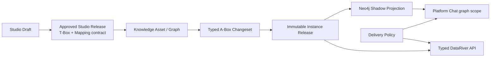

# Knowledge Asset 운영 모델 및 사용자 여정

## 1. 화면별 책임

| 화면 | 사용자가 하는 일 | PostgreSQL 정본 | 결과 |
|---|---|---|---|
| 조회 및 생성 | Asset 조회·생성·편집·아카이브, 버전 포커싱 | Graph, Studio Release, Instance Release | 현재 상태와 이력 |
| Studio Step 1 | 이름, alias, Domain, 보안등급 | Studio Draft | Asset 계약 초안 |
| Studio Step 2 | 직접/문서/DB/LLM T-Box 블록 순차 병합 | T-Box block/element/proposal | 검토 전 schema |
| Studio Step 3 | T-Box 대상과 DB source field Binding | A-Box Binding/Rule Draft | 재현 가능한 Mapping 계약 |
| 정보 관리 / 인스턴스·적재 | 직접 입력, 문서+LLM Changeset, Binding 조회, 검토·발행 | Changeset, immutable Release | 운영 A-Box |
| 정보 관리 / 프로파일 | Property 설명, 단위, 동의어 | Property Profile | 구조와 분리된 의미 메타 |
| 정보 관리 / API & Chat | API opt-in, Chat 조건/우선순위 | Delivery Policy | 안전한 제공 범위 |
| Chat Test | 특정 Graph/Release/Node로 GraphRAG 검증 | Release + verified Projection | 인용 포함 테스트 |

## 2. 정본과 파생물

- PostgreSQL의 Studio Release와 Instance Release가 정본이다.
- Neo4j는 Release hash/count 검증이 가능한 Projection이며 직접 수정 대상이 아니다.
- LLM 결과는 T-Box Proposal 또는 A-Box DRAFT Changeset이다. 자동 Publish 경로는 없다.
- `Mapped`, `Schema Published`, `Instance Published`, `Projection Verified`는 서로 다른 상태다.

## 3. T-Box 구성

Graph Builder는 하나의 accepted editor state에서 Tree, React Flow와 safe-Cypher 표현을
동기화한다. 직접 작성, 문서 업로드, Catalog metadata 검색, LLM Assistant 결과는 모두
Proposal을 거쳐 현재 블록에 병합하거나 새 블록으로 추가한다. 이전 블록은 읽기 전용으로
누적되고 최신 블록에서 이전 Class를 참조할 수 있다. 동일 identity/name 충돌은 기본
`KEEP_ORIGINAL`이며 사용자 승인 없이 덮어쓰지 않는다.

다른 Asset은 mutable alias나 active pointer가 아니라 권한 있는 exact Studio Release와
contract/T-Box hash를 선택한다. 서버는 Proposal 적용, 검토 요청과 발행 시 해당 pin의
Workspace·Domain·보안등급·Release 소유권과 aggregate ontology hash를 다시 검증한다.

## 4. A-Box 구성

### 직접 입력

발행된 T-Box의 Class/Relationship을 선택해 typed Node/Edge operation을 DRAFT Changeset에
추가한다. 모든 operation은 source reference, locator, version, method와 confidence를
요구한다. 제출, 독립 승인, 발행 후에만 새 Instance Release가 된다.

### 문서 + LLM

검증 업로드된 PDF, CSV, TXT, JSON, XML, HTML과 macro-free DOCX/XLSX/PPTX는 별도 worker가
parser/embedding/extraction 단계를 수행하고 근거가 결합된 DRAFT Changeset을 만든다.
PDF는 실제 page, 나머지는 bounded evidence segment를 사용한다. 실패, stale, 취소와
retry는 durable job state로 표현한다. 모델은 Release를 직접 만들 수 없으며 legacy
DOC/XLS, XML entity, macro/external OpenXML payload는 허용하지 않는다.

파일 없이 입력한 자연어도 브라우저에서 임의 인스턴스로 변환하거나 별도 모델 경로로
보내지 않는다. Unicode NFC로 정규화된 bounded UTF-8 TXT 원천으로 만들고, 기존 업로드의
SHA-256·분류·무결성 검증과 동일한 durable source-analysis worker를 통과시킨다. 따라서
자연어 입력 역시 source snapshot과 evidence hash가 있는 DRAFT Changeset으로만 귀결된다.
신규 Knowledge 원천은 서버가 선택한 profile·분류와 대상 graph UUID를 manifest에 고정한다.
일반 업로드는 이 graph binding을 가질 수 없고, 0085 이전 PDF 호환은 마이그레이션이 실제
SHA/크기/MIME와 validation summary가 모두 맞는 행에만 부여한 legacy marker로 한정한다.
기존 source snapshot이 없는 legacy PDF는 최초 분석 transaction이 owner/evidence를 다시
검증하고 manifest row lock 아래 대상 graph를 한 번만 고정한다. 다른 graph의 동시 또는
후속 요청은 이미 고정된 binding에서 거부된다.
job은 profile과 validation evidence hash를 별도 불변 pin으로 저장하며 worker는 외부 호출
전에 이를 재계산해 불일치하면 `STALE_SOURCE_VALIDATION`으로 종료한다.

### DB Binding

Studio는 Catalog의 로컬 Asset UUID, provider schema version, projection version과 명시적
field allowlist를 고정한다. 5–10행 Preview/Preflight와 별개로 ADR-0094의 database-ingestion
worker는 게시된 Studio Release, 등록된 connection profile/version/hash와 source field pin을
고정하고 성공 시에도 typed DRAFT Changeset만 만든다. 대상 runtime에서 전용 worker,
DB principal과 승인 manifest capability가 비활성화되어 있으면 enqueue를 fail closed한다.

## 5. 외부 API와 Chat

Asset의 endpoint alias는 식별자다. Delivery Policy에서 API가 활성화되면 인증된 호출자는
alias resolver에서 현재 active Release의 snapshot, GraphRAG와 export 상대 경로를 받을 수
있다. 모든 실제 호출은 OIDC, Workspace, Domain, Classification과 action authorization을
다시 통과한다.

Chat의 의미 라우터는 GRAPH 여부만 판단한다. 이후 Delivery Policy의 ANY/ALL/제외 조건과
우선순위가 하나의 권한 있는 Graph Release를 선택한다. 동률은 임의 선택하지 않는다.
질문이나 브라우저가 SQL, Cypher, provider URL 또는 credential을 전달할 수 없다.

## 6. 의도적으로 남은 운영 게이트

- 목표 runtime의 승인 DB connection manifest/credential, 전용 worker principal 및 실제
  source read-back 운영 증거
- system-managed lineage/glossary 기본 Graph의 scheduler·receipt·managed publish policy
- 목표 환경의 부하/soak, Neo4j rebuild 및 복구 증거

이 항목은 UI success 상태로 가장하지 않으며, capability가 없으면 명시적으로 unavailable
또는 NOT_RUN으로 표시한다.
