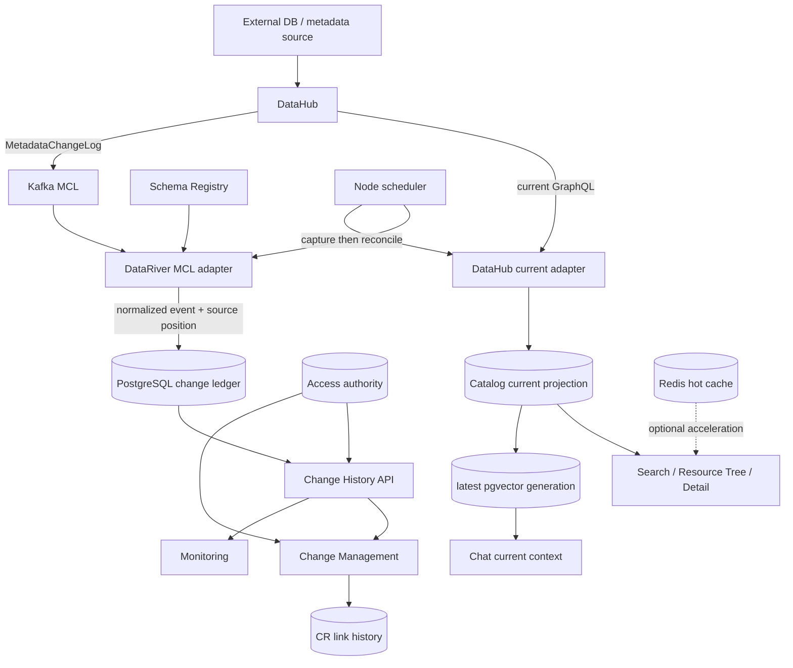
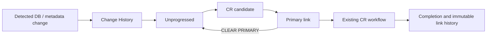

# POC Change Management 제품화 기준서

## 1. 문서 범위와 기준선

이 문서는 DataRiver POC의 Change History, Change Management, Monitoring, User/System Access와
Catalog current projection을 신규 환경에서 재현하고 운영하기 위한 현재 구현 기준서다.

| Lineage 항목 | 목적 | SHA 계약 |
|---|---|---|
| Functional Product SHA | 동결한 Change Management/MCL/Access/Monitoring runtime semantics | `4aea6d19c64253130e00d997c2837b74fac4837d` |
| Runtime Validation Evidence SHA | 위 제품 SHA의 DEV runtime/fresh validation 증거 | `313a559bdd9300d3ee2021935d2dbac0319bafd1` |
| Productization Documentation SHA | 이 문서·Runbook·sample config·backlog을 마지막으로 변경한 docs commit | matching closeout receipt의 `documentation_sha`; 보정 시작 anchor는 `01047b08d3a4c06c614c691bdd1f4f7219438ed8` |
| Closeout Validation Evidence SHA | 문서/config/deployment 정적 검증을 담은 evidence/receipt commit | 최종 closeout 보고의 exact evidence SHA; 보정 시작 anchor는 `80b2e4998880f33e9d7b2fc63165eaebcfddf1cb` |

Git commit은 자기 자신의 SHA를 내용에 안정적으로 포함할 수 없으므로, 최종 documentation과
closeout evidence SHA는 matching receipt와 배포 판정 보고가 정본이다. Functional Product와 Runtime
Evidence 사이에는 제품 파일 변경이 없다.

상태 표기는 다음 의미로만 사용한다.

- `IMPLEMENTED`: 현재 source에 구현되어 있다.
- `COMPLETE_RUNTIME_VERIFIED`: 위 기준 SHA의 DEV 실제 runtime과 fresh validation에서 확인했다.
- `TARGET_RECHECK_REQUIRED`: PREP/OPS의 네트워크, provider, CPU 아키텍처 또는 비밀값으로 재확인해야 한다.
- `BACKLOG`: 현재 기능 계약이 아니며 후속 작업이다.

## 2. 시스템 목적과 구현 상태

| 기능 | 목적 | 입력 | 처리·저장 | 출력 | 권한 | 실패 동작 | 상태 |
|---|---|---|---|---|---|---|---|
| MCL capture | DataHub 중간 변경을 순서대로 보존 | Kafka MCL, Registry Avro schema | bounded decode·normalize·dedup 후 PostgreSQL ledger와 partition checkpoint를 한 transaction으로 commit | `EXACT_MCL` 사건과 연속 offset | server process만 실행 | decode/DB 실패 offset에서 fail closed, checkpoint 미전진 | `COMPLETE_RUNTIME_VERIFIED` (DEV) |
| Change History | schema/metadata/lifecycle 감사 이력 제공 | normalized ledger | append-oriented ledger, source/checkpoint, KST 주차 | 사건 목록·상세·summary·weekly | 모든 active role 조회, System 범위 적용 | authority/catalog mapping 불명확 시 숨김 또는 409/503 | `COMPLETE_RUNTIME_VERIFIED` (DEV) |
| Change Management | 감지 사건과 기존 CR을 명시적으로 연결 | 사건, CR, server-held subject | candidate/primary link event를 append-only 저장 | 현재 link와 reverse history | admin 전체, steward/developer assigned System, viewer read-only | stale ETag/CAS·scope 오류는 effect 0 | `COMPLETE_RUNTIME_VERIFIED` (DEV) |
| Monitoring | 변경 현황을 DataRiver native 화면으로 표시 | summary/events/weekly API | server-side filter·집계 | 기본 `데이터 변경현황` 탭, 외부 dashboard 탭 | 조회 가능한 사건만 표시 | 0건과 provider/sync 장애 분리 | `COMPLETE_RUNTIME_VERIFIED` (DEV) |
| User/System Access | 사용자·역할·System 책임 범위를 서버가 소유 | access document, active subject env | PostgreSQL access projection과 protected core projection CAS | User/System 관리, action visibility | active server-held subject만 authority | client subject/role/System claim 거부 | `COMPLETE_RUNTIME_VERIFIED` (DEV) |
| Catalog current | 과거 원장과 분리된 최신 자산 조회 | DataHub current inventory | PostgreSQL current projection, optional Redis hot cache, latest vector generation | Search·Tree·Detail·Chat current context | catalog read 경계 | partial/provider 실패 시 last-good 유지, 삭제 추정 금지 | Search/Tree lifecycle `COMPLETE_RUNTIME_VERIFIED`; vector target recheck |
| Scheduler | KST 일 경계 capture 후 reconciliation | enabled flag, timezone, MCL contract | web process 내부 bounded job, PostgreSQL advisory lock와 durable receipt | startup catch-up·same-day suppression | 배포 설정 | capture 실패 시 receipt/checkpoint를 성공 처리하지 않음 | startup/catch-up `COMPLETE_RUNTIME_VERIFIED`; 실제 자정 `DAILY_CLOCK_NOT_OBSERVED` |
| Timeline backfill | retained history를 초기 보충 | DataHub Timeline | 보존된 사실만 `BACKFILLED_BEST_EFFORT` | 초기 historical ledger | server process | retention으로 사라진 사건을 합성하지 않음 | `BACKLOG`; ADR 계약만 있고 runtime 미구현 |

DataHub는 현재 metadata의 canonical source다. DataRiver PostgreSQL은 current read model과 변경 원장,
CR 연결 및 접근 권위의 canonical store다. Redis와 pgvector는 가속/재생성 가능한 projection이며 변경
원장의 대체 저장소가 아니다.

### 2.1 현재 POC runtime 권위 분리

- Node `poc-server.mjs`는 provider gateway, Change History access/events/weekly/link API, server-held
  active subject, MCL/scheduler와 PostgreSQL transaction을 소유한다.
- browser `PocApiClient`는 기존 화면 호환을 위해 다른 core 업무 흐름의 client-side adapter/state
  orchestration을 계속 포함하며 `/poc-api/state/core`로 versioned core JSON을 영속화한다.
- User/System Change History authority 변경은 `/api/v1/change-history/access`의 ETag/CAS를 거쳐
  protected core projection과 동기화된다. 다른 legacy Admin 기능까지 모두 새 Node domain API로
  이전되었다고 주장하지 않는다.
- 이 분리는 현재 구현이다. ADR-0124의 feature/application/provider port는 미래 목표이며 미구현이다.

## 3. 기술 스택

버전은 기준 SHA의 lockfile, Dockerfile, Compose와 2026-08-15 DEV runtime 관찰에서 읽었다.

| Technology | Version | Purpose | Where configured | Runtime responsibility |
|---|---:|---|---|---|
| Node.js | `22.19.0` | POC web/server, MCL adapter, scheduler | `frontend/package.json`, `deploy/poc/Dockerfile.example` | authoritative POC application runtime |
| npm | lockfile v3; image 내 실제 CLI 버전 `UNKNOWN` | reproducible package install | `frontend/package-lock.json` | `npm ci`로 exact dependency 설치 |
| React / React DOM | `19.2.7` | POC UI | frontend lockfile | browser presentation |
| Vite | `8.1.4` | TypeScript/Vite build | frontend lockfile | static POC bundle 생성 |
| KafkaJS | `2.2.4` | bounded Kafka consumer | frontend lockfile | partition/high-watermark/record read |
| Confluent Schema Registry client | `4.1.0` | Avro schema fetch/decode | frontend lockfile | MCL serialization boundary |
| kafkajs-snappy | `1.1.0` | KafkaJS Snappy codec registration | frontend lockfile | compressed MCL batch decode |
| snappyjs | `0.6.1` | pure JavaScript Snappy implementation | frontend lockfile | Node 22 arm64/amd64 codec |
| PostgreSQL | `17` image family | access/core/current/ledger/checkpoint/link/receipt truth | `pgvector/pgvector:0.8.2-pg17-bookworm` | durable POC state |
| pgvector | `0.8.2` | latest semantic projection | same image tag, init SQL | current Chat/vector retrieval |
| Redis | `8.2.6-bookworm` | optional hot cache | Compose image | cache miss/failure 시 PostgreSQL fallback |
| Neo4j | `2026.06.0` image tag | knowledge/graph projection | Compose image | optional graph retrieval |
| DataHub | DEV `v1.6.0`; target version is deployment input | metadata source, Timeline, MCL producer | external deployment + env | canonical current metadata |
| Kafka | `confluentinc/cp-kafka:7.9.2`; embedded Apache version `UNKNOWN` | DataHub MCL transport | external DataHub deployment | finite-retention forward transport, not ledger |
| Schema Registry | `confluentinc/cp-schema-registry:7.9.2` | MCL Avro schema | external DataHub deployment | subject/version/schema ID contract |
| Docker Engine | DEV observed `29.6.2` arm64; not source-pinned | container runtime | host prerequisite | build/run boundary |
| Docker Compose | DEV observed `5.3.1`; not source-pinned | application topology | Compose YAML | service/network/lifecycle orchestration |

DataHub/Kafka/Registry의 target 실제 버전과 schema identity는 배포 때 다시 확인한다. 이미지 tag에서
내부 Apache Kafka 버전을 추정하지 않는다.

## 4. 현재 아키텍처



Current projection과 append-only history는 분리한다. 삭제 자산은 current Search/Tree/Chat/vector에서
제외하지만 ledger와 CR link history는 유지한다. provider timeout, 인증 실패 또는 partial page는
삭제 증거가 아니며 last-good generation을 유지한다.

## 5. 설정 참조

실제 sample과 주석은 [`deploy/poc/.env.example`](../deploy/poc/.env.example), MCL 계산·검증 절차는
[`deploy/poc/MCL_CHANGE_HISTORY_RUNBOOK.md`](../deploy/poc/MCL_CHANGE_HISTORY_RUNBOOK.md)가
canonical이다. 아래 `R/O`는 required/optional, `S`는 secret, `Restart`는 변경 적용에 web/container
재시작이 필요한지를 뜻한다.

| 그룹 | 변수 | R/O | 목적·예시 형식 | S | Restart |
|---|---|---|---|---|---|
| application | `POC_BIND_HOST`, `POC_PORT`, `POC_PLATFORM`, `POC_IMAGE_TAG`, `POC_SOURCE_COMMIT`, `POC_NODE_IMAGE`, `POC_DOCKERFILE` | R | bind, image/revision/build contract | N | Y |
| network | `POC_SHARED_NETWORK`, `DATAHUB_EXTERNAL_NETWORK`, `POC_STATE_BIND_HOST` | R/O | existing Compose/external network names and loopback-only state bind | N | Y |
| database | `POC_PGVECTOR_IMAGE`, `POC_POSTGRES_HOST_PORT`, `POC_POSTGRES_DB`, `POC_POSTGRES_USER`, `POC_POSTGRES_PASSWORD` | R | state image/host diagnostic port/database/principal | password Y | Y |
| cache/graph | `POC_REDIS_IMAGE`, `POC_REDIS_PORT`, `POC_NEO4J_HTTP_PORT`, `NEO4J_IMAGE`, `NEO4J_USERNAME`, `NEO4J_PASSWORD` | R/O | Compose-owned Redis/Neo4j | password Y | Y |
| DataHub | `DATAHUB_GMS_URL`, `DATAHUB_GMS_TOKEN`, `DATAHUB_UI_URL` | R/O | container-routable GMS and optional browser link | token Y | Y |
| Access | `POC_CHANGE_HISTORY_ACTIVE_SUBJECT_ID` | O* | registered active user ID; private Change History API에는 사실상 required | N | Y |
| Scheduler | `POC_CHANGE_HISTORY_SCHEDULER_ENABLED`, `POC_CHANGE_HISTORY_SCHEDULER_TIME_ZONE`, `POC_CHANGE_HISTORY_SCHEDULER_LOCK_NAME` | R/O | disabled-first, IANA zone, logical deployment별 unique·release 간 stable lock | N | Y |
| Kafka/MCL | `POC_MCL_KAFKA_BROKERS`, `POC_MCL_KAFKA_CLIENT_ID`, `POC_MCL_KAFKA_GROUP_ID`, `POC_MCL_KAFKA_TOPIC`, `POC_MCL_SOURCE_IDENTITY_HASH`, `POC_MCL_SCHEMA_CONTRACT_HASH`, `POC_MCL_PROVIDER_NAME`, `POC_MCL_PROVIDER_VERSION` | R when enabled | routable brokers, isolated client/group, actual topic/provider and 64-char hashes | N | Y |
| Kafka auth | `POC_MCL_KAFKA_SSL`, `POC_MCL_KAFKA_SASL_MECHANISM`, `POC_MCL_KAFKA_SASL_USERNAME`, `POC_MCL_KAFKA_SASL_PASSWORD` | O | target Kafka TLS/SASL contract | user/password Y | Y |
| Schema Registry | `POC_MCL_SCHEMA_REGISTRY_URL`, `POC_MCL_SCHEMA_REGISTRY_USERNAME`, `POC_MCL_SCHEMA_REGISTRY_PASSWORD` | R/O | actual Registry root and optional auth | user/password Y | Y |
| MCL bounds | `POC_MCL_MAX_MESSAGES`, `POC_MCL_MAX_RECORD_BYTES`, `POC_MCL_TIMEOUT_MS` | O | positive bounded capture values | N | Y |
| Monitoring | `UI_GRAFANA_URL`, `GRAFANA_EMBED_BASE_URL`, `GRAFANA_EMBED_ENABLED`, `GRAFANA_EMBED_EVIDENCE_REFERENCE`, `MONITORING_DASHBOARDS_JSON` | O | optional exact dashboard/link contract | N | Y |
| Airflow | `AIRFLOW_URL`, `AIRFLOW_USERNAME`, `AIRFLOW_PASSWORD`, `POC_AIRFLOW_IMAGE`, `AIRFLOW_BIND_HOST`, `AIRFLOW_PORT`, `AIRFLOW_DAG_ID`, `AIRFLOW_DATARIVER_URL`, `AIRFLOW_WORKSPACE_ID`, `EXTERNAL_SERVICE_NO_PROXY` | O | optional Bulk preparation integration/runtime | password Y | Y |
| MinIO/S3 | `MINIO_URL`, `MINIO_ACCESS_KEY`, `MINIO_SECRET_KEY`, `MINIO_REGION`, `S3_BUCKET_QUARANTINE`, `S3_BUCKET_ACCEPTED`, `S3_BUCKET_EXPORTS`, `S3_BUCKET_FILEFOLDER`, `S3_BUCKET_INFOSCHEMA` | O | optional object storage contract | keys Y | Y |
| Chat | `LLM_CHAT_URL`, `LLM_CHAT_MODEL`, `LLM_CHAT_TOKEN`, `LLM_EMBEDDING_URL`, `LLM_EMBEDDING_MODEL`, `LLM_EMBEDDING_TOKEN`, `LLM_RERANKER_URL`, `LLM_RERANKER_MODEL`, `LLM_RERANKER_TOKEN` | O | OpenAI-compatible optional stages | tokens Y | Y |
| native/test only | `POC_ENV_FILE`, `POC_SERVER_HOST`, `POC_SERVER_PORT`, `POC_DATABASE_URL`, `POC_REDIS_URL`, `POC_TEST_DATABASE_TARGET`, `POC_TEST_DATABASE_ISOLATED_ACK`, `NODE_TEST_CONTEXT` | O | native launch or explicit isolated-test guard; Compose는 service names를 주입 | URL/password may be Y | process restart |

### 5.1 개별 변수 matrix

`C`는 해당 integration/기능을 사용할 때 required다. 예시는 형식만 나타내며 실제 endpoint, identity,
hash 또는 credential이 아니다. 모든 runtime 변수 변경은 별도 표기가 없으면 web/container restart가
필요하다.

| Name | R/O | Example/source | Secret | Restart |
|---|---|---|---|---|
| `POC_BIND_HOST` | O | `0.0.0.0`; Compose host bind | N | Y |
| `POC_PORT` | O | `39080`; host port | N | Y |
| `POC_PLATFORM` | O | `linux/amd64`; target build platform | N | build |
| `POC_IMAGE_TAG` | O | `local`; deployment-owned tag | N | build |
| `POC_SOURCE_COMMIT` | C | exact Git SHA for release build | N | build |
| `POC_NODE_IMAGE` | O | `node:22.19.0-bookworm-slim` | N | build |
| `POC_DOCKERFILE` | O | tracked Dockerfile path | N | build |
| `POC_SHARED_NETWORK` | O | Compose network name | N | Y |
| `DATAHUB_EXTERNAL_NETWORK` | C | existing external network name | N | Y |
| `POC_PGVECTOR_IMAGE` | O | reviewed pgvector image | N | Y |
| `POC_REDIS_IMAGE` | O | reviewed Redis image | N | Y |
| `POC_STATE_BIND_HOST` | O | loopback diagnostic bind | N | Y |
| `POC_POSTGRES_HOST_PORT` | O | host diagnostic port | N | Y |
| `POC_REDIS_PORT` | O | host diagnostic port | N | Y |
| `POC_NEO4J_HTTP_PORT` | O | host diagnostic port | N | Y |
| `POC_POSTGRES_DB` | O | deployment DB name | N | Y |
| `POC_POSTGRES_USER` | O | deployment DB role | N | Y |
| `POC_POSTGRES_PASSWORD` | R | existing secret source | Y | Y |
| `DATAHUB_GMS_URL` | C | container-routable GMS root URL | N | Y |
| `DATAHUB_GMS_TOKEN` | O | scoped DataHub token source | Y | Y |
| `DATAHUB_UI_URL` | O | approved browser-visible URL | N | Y |
| `POC_CHANGE_HISTORY_ACTIVE_SUBJECT_ID` | C | registered active subject ID | N | Y |
| `POC_CHANGE_HISTORY_SCHEDULER_ENABLED` | O | `false` until direct capture passes | N | Y |
| `POC_CHANGE_HISTORY_SCHEDULER_TIME_ZONE` | O | IANA zone, `Asia/Seoul` | N | Y |
| `POC_CHANGE_HISTORY_SCHEDULER_LOCK_NAME` | O | logical deployment 간 unique, 같은 deployment의 restart/rebuild/release 간 stable namespace | N | Y |
| `POC_MCL_KAFKA_BROKERS` | C | comma-separated routable brokers | N | Y |
| `POC_MCL_KAFKA_CLIENT_ID` | C | deployment-owned client ID | N | Y |
| `POC_MCL_KAFKA_GROUP_ID` | C | isolated consumer group | N | Y |
| `POC_MCL_KAFKA_TOPIC` | C | discovered MCL topic | N | Y |
| `POC_MCL_SOURCE_IDENTITY_HASH` | C | environment descriptor SHA-256 | N | Y |
| `POC_MCL_SCHEMA_CONTRACT_HASH` | C | Registry schema-string SHA-256 | N | Y |
| `POC_MCL_PROVIDER_NAME` | C | approved provider name | N | Y |
| `POC_MCL_PROVIDER_VERSION` | C | actual provider version | N | Y |
| `POC_MCL_KAFKA_SSL` | O | target TLS boolean | N | Y |
| `POC_MCL_KAFKA_SASL_MECHANISM` | O | target mechanism or empty | N | Y |
| `POC_MCL_KAFKA_SASL_USERNAME` | O | secret source principal | Y | Y |
| `POC_MCL_KAFKA_SASL_PASSWORD` | O | secret source | Y | Y |
| `POC_MCL_SCHEMA_REGISTRY_URL` | C | Registry root URL | N | Y |
| `POC_MCL_SCHEMA_REGISTRY_USERNAME` | O | Registry secret source principal | Y | Y |
| `POC_MCL_SCHEMA_REGISTRY_PASSWORD` | O | Registry secret source | Y | Y |
| `POC_MCL_MAX_MESSAGES` | O | positive batch bound | N | Y |
| `POC_MCL_MAX_RECORD_BYTES` | O | positive record bound | N | Y |
| `POC_MCL_TIMEOUT_MS` | O | positive timeout | N | Y |
| `UI_GRAFANA_URL` | O | approved dashboard URL | N | Y |
| `GRAFANA_EMBED_BASE_URL` | O | approved exact embed origin | N | Y |
| `GRAFANA_EMBED_ENABLED` | O | disabled-first boolean | N | Y |
| `GRAFANA_EMBED_EVIDENCE_REFERENCE` | C | reviewed embedding evidence ID | N | Y |
| `MONITORING_DASHBOARDS_JSON` | O | JSON array, maximum eight external tabs | N | Y |
| `AIRFLOW_URL` | C | Airflow API root | N | Y |
| `AIRFLOW_USERNAME` | C | existing Airflow principal | Y | Y |
| `AIRFLOW_PASSWORD` | C | existing Airflow secret | Y | Y |
| `POC_AIRFLOW_IMAGE` | O | reviewed Airflow image | N | Y |
| `AIRFLOW_BIND_HOST` | O | host bind | N | Y |
| `AIRFLOW_PORT` | O | host port | N | Y |
| `AIRFLOW_DAG_ID` | O | reviewed Bulk preparation DAG ID | N | Y |
| `AIRFLOW_DATARIVER_URL` | C | Airflow-to-DataRiver routable URL | N | Y |
| `AIRFLOW_WORKSPACE_ID` | O | actual DataRiver Workspace UUID | N | Y |
| `EXTERNAL_SERVICE_NO_PROXY` | O | comma-separated proxy-bypass hosts | N | Y |
| `MINIO_URL` | C | S3-compatible root URL | N | Y |
| `MINIO_ACCESS_KEY` | C | existing access key source | Y | Y |
| `MINIO_SECRET_KEY` | C | existing secret key source | Y | Y |
| `MINIO_REGION` | O | provider region | N | Y |
| `S3_BUCKET_QUARANTINE` | O | deployment bucket name | N | Y |
| `S3_BUCKET_ACCEPTED` | O | deployment bucket name | N | Y |
| `S3_BUCKET_EXPORTS` | O | deployment bucket name | N | Y |
| `S3_BUCKET_FILEFOLDER` | O | deployment bucket name | N | Y |
| `S3_BUCKET_INFOSCHEMA` | O | deployment bucket name | N | Y |
| `LLM_CHAT_URL` | C | OpenAI-compatible endpoint | N | Y |
| `LLM_CHAT_MODEL` | C | approved model ID | N | Y |
| `LLM_CHAT_TOKEN` | O | provider token source | Y | Y |
| `LLM_EMBEDDING_URL` | C | embedding endpoint | N | Y |
| `LLM_EMBEDDING_MODEL` | C | approved embedding model | N | Y |
| `LLM_EMBEDDING_TOKEN` | O | provider token source | Y | Y |
| `LLM_RERANKER_URL` | C | reranker endpoint | N | Y |
| `LLM_RERANKER_MODEL` | C | approved reranker model | N | Y |
| `LLM_RERANKER_TOKEN` | O | provider token source | Y | Y |
| `NEO4J_IMAGE` | O | reviewed Neo4j image | N | Y |
| `NEO4J_USERNAME` | O | graph principal | Y | Y |
| `NEO4J_PASSWORD` | R | existing graph secret source | Y | Y |
| `POC_ENV_FILE` | O | native process env-file path | path may be sensitive | process |
| `POC_SERVER_HOST`, `POC_SERVER_PORT` | O | native server bind | N | process |
| `POC_DATABASE_URL` | O | native DB URL alternative | Y | process |
| `POC_REDIS_URL` | O | native Redis URL | may be Y | process |
| `POC_TEST_DATABASE_TARGET` | C test-only | isolated DB target descriptor | N | test process |
| `POC_TEST_DATABASE_ISOLATED_ACK` | C test-only | explicit isolation acknowledgement | N | test process |
| `NODE_TEST_CONTEXT` | derived test-only | Node test runner | N | test process |

`POC_CHANGE_HISTORY_SCHEDULER_ENABLED=false`이면 MCL binding은 scheduler 시작에 필요하지 않지만,
직접 bounded capture에는 모두 필요하다. 환경변수 이름과 default는 source/Compose와 함께 검토한다.

## 6. 비밀정보 계약

- URL, image tag, provider/version, source/schema hash, topic, timezone, subject ID와 network name은
  비민감 설정이다. subject ID도 authority이므로 브라우저가 정하지 않고 배포가 소유한다.
- DB/Neo4j/Airflow/MinIO 비밀번호·키, DataHub/LLM token, Kafka/Registry SASL 자격증명은 secret이다.
- 현재 POC Compose는 host-local ignored `.env` 값을 container environment로 전달한다. Change
  History용 secret-file/direct Docker secret reader는 현재 구현에 없으므로 있다고 주장하지 않는다.
- `.env`는 Git에 commit하지 않고, 출력·receipt·브라우저·DB ledger에 실제 secret을 넣지 않는다.
- secret file/injection 개선은 backlog이며 적용 전 현재 environment contract를 바꾸지 않는다.

Root `README.md`의 전체 DataRiver stack은 다른 service에 대해 `secrets/` mount/reference를 설명할 수
있지만, 그 설명을 현재 Node POC Change Management runtime의 secret-file 지원으로 해석하지
않는다. 현재 계약은 `ignored .env/deployment environment = non-secret config + credential`이고,
목표 계약은 `.env = non-secret`, `secret injection/files = credential`이다.

## 7. 초기화와 운영

### 7.1 최초 설치

```bash
set -eu
git pull --ff-only origin dev
if [ ! -e deploy/poc/.env ]; then
  cp deploy/poc/.env.example deploy/poc/.env
fi
# 현재 POC 계약에서는 ignored .env에 non-secret config와 credential을 입력한다.
export POC_SOURCE_COMMIT="$(git rev-parse HEAD)"

# A. DataHub와 같은 Docker host/external Docker network를 사용
compose_files=(
  -f deploy/poc/docker-compose.poc.yaml
  -f deploy/poc/docker-compose.datahub-provider.yaml
)
# B. remote DataHub/Kafka/Registry DNS/TCP endpoint를 사용하면 위 배열 대신:
# compose_files=(-f deploy/poc/docker-compose.poc.yaml)

docker compose --env-file deploy/poc/.env "${compose_files[@]}" config --quiet
docker compose --env-file deploy/poc/.env "${compose_files[@]}" build web
image_id="$(docker compose --env-file deploy/poc/.env "${compose_files[@]}" images -q web)"
image_revision="$(docker image inspect \
  --format '{{ index .Config.Labels "org.opencontainers.image.revision" }}' "$image_id")"
test "$POC_SOURCE_COMMIT" = "$image_revision"
docker compose --env-file deploy/poc/.env "${compose_files[@]}" up -d
curl -fsS http://127.0.0.1:39080/healthz
curl -fsS http://127.0.0.1:39080/poc-api/capabilities
```

A의 overlay는 이미 존재하는 `${DATAHUB_EXTERNAL_NETWORK}`를 연결하며
DataHub/Kafka/Registry를 생성하거나 재시작하지 않는다. B에서는 overlay를 붙이지 않는다.
shell-exported exact SHA가 `.env`의 `POC_SOURCE_COMMIT` placeholder를 override하므로 build마다 `.env`의
이전 SHA를 수정하지 않는다.

### 7.2 기존 PostgreSQL volume schema 적용

`docker-entrypoint-initdb.d`는 기존 volume에서 자동 재실행되지 않는다. 백업 뒤 현재 SHA의 SQL을
기존 `pgvector`에 명시적으로 적용한다. SQL은 `IF NOT EXISTS`/catalog guard를 사용하지만, 성공 로그와
table/constraint 확인 없이 idempotent 적용을 주장하지 않는다.
이는 현재 POC의 `001-poc-state.sql` 수동/idempotent 재적용 방식이지 versioned migration
framework가 아니다. 향후 정본은 backlog `POC_SCHEMA_MIGRATION_CONTRACT`다.

```bash
docker compose --env-file deploy/poc/.env -f deploy/poc/docker-compose.poc.yaml \
  exec -T pgvector sh -lc 'psql -v ON_ERROR_STOP=1 -U "$POSTGRES_USER" -d "$POSTGRES_DB"' \
  < deploy/poc/postgres-init/001-poc-state.sql
```

### 7.3 application-only update

```bash
set -eu
git pull --ff-only origin dev
export POC_SOURCE_COMMIT="$(git rev-parse HEAD)"
# A(same Docker host):
compose_files=(-f deploy/poc/docker-compose.poc.yaml -f deploy/poc/docker-compose.datahub-provider.yaml)
# B(remote DNS/TCP)에서는 위 배열 대신:
# compose_files=(-f deploy/poc/docker-compose.poc.yaml)
docker compose --env-file deploy/poc/.env "${compose_files[@]}" build web
image_id="$(docker compose --env-file deploy/poc/.env "${compose_files[@]}" images -q web)"
test "$POC_SOURCE_COMMIT" = "$(docker image inspect \
  --format '{{ index .Config.Labels "org.opencontainers.image.revision" }}' "$image_id")"
docker compose --env-file deploy/poc/.env "${compose_files[@]}" up -d --no-deps web
curl -fsS http://127.0.0.1:39080/healthz
```

지원 service를 불필요하게 recreate하지 않는다. 전체 bootstrap은 새 volume/새 환경에서만 수행한다.

### 7.4 restart, stop, rebuild와 rollback

```bash
# web만 restart
docker compose --env-file deploy/poc/.env -f deploy/poc/docker-compose.poc.yaml restart web

# web만 정지
docker compose --env-file deploy/poc/.env -f deploy/poc/docker-compose.poc.yaml stop web

# exact 이전 SHA로 application-only rollback
git checkout PREVIOUS_APPROVED_SHA
export POC_SOURCE_COMMIT="$(git rev-parse HEAD)"
# A(same Docker host):
compose_files=(-f deploy/poc/docker-compose.poc.yaml -f deploy/poc/docker-compose.datahub-provider.yaml)
# B(remote DNS/TCP)에서는 위 배열 대신:
# compose_files=(-f deploy/poc/docker-compose.poc.yaml)
docker compose --env-file deploy/poc/.env "${compose_files[@]}" build web
image_id="$(docker compose --env-file deploy/poc/.env "${compose_files[@]}" images -q web)"
test "$POC_SOURCE_COMMIT" = "$(docker image inspect \
  --format '{{ index .Config.Labels "org.opencontainers.image.revision" }}' "$image_id")"
docker compose --env-file deploy/poc/.env "${compose_files[@]}" up -d --no-deps web
```

rollback은 DB/ledger/checkpoint/source를 삭제하거나 rewind하지 않는다. image tag와 exact SHA를
receipt에 기록하며, DB contract가 바뀐 release는 별도 backup/rollback 검토가 필요하다.

### 7.5 MCL 활성화 순서

1. DataHub actual version, Kafka cluster/topic/advertised listener, Registry subject/version/ID/hash를
   확인한다.
2. provider name/version, Kafka cluster ID/topic, Registry subject/schema hash 여섯 descriptor 전체로
   candidate source identity hash를 먼저 계산한다. DB에서 그 exact hash row가 있을 때만
   재사용하며 provider/version/schema hash 일부 일치만으로 선택하지 않는다.
3. scheduler를 `false`로 두고 runbook의 canonical bounded capture로 first exact boundary를 만든다.
4. checkpoint와 ledger commit, replay/dedup을 확인한다.
5. server-held active subject와 access API를 확인한다.
6. 그 뒤에만 scheduler를 `true`, timezone을 `Asia/Seoul`로 설정해 web을 재시작한다.

상세 명령과 판정 기준은 MCL runbook에만 둔다.

## 8. 초기화 주의사항

- source identity는 환경별 provider 계약이다. PREP/DEV/OPS 사이에 hash·offset·checkpoint를 복사하지 않는다.
- checkpoint reset, Kafka offset reset, ledger truncate/update는 정상 복구 절차가 아니다.
- Registry latest 응답의 실제 subject/version/schema ID/schema SHA-256과 DataHub actual version을 함께 기록한다.
- scheduler enable 전에 Kafka/Registry connectivity와 direct bounded capture를 확인한다.
- active subject는 등록된 active user여야 하며 client가 subject/role/System을 선택하지 못한다.
- 기존 volume에 destructive initialization, `docker compose down -v`, DB reset을 사용하지 않는다.
- provider partial/failure는 asset deletion 증거가 아니다. last-good current projection을 유지한다.
- unit test는 live DEV DB 환경을 상속해서 실행하지 않는다. test isolation guard가 명시적 isolated target과 ack 없이 persistent DB write를 차단한다.
- 삭제 asset의 current row는 제외해도 Change History와 CR link history는 삭제하지 않는다.
- tracked `deploy/poc/Dockerfile.example`이 reproducible deployment의 canonical 목표다.
  `Dockerfile.local`은 host 제약을 위한 임시 DEV/PREP compatibility일 뿐이며 scheduler/MCL COPY와
  package/lock drift를 매 배포 검증해야 한다. retirement/drift removal은 backlog이다.
- `scripts/export_poc_release.sh`는 remote가 없는 legacy static/simulated bundle 계약이다. 현재 live-provider
  Change Management의 canonical publication 경로로 사용하지 않으며, 교체 또는 명시적 retirement는 backlog다.

## 9. Change Management 업무 계약



- detected change는 CR을 자동 생성하지 않는다.
- candidate/primary link는 CR state, round, revision, approval 또는 completion을 자동 변경하지 않는다.
- 하나의 CR은 여러 normalized change transaction과 연결할 수 있다.
- primary, candidate와 append-only SET/CLEAR history는 분리한다. unlink 뒤에도 과거 이력은 남는다.
- 유효한 primary가 없거나 REJECTED/CANCELLED CR, inactive candidate, non-primary만 있으면 미진행이다.
- Column rename은 old field `DELETE` + new field `CREATE`, Table rename은 old lifecycle `DELETE` + new
  asset `CREATE`로 보존하며 URN 변화만으로 `RENAME`을 추측하지 않는다.

CR 상태 문자열은 바꾸지 않고 다음 presentation mapping만 사용한다.

| 표시 단계 | Domain evidence |
|---|---|
| 접수 완료 | `REGISTERED`, 최초 round의 `IN_REVIEW` |
| 재검토 | `CHANGES_REQUESTED`, round/revision/transition으로 증명된 재신청 `IN_REVIEW` |
| 변경/Test | `TESTING`, `APPLY_QUEUED`, `APPLYING`, `APPLY_FAILED` |
| 완료검토 | `FINAL_REVIEW` |
| 완료 | `APPLIED`, `COMPLETED` |
| 집계 제외 | `REJECTED`, `CANCELLED` |

## 10. 화면 정의

| Screen ID | 화면 / 목적 | Roles | Data/API | 구성·컬럼·필터 | Actions/validation | 상태·navigation | Acceptance |
|---|---|---|---|---|---|---|---|
| `MON-CH-01` | Monitoring 기본 `데이터 변경현황` | 모든 active role, 행별 System 범위 | `/api/v1/change-history/summary`, `/events`, `/weekly` | sync/guarantee summary, 기간·category·operation·platform·DB·schema·System·담당자·link·stage, trend/table/detail | 조회 및 detail 열기; client claim 사용 안 함 | 0건, sync/provider 오류를 분리; 기존 external tabs로 이동 가능 | 실제 schema/metadata/lifecycle event와 before/after/actor/time 표시 |
| `CM-OV-01` | Change Management / CR STATUS OVERVIEW | 모든 active role 조회 | `/weekly`, 기존 core CR state | schema, system, owner, total, unprogressed, 접수 완료, 재검토, 변경/Test, 완료검토, 완료 | 수치 선택 시 detected-change 조건 적용 | empty/error/read-only 상태 | server 집계와 KST 주차, domain state 불변 |
| `CM-EV-01` | Detected-change list/detail | 모든 active role, scope-pruned | `/events`, `/events/{event}` | category, operation, asset/field, precision, before/after, actor/source/detected time | detail/filter/page | 404 existence hiding, loading/empty/error | history와 current metadata가 섞이지 않음 |
| `CM-LINK-01` | 사건 ↔ CR candidate/primary 관리 | admin; assigned steward/developer; viewer read-only | `/events/{id}/cr-links`, POST `/cr-link-events` | current primary/candidates, CR/round, reverse history | `ADD/REMOVE_CANDIDATE`, `SET/CLEAR_PRIMARY`; If-Match/idempotency/reason | stale 409, forbidden 403, no optimistic success | link/unlink 후 CR state/round/revision 불변, history 유지 |
| `CR-HIST-01` | CR detail reverse history | CR과 event 모두 조회 가능한 role | `/api/v1/change-requests/{id}/change-history` | linked event, current stage, SET/CLEAR history | read only | denied는 존재 노출 없이 처리 | one CR → many events를 bounded list로 표시 |
| `ADM-USR-01` | User 관리 | admin mutation, 그 외 정책상 조회/disabled | `/api/v1/change-history/access` GET/PUT | subject, display name, role, active, owner refs | create/update via ETag/CAS | validation/error/read-only | 4 role과 inactive denial 유지 |
| `ADM-SYS-01` | System/담당자 관리 | admin mutation | access GET/PUT | System, platform/database/schema scope, assignment, responsibility, priority | System/assignment update via ETag/CAS | ambiguous scope fail closed | admin all-System, assigned role scope, policy order 유지 |

현재 화면 component는 `frontend/src/features/monitoring`, `frontend/src/features/change-history`,
`frontend/src/features/governance`, `frontend/src/features/admin`에 있다. 표에 없는 subject-switch UI, HTTP manual scheduler trigger,
자동 CR 생성·승인 버튼은 현재 제품에 존재하지 않는다.

## 11. 배포 계약과 이식성

공식 재현 계약은 다음과 같다.

`same source SHA + supported container runtime + valid .env/secrets + compatible external service contract = reproducible runtime`

| 환경 | 지원/검증 범위 | 필수 재확인 |
|---|---|---|
| `DEV_MAC_ARM64` | Node 22 runtime, actual MCL/CR/access/current flow verified | host Docker resources와 provider availability |
| `PREP_WSL_AMD64` | published candidate 단위 검증 환경 | Linux/amd64 image, Kafka advertised listener/DNS, Registry, env/secrets, exact boundary |
| `OPS_LINUX_AMD64` | 아직 실행하지 않음 | 이미지/digest/checksum, backup/restore, external compatibility, security/HA/operations gate |

CPU architecture, Docker/Compose, external service compatibility, routable DNS/network, writable/secret
filesystem, 충돌 없는 ports가 prerequisite다. 모든 환경에서 무조건 동작한다고 주장하지 않는다.
provider overlay를 사용하면 반복적인 `docker network connect`는 필요 없다. 새 proxy/service/container는
추가하지 않는다.

## 12. 검증 상태와 잔여 backlog

Fresh evidence 기준으로 focused/full POC server, access/CR/history/weekly/UI, MCL/scheduler/catalog
regression, lint, typecheck, build와 Linux/amd64 image build가 통과했다. 제품화 문서 변경은 MCL mutation
E2E를 반복하지 않고 config render, env/source 대조, link/path, secret/hardcoding scan으로 검증한다.

잔여 항목은 [`docs/29_MASTER_EXECUTION_BACKLOG.md`](29_MASTER_EXECUTION_BACKLOG.md)가 canonical이다.
핵심 target/debt는 `VECTOR_PROVIDER_UNAVAILABLE`, Chat/vector deleted-current target recheck, PREP targeted
recheck, OPS validation/deployment, `DAILY_CLOCK_NOT_OBSERVED`, GX/Quality integration, Chat refinement,
Vite chunk-size warning, secret-file injection, `Dockerfile.local` retirement, legacy export helper,
Timeline backfill, browserless loopback fallback, `POC_SCHEMA_MIGRATION_CONTRACT`,
`REPRODUCIBLE_DEPLOYMENT_ACCEPTANCE`와 `MODULAR_PRODUCT_ARCHITECTURE`다.

## 13. Closeout hardcoding·secret audit

- `origin/dev..4aea6d1`의 runtime 제품 diff에서 actual DEV/PREP IP, credential/token, fixture asset URN,
  fixture System/User ID와 test DB/schema/table literal이 새로 추가되지 않았다.
- `urn:li:` 문자열은 DataHub protocol grammar/prefix validation이며 실제 fixture identity가 아니다.
- test fixture literal은 `*.test.*`와 explicit isolated-test guard에 한정한다.
- `frontend/src/poc/pocApi.ts`의 browser-less attachment URL fallback
  `http://127.0.0.1:39080`은 이번 candidate 이전부터 있던 POC default다. 정상 browser runtime은
  `globalThis.location.origin`을 사용하므로 Change Management provider endpoint가 아니지만, strict
  loopback-default 제거는 별도 범위에서 검토할 수 있다.
- tracked example/runbook에는 placeholder와 loopback bind/troubleshooting 예시만 있고 actual endpoint,
  source/schema hash, password, token 또는 raw Registry schema가 없다.
- 현재 POC secret 값은 ignored host `.env`/deployment environment에만 존재해야 한다. repository에서
  actual secret finding은 없다.
