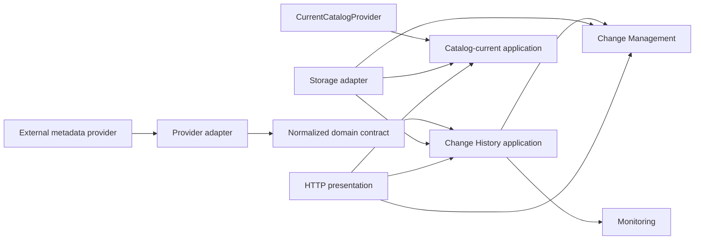

# ADR-0124: POC 모듈 경계와 metadata provider 이식성 계획

- Status: Proposed backlog plan; no runtime refactor approved
- Date: 2026-08-16
- Owners: Architecture, Application, Data Engineering, Frontend
- Refines: ADR-0001, ADR-0002, ADR-0115, ADR-0118, ADR-0123

## Context

현재 POC는 검증된 단일 Node 배포 단위를 유지하면서 빠르게 기능을 통합했다. 이 방식은 현재 운영
계약에는 적합하지만 Change History, Change Management, access, DataHub current adapter와 HTTP
presentation의 변경 blast radius가 커질 수 있다. 이번 closeout은 동작을 바꾸는 refactor가 아니며,
두 번째 metadata provider가 실제 필요하기 전에 새 framework나 service를 도입하지 않는다.

현재 주요 결합 지점은 다음과 같다.

- `frontend/poc-server.mjs`: HTTP routing, DataHub GraphQL, Catalog projection, access, Change History/CR
  query와 scheduler bootstrap이 한 runtime module에 함께 있다.
- `frontend/poc-mcl-capture.mjs`: KafkaJS/Schema Registry decode, DataHub aspect normalization과
  persistence orchestration이 한 module에 있다.
- `frontend/poc-state-store.mjs`: PostgreSQL/Redis adapter, schema bootstrap, core/access/catalog/change
  history storage contract를 함께 소유한다.
- `frontend/src/poc/pocApi.ts`: transport compatibility와 여러 feature의 client adapter가 함께 있다.
- UI는 이미 `features/change-history`, `features/monitoring`, `features/governance`, `features/admin`으로
  일부 경계가 있으나 API type/command ownership은 더 명확히 분리할 여지가 있다.

## Decision

`MODULAR_PRODUCT_ARCHITECTURE` epic에서 다음 논리 경계를 목표로 한다. 현재는 문서 계약만
승인하며 directory 이동, service 분리, schema 변경 또는 dependency 추가를 하지 않는다.

- `change-history`: normalized event, precision, lifecycle, checkpoint/ledger query contract
- `change-management`: CR link/candidate/primary/history와 presentation stage
- `access`: user/role/System assignment/assignee policy와 server-held subject
- `catalog-current`: current inventory, deletion/reactivation, cache/vector generation
- `monitoring`: summary/filter/trend/detail presentation contract
- `adapters/datahub`: Timeline, GraphQL current, MCL payload mapping
- `adapters/storage`: PostgreSQL/Redis/pgvector implementation
- `application/http`: request parsing, authorization invocation, error/ETag/idempotency mapping
- `frontend feature modules`: screen-local API/types/state/rendering

의존성 방향은 아래와 같다.



Domain/application이 Kafka, Avro, DataHub aspect payload, GraphQL response 또는 provider-specific URN
parser를 직접 요구하지 않게 한다. adapter는 provider payload를 bounded normalized contract로
변환하고 unknown/incompatible contract를 fail closed한다.

## Provider-neutral contract

아래는 설계 최소안이며 현재 새 interface/framework 구현을 지시하지 않는다.

```ts
interface MetadataChangeProvider {
  describeSource(): Promise<SourceContract>
  captureBoundary(): Promise<PartitionBoundary[]>
  readBounded(request: CaptureRequest): Promise<NormalizedChangeBatch>
}

interface CurrentCatalogProvider {
  readCompleteGeneration(request: CatalogReadRequest): Promise<CurrentCatalogGeneration>
  readAsset(identity: AssetIdentity): Promise<CurrentAsset | null>
}
```

`NormalizedChangeBatch`는 provider-neutral asset identity, category, operation, bounded before/after,
actor/source time, provider event identity와 partition/offset 같은 opaque source position을 제공한다.
Change History, CR와 Monitoring은 이 normalized event만 소비한다. provider-specific fields는 source
diagnostic/reference 범위 밖으로 전파하지 않는다.

`CurrentCatalogGeneration`은 complete/partial/failure 증거, generation identity와 asset current facts를
제공한다. complete 증거가 없는 failure/partial result는 deletion 권한을 갖지 않는다.

## Migration plan and gates

1. 현재 behavior/failure/authorization tests를 module contract 기준으로 고정한다.
2. pure normalization과 current-generation contract를 provider adapter port 뒤로 이동한다.
3. storage interface를 기존 transaction/CAS/advisory-lock 의미 그대로 추출한다.
4. HTTP와 frontend type을 feature 단위로 이동하되 API/route/UX를 바꾸지 않는다.
5. 두 번째 provider 요구가 실제 승인될 때 conformance suite와 별도 adapter를 추가한다.
6. service/container 분리는 measured lifecycle/load/failure isolation evidence와 별도 ADR이 있을 때만
   검토한다.

각 단계는 diff blast radius, migration/rollback, current/history isolation, System authority,
checkpoint/idempotency, Linux/amd64 artifact와 full regression을 독립적으로 통과해야 한다.

## Consequences

- 현재 검증된 단일 Node/Compose 배포와 CR/MCL domain semantics는 변하지 않는다.
- provider 교체가 CR/Monitoring에 외부 payload 의존성을 확산시키지 않는 목표가 명확해진다.
- 당장은 일부 대형 module과 결합이 남으며 이는 accepted backlog다.
- 추상화 자체를 목적으로 작업하지 않고, 실제 두 번째 provider 또는 측정된 변경 비용이 다음
  implementation gate다.
