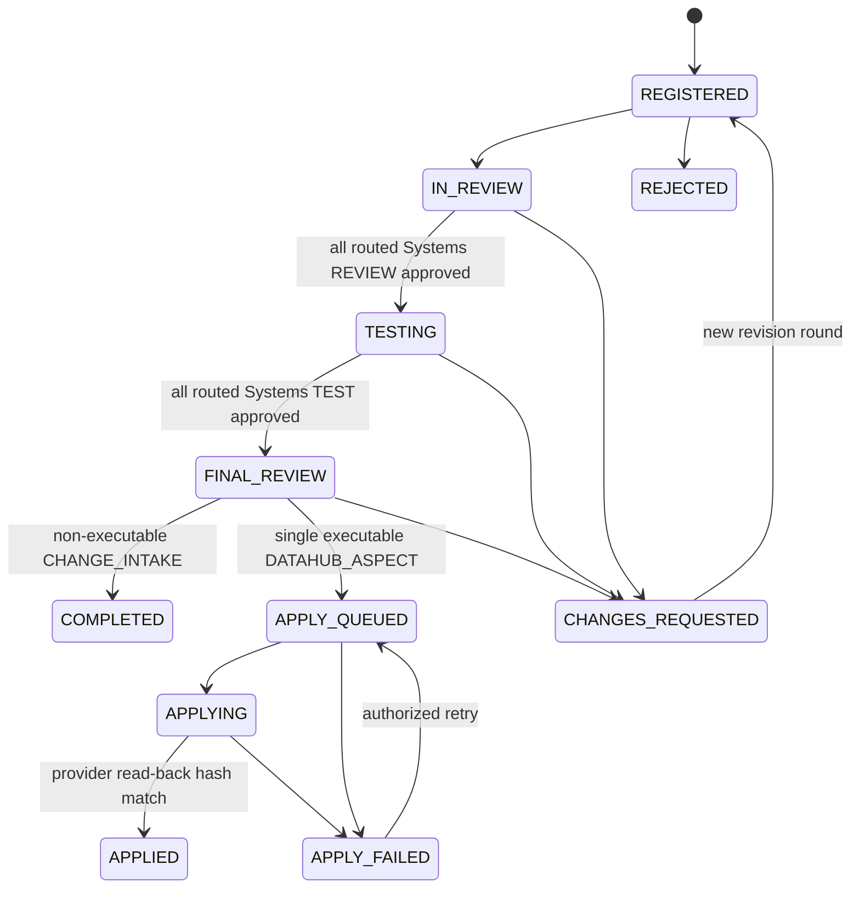
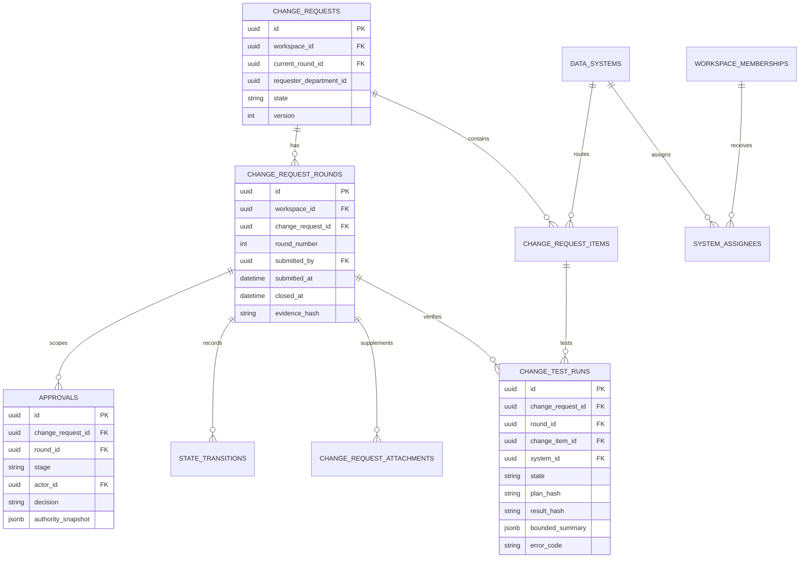
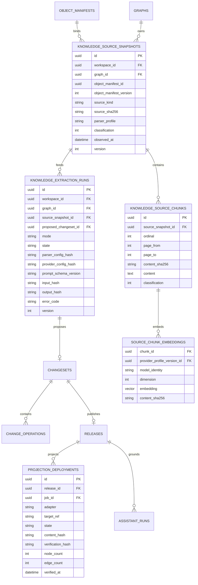
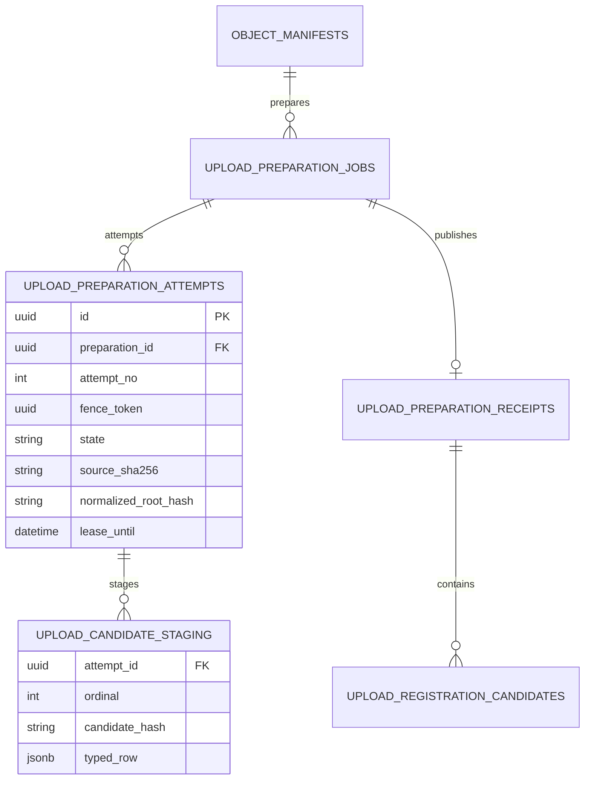

# DataRiver 4대 핵심 메뉴 유즈케이스 및 구현 기준선

- 작성일: 2026-07-21
- 대상 브랜치: `agent/admin-ui-stabilization`
- 상태: **승인된 설계 · Step 2 구현 반영 · Step 3 실행 증거는 test_checklist에서 관리**
- 범위: 검색, 등록관리, 변경관리, 지식관리와 DataHub, Airflow, SeaweedFS,
  PostgreSQL, Neo4j, 로컬 Ollama 연계

이 문서는 유즈케이스와 수용 기준의 기준선이다. 구현 여부와 실행 환경에서 관측한 결과를
구분하며, 실제 데이터 주입 결과는 `docs/test_checklist.md`에 식별자, 시각, 상태와 실패 경계를
함께 기록한다.

## 1. 판정 규칙과 설계 우선순위

### 1.1 상태 표기

| 표기 | 의미 |
|---|---|
| `IMPLEMENTED` | 현재 소스에 타입, 권한, 실패 경로와 테스트가 존재함 |
| `LIVE-OBSERVED` | 2026-07-21 현재 로컬 실행 환경에서 읽기 전용으로 확인함 |
| `GAP` | 요구 동작을 현재 계약으로는 정확하게 수행할 수 없음 |
| `PROPOSED` | Step 2 구현을 위한 설계안이며 아직 API/DDL/worker가 아님 |
| `EXTERNAL-GATE` | 실제 IdP, WebAuthn, DataHub, Airflow, S3 또는 모델 실행 증거가 필요함 |

소스 우선순위는 승인된 ADR과 보안 불변식, 현재 v1 API/데이터 계약, 본 문서, 화면 요구,
`datariver_v0`의 레이아웃 의도 순이다. v0의 브라우저 비밀값, 직접 DataHub/Neo4j 변경, raw
SQL/Cypher, mock 성공과 로컬 스토리지 권한은 이식하지 않는다.

### 1.2 공통 불변식

1. PostgreSQL은 요청, 승인, 이력, 지식 릴리스, 작업 의도와 감사의 canonical source다.
2. DataHub는 반영된 카탈로그 메타데이터의 소유자다. DataRiver 검색 projection은 재구축
   가능하며 DataHub 응답을 그대로 브라우저에 전달하지 않는다.
3. Airflow와 Valkey 상태는 운영 증거일 뿐 업무 완료의 근거가 아니다. 완료 상태는 PostgreSQL
   상태와 외부 시스템 read-back 검증으로 결정한다.
4. SeaweedFS object 좌표, DataHub/Ollama/Neo4j endpoint와 credential은 브라우저에 반환하지
   않는다. DB에는 비밀값 대신 strict secret reference만 저장한다.
5. Neo4j는 PostgreSQL의 불변 KG release에서 재구축 가능한 private read projection이다. Bolt와
   raw Cypher를 public/API/browser에 노출하지 않는다.
6. LLM 출력은 불신 입력이다. 모델은 변경 승인, graph publish, SQL/Cypher/HTTP 실행 또는 tool
   mutation을 수행할 수 없다.
7. 모든 비동기 작업은 idempotency, optimistic version, lease/fence, 재시도 분류, 감사 및
   dependency degradation을 가져야 한다.
8. Workspace, classification policy, subject permission scope, source/projection version은 검색,
   캐시, export, CR, KG retrieval과 citation에 함께 결합한다.

## 2. 현재 기준선과 확인된 사실

### 2.1 실행 인프라 스냅샷

`docker compose ps`와 `docker stats --no-stream`으로 다음을 확인했다.

- `api`, `web`, `apisix`, PostgreSQL, 두 Valkey, SeaweedFS, Keycloak, upload workers,
  governance apply worker와 outbox relay가 실행 중이다.
- Airflow API server와 scheduler는 healthy이며 DAG processor와 triggerer도 실행 중이다.
- 별도 `compose.graph.yaml`의 Neo4j Community가 healthy다. 현재 약 889 MiB를 사용하고 1.5 GiB
  제한이 적용돼 있다.
- DataHub GMS, Frontend, Actions, Kafka/ZooKeeper, MySQL, Elasticsearch가 별도 Compose
  프로젝트에서 실행 중이다.
- 이 상태는 개발용 Single-node Pilot이며 HA 또는 운영 준비 완료를 의미하지 않는다.

2026-07-21 E2E 시점의 등록 관련 Airflow 상태는 아래와 같다. 검색 동기화와 선택적 seed DAG의
운영 스케줄은 이번 등록 E2E 완료 판정에 포함하지 않는다.

| 실제 DAG ID | 목적 | schedule | 현재 상태 |
|---|---|---|---|
| `datariver_catalog_probe` | DataRiver/DataHub 계약 probe | 소스 정의 | 이번 E2E 대상 아님 |
| `datariver_catalog_sync` | DataHub -> local catalog projection 동기화 | `0 */6 * * *` | 이번 E2E 대상 아님 |
| `datariver_manual_metadata_apply` | immutable MANUAL receipt apply/read-back | `*/5 * * * *` | unpaused · 실제 성공 run 확인 |
| `datariver_bulk_registration_prepare` | accepted CSV/XLSX typed preparation | service API poll | unpaused · CSV/XLSX 실제 성공 run 확인 |
| `datariver_semiconductor_seed_ingestion` | 명시적 반도체 seed 적재 | 소스 정의 | 선택 기능 · 이번 E2E 대상 아님 |

Airflow는 object/DataHub/업무 DB를 직접 변경하지 않고 OIDC service identity로 DataRiver의
고정 내부 API만 호출한다. DAG task success만으로 업무 성공을 주장하지 않고 canonical receipt와
provider read-back을 함께 확인한다.

### 2.2 메뉴별 현재 상태

| 메뉴 | 확인된 구현 | 핵심 Gap |
|---|---|---|
| 검색 | 즉시 `ASC→DESC→NONE`, toolbar filter/export, Terms/Tags, horizontal scroll, `50/100/200/500/1000/전체`, DataHub typed parsing | 제한된 E2E 계정에는 server export 권한이 없어 다운로드 버튼은 의도대로 비활성 |
| MANUAL 등록 | typed metadata, name-only Tag/Term lookup, immutable receipt, Airflow apply와 DataHub typed read-back | 다른 aspect/provider failure와 catalog sync 지연은 계속 명시적 실패/지연 상태로 처리 |
| BULK 등록 | multipart quarantine/validation, CSV/XLSX typed parser, fenced preparation/receipt/candidate, Airflow DAG | candidate를 실제 변경으로 적용하는 단계는 일반 CR 권한·검토 흐름에 종속 |
| 변경관리 | revision round, bound TEST attachment/result, 다중 System Developer/Data Steward/global Admin authority와 typed FINAL decision | 실제 FINAL 3인 승인은 각 사람의 WebAuthn step-up이 필요한 외부 보안 gate |
| 지식관리 | 고정 left tree, typed graph/changeset/release, grounded PDF extraction, Neo4j canonical shadow verification, 별도 GraphRAG answer | publish/project는 WebAuthn gate이며 durable production inference worker는 production promotion gate |

### 2.3 Search Terms/Tags 현재 데이터

현재 PostgreSQL projection을 읽기 전용으로 집계한 결과는 다음과 같다.

| 항목 | 값 |
|---|---:|
| active assets | 2,012 |
| 하나 이상의 Tag를 가진 assets | 2,000 |
| 하나 이상의 Term을 가진 assets | 2,000 |
| 최근 `observed_at` | 2026-07-20 07:34:49 UTC |

따라서 Terms/Tags는 DB 전체에서 비어 있지 않다. Step 2에서는 동일 asset을 기준으로 DataHub
GraphQL 응답, projection row, `/catalog/assets` JSON, 현재 web bundle DOM을 연결 추적한다. 특정
12개 asset에 association이 없는 경우에는 값을 만들지 않고 빈 상태로 표시한다.

실제 MANUAL submission과 CSV/XLSX/PDF upload manifest, Bulk preparation/receipt/candidate가 생성된
상태다. 정확한 ID, SHA-256, Airflow run과 provider read-back은 `docs/test_checklist.md`에 기록한다.

## 3. Actor와 테스트 Persona

| Actor | 책임 |
|---|---|
| Data Consumer | 허용된 catalog/KG를 검색하고 detail, lineage, citation을 조회 |
| Registration Operator | dataset metadata를 MANUAL/BULK로 제안하고 자신의 이력을 조회 |
| CR Requester | 신규 CR과 증빙을 제출하고 보완 요청에 재제출 |
| System Developer | 담당 System의 REVIEW와 TEST, FINAL Developer evidence를 기록 |
| System Data Steward | 담당 System의 FINAL stewardship evidence를 기록 |
| Global Admin | 전역 FINAL approval, System/role/configuration 관리 |
| Airflow service identity | 정해진 내부 API만 호출하고 provider/S3 credential을 갖지 않음 |
| Upload/Extraction worker | private object를 stream/validate하고 bounded candidate evidence만 생성 |
| Projection worker | immutable release를 Neo4j shadow projection으로 재구축하고 검증 |
| DataHub adapter | 고정 GraphQL/aspect contract와 version gate를 적용 |
| LLM adapter | approved typed request/tool schema만 사용하고 출력 검증에 종속 |

CR 다중 System E2E의 최소 인원은 Requester, 모든 대상 System을 담당하는 Developer, 모든 대상
System을 담당하는 Data Steward, Global Admin의 4명이다. System별 담당자가 다르면 6명 이상이
필요하다. 자동 테스트 계정은 격리된 개발 Workspace에만 생성하고 운영 identity를 대체하지 않는다.

## 4. 검색(Search) 유즈케이스

### 4.1 정상 유즈케이스

| ID | 유즈케이스 | 선행조건 | 정상 흐름과 결과 |
|---|---|---|---|
| `SRCH-01` | 기본 검색 결과 조회 | active Workspace와 `catalog.search` | 빈 query로 서버 허용 순서의 첫 50건을 조회한다. hidden total이나 denied row는 노출하지 않는다. |
| `SRCH-02` | literal multi-term 검색 | 2자 이상 query | Schema/Table/Column/Tag/Term/Description 중 선택된 필드에서 ALL semantics로 검색한다. `%`, `_`, `\`는 wildcard가 아니라 문자다. |
| `SRCH-03` | autocomplete | 2자 이상 입력 | 권한이 선적용된 name suggestion만 최대 20건 이내 반환한다. |
| `SRCH-04` | 고급 필터 | filter button 클릭 | Type, Platform, Database, Schema, Domain, Classification, Lifecycle와 검색 필드를 선택하고 cursor를 초기화한다. |
| `SRCH-05` | Resource Tree scope | typed container projection 존재 | Platform -> Database -> Schema branch를 lazy paging하며 선택 scope를 검색 조건에 반영한다. URN을 분해해 hierarchy를 추측하지 않는다. |
| `SRCH-06` | 헤더 즉시 정렬 | sortable column | 헤더 클릭마다 `ASC -> DESC -> NONE`으로 순환하고 popover/menu를 열지 않는다. `aria-sort`와 아이콘을 함께 갱신한다. |
| `SRCH-07` | 정렬 해제 | `ASC` 또는 `DESC` | 세 번째 클릭은 서버가 반환한 원래 logical window 순서로 복귀한다. multi-sort는 이번 요구에 포함하지 않는다. |
| `SRCH-08` | column/local filter | 검색 결과 존재 | 헤더 click은 정렬 전용이다. 현재-window column filter가 필요할 때는 검색창 옆 Filter panel 안의 명시적 control로 제공해 click 의미를 혼합하지 않는다. |
| `SRCH-09` | logical page size | 결과 존재 | 50, 100, 200, 500, 1000, 전체를 선택한다. browser는 server cursor를 최대 100건씩 순차 소비하며 API max limit를 우회하지 않는다. |
| `SRCH-10` | Terms/Tags 표시 | projection association 존재 | `terms[]`, `tags[]`를 각각 badge scroller로 표시한다. 누락 값은 `-`로 표시하고 다른 필드에서 추론하지 않는다. |
| `SRCH-11` | 가로 스크롤 | 총 column width가 viewport보다 큼 | table frame 안에서만 horizontal scroll을 제공하고 page 전체 폭을 늘리지 않는다. 첫 열, header와 keyboard focus가 유지된다. |
| `SRCH-12` | detail/column metadata | `catalog.read` | local authorized base detail 후 DataHub typed enrichment를 표시한다. `observed_at`/`stale_at`을 구분한다. |
| `SRCH-13` | lineage 조회 | authorized target | depth 1..3의 typed lineage만 조회하고 모든 intermediate node를 set authorization한다. hidden path를 건너 연결하지 않는다. |
| `SRCH-14` | CSV/XLSX export | 별도 `catalog.export`와 worker capability | 현재 query/filter/security/source snapshot으로 server job을 만든다. 브라우저 visible row를 파일로 변환하지 않는다. |
| `SRCH-15` | query 변경 취소 | 이전 요청 진행 중 | 이전 fetch를 abort하고 새 query/cursor만 화면에 반영한다. 늦게 도착한 응답이 최신 결과를 덮지 않는다. |
| `SRCH-16` | DataHub 재동기화 | `datariver_catalog_sync`가 활성화됨 | 고정 100건 page로 scan하고 각 commit마다 projection watermark를 증가시킨다. 마지막 page에서 tombstone과 sync completion을 기록한다. |

`SRCH-06`은 현재 수용된 "loaded logical window 정렬" 의미를 유지한다. 전체 결과의 전역 정렬이
필요하면 `/catalog/assets`에 allowlisted `sort`/`order`를 추가하고 cursor, cache, export request
hash에 포함해야 한다. 그 계약 없이 현재 page 정렬을 전역 정렬처럼 표시하지 않는다.

### 4.2 실패/보안 유즈케이스

| ID | 조건 | 기대 결과 |
|---|---|---|
| `SRCH-N01` | Workspace/permission/classification 불일치 | count, facet, suggestion, row, export 모두 동일하게 deny 또는 existence-hiding |
| `SRCH-N02` | RESTRICTED Search grant 없음/만료/폐기 | 일반 결과에 포함하지 않으며 Chat/export로 확장하지 않음 |
| `SRCH-N03` | stale/cross-shape cursor | 명시적 409/422, 처음부터 다시 검색 |
| `SRCH-N04` | DataHub timeout/rate limit/contract drift | authorized local base 또는 bounded stale enrichment, 아니면 sanitized 503; 새 값을 만들어내지 않음 |
| `SRCH-N05` | catalog sync paused | 화면은 현재 projection watermark를 사용하고 "실시간"이라고 주장하지 않음 |
| `SRCH-N06` | export snapshot 중 권한/source version 변경 | job 실패, artifact download 금지 |
| `SRCH-N07` | formula-like CSV/XLSX value | server worker가 spreadsheet execution을 neutralize |
| `SRCH-N08` | Terms/Tags가 특정 asset에 없음 | 빈 badge 상태; description/column association을 table association으로 승격하지 않음 |
| `SRCH-N09` | cache Valkey 장애 | 같은 ABAC SQL/DataHub 경로로 동작하고 latency만 degraded |
| `SRCH-N10` | 전체 조회 cursor 반복/무한 paging | visited cursor와 total/page bound로 중단하고 오류 표시 |

## 5. 등록관리(Registration) 유즈케이스

### 5.1 MANUAL 등록

현재 실제 DAG ID는 `datariver_manual_metadata_apply`다. 브라우저는 DAG를 직접 trigger하지
않는다. Save가 canonical `QUEUED` submission과 private CSV receipt를 만든 뒤, Airflow schedule이
service-only apply endpoint를 polling하는 구조를 유지한다.

| ID | 유즈케이스 | 정상 흐름과 완료 근거 |
|---|---|---|
| `REG-M01` | 대상 dataset 선택 | authorized Resource Tree/search에서 opaque asset ID를 선택하고 live detail/schema를 읽는다. |
| `REG-M02` | Table/Column metadata 편집 | Description, 하나의 Domain, Tags, Terms를 typed draft로 편집한다. provider document/URN은 browser input이 아니다. |
| `REG-M03` | 기존 Tag/Term name-only 검색 | query는 각 candidate의 normalized `name`에만 적용한다. URN, description, path가 keyword와 맞더라도 name이 맞지 않으면 제외한다. |
| `REG-M04` | 기존 controlled value 선택 | API가 `{kind,name,ref,source}`를 반환하고 UI는 name을 표시하되 canonical `ref`를 submission에 보존한다. display name에서 glossary URN을 재조립하지 않는다. |
| `REG-M05` | 신규 Tag/Term 제안 | 기존 value와 구분된 `{proposal_name}` intent로 저장한다. DataHub entity가 provision되지 않았다면 apply는 명시적 failure/retry이며 browser가 entity를 만들지 않는다. |
| `REG-M06` | Save | 서버가 권한, asset/source/schema drift를 재검증하고 private CSV를 작성한다. object SHA/size/row count, immutable payload, DB submission, outbox를 원자적 의도로 기록한다. |
| `REG-M07` | idempotent retry | 같은 key/same request는 같은 submission ID를 반환하고 다른 payload는 conflict다. |
| `REG-M08` | Airflow apply | DAG가 OIDC service token으로 한 건씩 claim한다. Airflow는 S3/DataHub credential을 갖지 않고 DataRiver API가 receipt를 stream/verify한다. |
| `REG-M09` | DataHub apply/read-back | `datasetProperties`, `domains`, `globalTags`, `glossaryTerms`, `schemaMetadata`를 typed merge하고 aspect별 read-back hash가 모두 일치해야 `APPLIED`다. |
| `REG-M10` | 등록 이력 조회 | `PROPOSED`: owner/admin scoped list/detail API가 serial, opaque asset, state, attempts, timestamps, bounded failure code를 반환한다. object key와 provider payload는 반환하지 않는다. |
| `REG-M11` | catalog 결과 확인 | apply 이후 `datariver_catalog_sync`를 실행하고 Search Terms/Tags/description에서 provider result를 재확인한다. |

MANUAL 상태는 최소 `QUEUED -> PROCESSING -> APPLIED|FAILED`를 사용하고, lease 만료와 retryable
failure에는 `next_attempt_at` 기반 durable backoff를 추가한다. 가장 오래된 retryable failure가 같은
DAG run에서 반복 claim되어 이후 submission을 굶기지 않게 한다.

#### MANUAL 실패 유즈케이스

| ID | 조건 | 기대 결과 |
|---|---|---|
| `REG-MN01` | `S3_BUCKET_INFOSCHEMA`/secret 누락 | readiness 또는 submission을 명시적으로 거부; bucket fallback 금지 |
| `REG-MN02` | asset 권한 회수, 삭제, schema/source drift | receipt 생성 또는 apply 전에 fail closed |
| `REG-MN03` | CSV size/hash/row/typed payload 불일치 | terminal integrity failure, DataHub call 0회 |
| `REG-MN04` | object write 후 DB rollback | orphan reconciliation 대상; 성공 응답 금지 |
| `REG-MN05` | provider timeout/429/5xx | retryable failure와 backoff, `APPLIED` 금지 |
| `REG-MN06` | 일부 aspect 반영 후 worker crash | 다음 lease에서 read-before-write로 이미 맞는 aspect를 건너뛰고 나머지 처리 |
| `REG-MN07` | provider read-back mismatch | `FAILED`, 상세 provider payload는 숨기고 request/correlation evidence 기록 |
| `REG-MN08` | DAG paused/OIDC/workspace/API URL 오류 | submission은 durable `QUEUED`; 운영 capability에 action이 보이고 false success 금지 |
| `REG-MN09` | retry 최대 횟수 초과 | terminal/operator-review state와 감사, 자동 무한 재시도 금지 |

### 5.2 BULK 등록

typed 실행 profile은 `DATASET_DESCRIPTION_CSV_V1`과 `DATASET_DESCRIPTION_XLSX_V1`이다. 두
형식 모두 같은 normalized candidate 계약과 ordered root를 사용하며, XLSX는 ZIP/OOXML 보안
검사 후 worksheet를 bounded streaming parse한다.

| ID | 유즈케이스 | 정상 흐름과 완료 근거 |
|---|---|---|
| `REG-B01` | multipart upload 생성 | explicit content profile, filename, MIME, size, classification으로 private quarantine intent 생성 |
| `REG-B02` | direct part upload/complete | browser가 presigned part URL로 SeaweedFS에 전송하고 size/SHA/part ETag를 completion에 제출 |
| `REG-B03` | quarantine validation/promotion | worker가 source bytes를 stream 검증하고 attempt-specific accepted object를 full read-back한 뒤 manifest를 `ACCEPTED`로 commit |
| `REG-B04` | CSV typed preparation | exact six headers와 V2 parser limits를 적용해 all-or-nothing candidates를 만든다. |
| `REG-B05` | XLSX typed preparation | `DATASET_DESCRIPTION_XLSX_V1` profile을 명시적으로 선택하고 동일 normalized row DTO로 변환한다. |
| `REG-B06` | Bulk Airflow orchestration | 실제 DAG `datariver_bulk_registration_prepare`가 OIDC service API로 accepted manifest를 claim한다. |
| `REG-B07` | fenced atomic publication | attempt-local staging -> source/hash/lease/fence 재검증 -> receipt/candidates/READY를 한 transaction에 publish한다. partial candidate는 노출하지 않는다. |
| `REG-B08` | candidate preview | submitted identity와 current authorized target을 분리해 표시하고 identity drift 시 page 전체를 non-disclosing failure로 처리한다. |
| `REG-B09` | governed proposal | 한 candidate를 live preview/ETag로 revalidate해 한 typed CR과 provenance binding으로 생성한다. true fan-out은 별도 batch aggregate 전까지 금지한다. |
| `REG-B10` | 이력 조회 | manifest, preparation, receipt, counts, progress, failure code를 기존 integration tables에서 반환한다. object coordinate/lease token은 숨긴다. |

#### XLSX parser 보안 계약

1. `.xlsx`와 해당 MIME만 허용하고 `.xlsm`, VBA, OLE, 암호화 workbook을 거부한다.
2. ZIP entry 수, compressed/uncompressed bytes, compression ratio, shared strings, row/column 수를
   profile 값으로 제한해 ZIP bomb를 차단한다.
3. 정확히 하나의 allowlisted worksheet와 정확한 ordered header를 요구한다. hidden/veryHidden
   sheet, external link, data connection, hyperlink와 formula cell을 거부한다.
4. read-only streaming parser를 worker image에만 둔다. API process가 workbook 전체를 메모리에
   올리지 않는다.
5. raw workbook SHA-256과 parser/schema/config version, normalized row root hash를 모두 receipt에
   기록한다. CSV와 XLSX의 byte hash는 다르며 동일하다고 가장하지 않는다.
6. 모든 cell은 string/blank typed contract로 정규화하고 날짜, 부동소수점 자동 변환으로 asset
   identity를 바꾸지 않는다.

#### BULK 실패 유즈케이스

| ID | 조건 | 기대 결과 |
|---|---|---|
| `REG-BN01` | MIME/extension/profile 불일치 | initiate 또는 validation에서 422/REJECTED |
| `REG-BN02` | presigned expiry/CORS/part 누락/hash 불일치 | completion 불가, resumable/abort 상태 유지 |
| `REG-BN03` | CSV encoding/header/duplicate/row limit 오류 | whole preparation `FAILED`, candidate 0개 visible |
| `REG-BN04` | XLSX macro/formula/external link/ZIP bomb | parser 전/중 fail closed, formula result를 data로 신뢰하지 않음 |
| `REG-BN05` | worker crash/lease expiry | stale worker publish 거절, 새 fence로 재시도 |
| `REG-BN06` | target 삭제/권한 회수/identity drift | preview/proposal 거절, 어느 row인지 unauthorized caller에게 누설하지 않음 |
| `REG-BN07` | DAG/worker 부재 | `QUEUED`를 성공으로 표시하지 않고 capability gap 노출 |
| `REG-BN08` | candidate 일부 CR 생성 실패 | batch success 금지; 초기 계약은 one candidate/one transaction |

## 6. 변경관리(Change Request) 유즈케이스

### 6.1 상태와 두 종류의 완료



신규 CR 모달의 multi-target `CHANGE_INTAKE`는 final approval 이후 `COMPLETED`가 되지만 DataHub
반영을 의미하지 않는다. 실제 DataHub 반영 E2E는 별도의 single `DATAHUB_ASPECT` request가
`APPLIED`까지 가는 시나리오로 검증한다. 두 결과를 한 "반영 완료" badge로 합치지 않는다.

### 6.2 정상 유즈케이스

| ID | 유즈케이스 | 정상 흐름과 evidence |
|---|---|---|
| `CR-01` | 신규 multi-target intake | requester profile/department를 서버에서 확인하고 existing A/B targets와 manual new target을 하나의 CR에 추가한다. existing target route는 catalog binding System, new target은 authorized default System을 사용한다. |
| `CR-02` | target table/column hierarchy | table/column이 shared columns를 사용하고 logical description/requested change를 immutable intake evidence로 저장한다. |
| `CR-03` | request attachment | private upload, MIME/size/scanner, Workspace prefix와 object receipt를 기록하고 CR create와 attachment retry를 구분한다. |
| `CR-04` | list/detail | target authorization을 재검증하고 opaque CR ID/number, current round, targets, approvals, transitions, attachments를 조회한다. |
| `CR-05` | REVIEW 시작 | `REGISTERED -> IN_REVIEW`를 version-fenced command로 수행한다. |
| `CR-06` | multi-System REVIEW | 모든 routed System에 대해 현재 active/unexpired Developer 한 명의 APPROVED evidence가 있어야 TESTING으로 이동한다. 한 actor가 여러 System의 동일 role을 담당할 수 있다. |
| `CR-07` | 보완 재요청 | 현재 round를 `CHANGES_REQUESTED`로 닫고 requester가 새 round evidence로 재제출한다. 이전 round approval은 재사용하지 않는다. |
| `CR-08` | TEST evidence | server-owned typed test plan/run 또는 scanned TEST attachment를 현재 round/item/System에 결합한다. raw browser SQL을 실행하지 않는다. |
| `CR-09` | multi-System TEST approval | 모든 routed System Developer의 별도 TEST approval과 필수 test receipt가 있어야 FINAL_REVIEW로 이동한다. |
| `CR-10` | FINAL approval | 각 routed System별 Developer + Data Steward, 그리고 CR 전체 global Admin 한 명이 APPROVED해야 한다. 세 role class는 서로 다른 actor이고 requester는 FINAL 불가다. |
| `CR-11` | FINAL reject | FINAL authority를 가진 actor의 typed `FINAL/REJECTED` evidence와 terminal transition을 하나의 transaction에 기록한다. 일반 `change.review` transition으로 우회하지 않는다. |
| `CR-12` | intake completion | 모든 FINAL evidence 후 현재 routed System Developer가 reason과 함께 `COMPLETED`를 기록한다. provider effect는 0이다. |
| `CR-13` | executable aspect apply | single typed preview/ETag request가 FINAL 후 outbox와 `APPLY_QUEUED`를 commit하고 worker가 before hash, apply, read-back hash를 확인해 `APPLIED`를 기록한다. |
| `CR-14` | apply retry | retryable `APPLY_FAILED`만 authorized retry할 수 있고 duplicate event/inbox는 한 business effect를 만든다. |
| `CR-15` | concurrent mutation | stale `If-Match`와 different-payload idempotency replay는 409이며 UI가 자동 재전송하지 않는다. |
| `CR-16` | assignment/member 변경 | approval 직전 current System assignment, active/unexpired membership과 target binding을 재확인하고 당시 authority snapshot을 immutable 저장한다. |
| `CR-17` | 담당 System 최소 공개 | 담당자는 자신의 System scope target/evidence만 포함한 redacted work item으로 승인한다. 다른 System의 비인가 target detail은 보지 못한다. aggregate completeness는 서버가 계산한다. |
| `CR-18` | refresh/reopen | 여러 actor가 새로고침해 같은 canonical round/state/evidence를 본다. browser local state는 권한 또는 완료 근거가 아니다. |

### 6.3 필수 실패/부정 유즈케이스

| ID | 조건 | 기대 결과 |
|---|---|---|
| `CR-N01` | 대상 System 하나의 REVIEW/TEST approval 누락 | 다음 단계 전이 거부 |
| `CR-N02` | requester FINAL 또는 same actor가 FINAL role 중복 | approval 거부 |
| `CR-N03` | expired membership/inactive System/assignee | 현재 approval authority 없음 |
| `CR-N04` | target classification/lifecycle/system/domain drift | review/transition/apply fail closed |
| `CR-N05` | stale version 또는 idempotency payload mismatch | state/evidence 변화 없이 409 |
| `CR-N06` | `CHANGES_REQUESTED` 후 과거 approval 존재 | current round 계산에서 제외; 같은 actor 재승인 가능 |
| `CR-N07` | TEST receipt 없음/실패 | FINAL_REVIEW 전이 거부 |
| `CR-N08` | DataHub before hash drift | provider write 전 `APPLY_FAILED` |
| `CR-N09` | provider write 후 read-back mismatch | `APPLIED` 금지, retry/reconcile evidence 보존 |
| `CR-N10` | attachment size/MIME/scanner/storage 실패 | CR intent와 attachment 실패를 분리 표시하고 duplicate CR 생성 없이 재시도 |
| `CR-N11` | WebAuthn disabled 또는 stale assurance | high-risk direct approval 거부; password로 자동 downgrade하지 않음 |
| `CR-N12` | legacy item에 routing binding 없음 | 읽기만 가능하거나 quarantine, 진행/완료 금지 |

### 6.4 CR에서 확인된 DB/권한 결함

1. **Revision round 부재 (`P0`)**: 현재 approval unique key는 request/stage/actor이고 round가 없다.
   보완 재요청 후 과거 APPROVED/REJECTED가 재사용되고 동일 actor가 다시 판단할 수 없다.
2. **FINAL reject 우회 (`P0`)**: UI가 FINAL rejection을 typed FINAL decision이 아닌 일반 transition으로
   호출할 수 있어 System/global role과 assurance gate를 우회한다.
3. **부분 담당자 조회 충돌 (`P0`)**: 한 System 담당자가 multi-System CR의 모든 target을 볼 권한이
   없으면 자신의 System approval도 기록하지 못한다. `CR-17`의 redacted work item을 채택한다.
4. **Manual completion actor (`P0`)**: 현재 `complete-intake`는 `change.review`만 확인한다. current
   routed Developer authority를 추가 검증한다.
5. **TEST canonical evidence 부재 (`P1`)**: Developer approval만으로 TEST를 통과할 수 있다.
6. **Requester department 손실 (`P1`)**: request body의 department/date가 canonical record에 남지
   않는다. date는 server `created_at`, department는 verified membership snapshot으로 기록한다.
7. **Attachment 원자성/검사 (`P1`)**: CR 생성 후 순차 첨부 중 실패하면 duplicate submit 위험이 있고
   upload quarantine/scanner/outbox boundary를 재사용하지 않는다.
8. **신규 aggregate 저장 순서 (`P0`, 해결)**: parent/round/item을 독립 ORM model로 한 번에 flush할
   때 item이 parent보다 먼저 INSERT되어 FK 위반이 발생했다. deferred current-round FK를 유지하면서
   parent만 먼저 명시적으로 flush한 후 round/item을 추가한다.
9. **shared session commit 후 RLS context 소실 (`P0`, 해결)**: Governance UoW가 route의 shared
   session을 commit하면 PostgreSQL `SET LOCAL` request scope가 끝난다. 이후 attachment/list route가
   같은 session으로 직접 조회하면 존재하는 CR을 404로 숨겼다. commit 뒤 route-level DB read 전에
   workspace/subject context를 반드시 재설정한다.

2026-07-21 actual E2E는 8번과 9번을 각각 intake HTTP 500과 TEST attachment HTTP 404로 재현했다.
수정된 API에서 동일 시나리오를 다시 실행해 `FINAL_REVIEW/v7`, TEST hash binding, password/direct-
grant 3종의 `FIDO2_REQUIRED` 403과 service-token 403을 확인했다. E2E fixture는 성공/예외 공통
teardown으로 제거하고, immutable policy decision만 감사 증거로 남긴다.

## 7. 지식관리(Knowledge Management) 유즈케이스

### 7.1 Registry와 공통 Layout

| ID | 유즈케이스 | 정상 흐름 |
|---|---|---|
| `KG-R01` | graph/initial ontology 생성 | typed graph type, classification, entity/edge type allowlist와 idempotency로 DRAFT graph를 생성한다. |
| `KG-R02` | registry/list/inspector | ABAC-filtered graph, immutable release history, counts, status와 bounded React Flow snapshot을 표시한다. |
| `KG-R03` | release activation/rollback | exact release와 verified projection을 확인하고 optimistic command로 active pointer를 변경한다. rollback은 prior immutable release 선택이다. |
| `KG-R04` | governed export | exact release에서 classification-filtered JSON-LD/edge-list를 반환한다. |
| `KG-L01` | persistent left tree | Registry, Data Ingestion, Knowledge Chat 모두 같은 `KnowledgeWorkspaceLayout` 안에서 section만 교체해 left tree가 사라지지 않는다. |
| `KG-L02` | theme consistency | left work menu와 Mode A/B selector의 full navy background를 제거하고 white/slate surface + enterprise-blue active border/text를 사용한다. |

### 7.2 Mode A - T-Box Ontology Builder

| ID | 유즈케이스 | 정상 흐름 |
|---|---|---|
| `KG-A01` | visual draft | UUID stable node/edge ID, allowlisted type, graph gestures로 local draft를 만든다. |
| `KG-A02` | safe Cypher draft | CREATE-only subset을 local parser가 typed UUID operations로 변환한다. raw string은 서버/Neo4j로 전송하지 않는다. |
| `KG-A03` | source-based schema proposal | accepted source snapshot 또는 catalog scope를 선택하고 extraction job이 provenance/confidence를 가진 typed proposal을 만든다. |
| `KG-A04` | changeset create/append | proposal/draft를 ordered NODE/EDGE operation으로 DRAFT changeset에 추가한다. |
| `KG-A05` | submit validation | ontology membership, endpoint, duplicate identity, classification, provenance와 base hash를 검증하고 결과를 저장한다. |
| `KG-A06` | independent review | author가 아닌 `kg.review` actor가 approve/reject하고 이유를 남긴다. |
| `KG-A07` | atomic publish | approved changeset의 release 생성, changeset `PUBLISHED`, outbox를 하나의 UoW로 commit한다. publish 자체가 verified graph projection을 가장하지 않는다. |
| `KG-A08` | concurrent base drift | active/base release 또는 version이 달라지면 conflict 후 새 changeset/rebase가 필요하다. |

### 7.3 Mode B - A-Box Data Enricher

| ID | 유즈케이스 | 정상 흐름 |
|---|---|---|
| `KG-B01` | 기존 ontology mapping | exact ontology/release를 선택하고 source chunks에서 allowed node/edge instances를 proposal한다. |
| `KG-B02` | dynamic one-pass | ontology delta와 instances를 함께 제안하되 새 DRAFT graph/changeset으로만 생성한다. |
| `KG-B03` | preview | candidate node/edge, provenance page, confidence, warning과 validation을 보여주며 canonical release는 바꾸지 않는다. |
| `KG-B04` | accept/edit/reject | 사람이 candidate를 편집/선택해 typed changeset으로 승격한다. model은 승인자가 아니다. |
| `KG-B05` | cancel/retry | source/config/model hash가 같은 idempotent run을 재사용하고 stale worker output은 publish하지 않는다. |

### 7.4 Neo4j projection

| ID | 유즈케이스 | 정상 흐름 |
|---|---|---|
| `KG-P01` | shadow load | release event 후 projection worker가 constant labels/relationship type과 parameterized values로 release-scoped shadow graph를 적재한다. |
| `KG-P02` | verify | node/edge count, per-assertion hash aggregate, release content hash와 fixed golden queries를 검증한다. |
| `KG-P03` | activate | VERIFIED deployment와 exact active release만 query adapter가 선택한다. projection status를 canonical PostgreSQL에 기록한다. |
| `KG-P04` | drift/rebuild | hash/count mismatch를 DRIFTED로 기록하고 shadow를 삭제/재구축한다. PostgreSQL release는 변경하지 않는다. |
| `KG-P05` | Neo4j unavailable | catalog와 PostgreSQL release는 정상 유지한다. Knowledge Chat은 approved PostgreSQL adjacency fallback 또는 명시적 degraded 상태만 사용한다. |

Neo4j에는 constant `DRNode`와 `DR_EDGE`를 사용하고 ontology type은 property로 저장하는 방식을
우선한다. Cypher parameter로 label/type을 바꿀 수 없다는 이유로 model/client 문자열을 query에
붙이지 않는다. 모든 query는 `workspace_id`, `graph_id`, `release_id`, bounded hops/nodes를 포함한다.

### 7.5 별도 Knowledge GraphRAG Chat

| ID | 유즈케이스 | 정상 흐름 |
|---|---|---|
| `KG-C01` | exact graph/release 선택 | 일반 Chat route와 별개 URL/state에서 server-returned active or prior release만 선택한다. |
| `KG-C02` | hybrid retrieval | authorized chunk vector retrieval -> optional rerank -> bounded graph expansion -> canonical release/ABAC revalidation 순으로 evidence bundle을 만든다. |
| `KG-C03` | typed LLM composition | approved OpenAI-compatible adapter에 fixed answer/citation tool schema만 제공한다. SQL/Cypher/HTTP/tool mutation 필드는 없다. |
| `KG-C04` | citation | answer의 각 claim이 source document, page/section locator, source hash/version, release ID/hash와 evidence chunk ID를 가진다. |
| `KG-C05` | session isolation | `assistant.chat_sessions.scope`를 server-built `KNOWLEDGE_RELEASE` scope로 확장하고 일반 Chat UI와 session list를 공유하지 않는다. active retention policy를 그대로 준수한다. |
| `KG-C06` | actual run audit | 실제 activated configuration revision, provider/model, prompt/tool-schema version, embedding/reranker revision, usage AVAILABLE/UNAVAILABLE을 `assistant_runs`에 기록한다. deterministic composer identity로 고정 기록하지 않는다. |
| `KG-C07` | prior release comparison | 각각의 immutable release에 pin된 두 질의를 실행하고 source/release가 섞이지 않게 비교한다. |
| `KG-C08` | abstention | citation 누락, invalid ID, grounding 부족, projection mismatch 또는 model malformed response는 `검증 불가`/governed refusal이며 uncited prose를 반환하지 않는다. |

#### Knowledge 실패/보안 유즈케이스

| ID | 조건 | 기대 결과 |
|---|---|---|
| `KG-N01` | unsupported/malicious PDF, hash drift, parser timeout, no text | extraction FAILED와 bounded code; release 변화 없음 |
| `KG-N02` | prompt injection/tool request in source | text evidence로만 취급, executable field/tool 추가 불가 |
| `KG-N03` | LLM unavailable/timeout/malformed tool arguments | no fallback model, no operation publish, refusal/degraded evidence |
| `KG-N04` | self review | approval 거부 |
| `KG-N05` | invalid ontology/edge endpoint/provenance missing | validation error persisted, publish 거부 |
| `KG-N06` | Neo4j count/hash mismatch | deployment DRIFTED/FAILED, active query source로 선택 금지 |
| `KG-N07` | embedding/reranker config 저장만 되고 미활성 | extraction/query capability unavailable; SAVE/TEST를 runtime applied로 표시하지 않음 |
| `KG-N08` | RESTRICTED evidence/clearance mismatch | retrieval 전에 deny; prompt/model/graph 결과에 포함하지 않음 |
| `KG-N09` | retention policy 없음/expired session | persistent answer 저장 거부; 허용된 dev admin `EPHEMERAL_NO_STORE`만 별도 표시 |
| `KG-N10` | publication 중 두 번째 DB commit 실패 | 단일 UoW rollback으로 release/changeset partial state 0건 |

### 7.6 구현 전 correctness 결함과 반영 결과

1. UI는 canonical `REVIEW` 상태를 사용해 독립 검토 동작을 노출한다.
2. safe Cypher draft는 server UUID schema와 일치하는 stable UUID operation만 생성한다.
3. release publish와 changeset `PUBLISHED` 전환은 같은 PostgreSQL UoW에서 처리한다.
4. Neo4j adapter는 release-scoped shadow를 적재한 뒤 전체 typed snapshot을 다시 읽어 canonical
   content hash가 같은 경우에만 `SHADOW_VERIFIED`로 기록한다.
5. Knowledge GraphRAG audit는 실제 provider/model/prompt/tool schema와 deployment 또는 activated
   System Configuration의 version/hash를 기록한다.
6. Chat/Embedding/Neo4j에는 typed startup consumer와 실제 inference/authenticated query TEST가
   구현됐다. SAVE/TEST는 ACTIVATE 또는 재시작 적용으로 가장하지 않는다.
7. Neo4j runtime과 Compose는 동일한 mounted `neo4j_auth` secret contract를 사용한다.

2026-07-21 actual adapter E2E에서는 PwC PDF page 58의 server-owned evidence ID로 3 nodes/2 edges를
생성하고 Neo4j canonical hash read-back, citation 3개의 Gemma answer와 audit 생성까지 통과했다.
이는 isolated adapter 검증이며 실제 사용자 graph의 independent review/WebAuthn publish를 대신하지
않는다. 정확한 hash와 cleanup 증거는 `docs/test_checklist.md`에 기록한다.

## 8. PwC 반도체 PDF 기반 GraphRAG 설계

대상 자료는 [Samil PwC, *Semiconductor and beyond: 글로벌 반도체 산업 전망 2026*](https://www.pwc.com/kr/ko/insights/industry-focus/samilpwc_semicon-trends-outlook-2026.pdf)이다.
PDF는 105쪽이며 수요 분석, 공급망 분석, 향후 전망의 세 부분으로 구성된다. 공급망 부분은 설계,
IP/EDA, 장비/소재, 생산, 패키징/테스트를 구분하고, 보고서의 전망 값은 사실 자체가 아니라 출처와
시점을 가진 `Claim`으로 모델링한다.

보고서는 `© 2026 Samil PwC. All rights reserved.`를 명시한다. 따라서 PDF와 대량 추출 text를 Git,
test fixture 또는 결과 문서에 복제하지 않는다. Step 3 실행 시 사용자가 지정한 공개 URL에서
운영자-controlled fixture로 획득하고 SHA-256을 기록한 뒤 private object store에만 보관한다. 테스트
증거에는 URL, hash, page locator와 최소 요약만 남기고 retention policy에 따라 정리한다.

### 8.1 초기 ontology proposal

아래는 model 출력이 아니라 사람이 검토할 초기 T-Box 제안이다.

| Node type | 예 | 핵심 속성 |
|---|---|---|
| `SourceDocument` | PwC 2026 report | title, publisher, publication_year, source_hash |
| `Section` | Demand, Supply Chain, Outlook | title, page range |
| `Claim` | 시점이 있는 성장/지역/기술 전망 | statement_hash, effective_time, confidence |
| `Metric` | CAGR, market size, share | value, unit, base_year, target_year |
| `EndMarket` | server/network, automotive | name |
| `ChipCategory` | power semiconductor, GPU, memory | name |
| `Technology` | generative AI, EV, autonomous driving | name |
| `Material` | SiC, GaN, silicon, ruthenium | name |
| `ValueChainStage` | Design, IP/EDA, Production, Packaging/Test | name |
| `Region` | country/region named by source | name |
| `RiskOrDriver` | export control, localization, demand growth | name, kind |

| Edge type | 의미 |
|---|---|
| `HAS_SECTION` | document -> section |
| `ASSERTS` | section -> claim |
| `ABOUT` | claim -> domain entity |
| `HAS_METRIC` | claim -> metric |
| `DRIVES_DEMAND_FOR` | technology/end market -> chip category |
| `USES_MATERIAL` | chip category/process -> material |
| `PART_OF_VALUE_CHAIN` | entity -> value-chain stage |
| `HAS_STRENGTH_IN` | region -> value-chain stage, source claim 필요 |
| `AFFECTED_BY` | entity/stage -> risk or driver |

모든 assertion은 `source_document_id`, page/section locator, source hash/version, extraction method,
model/prompt revision, confidence와 classification을 가져야 한다. report의 전망 수치는 `Metric`만
단독 저장하지 않고 이를 주장한 `Claim`과 함께 저장한다.

### 8.2 Pipeline

```mermaid
flowchart LR
    F["Operator-acquired PDF + SHA-256"] --> U["Private multipart upload"]
    U --> M["Accepted KNOWLEDGE_SOURCE_PDF_V1 manifest"]
    M --> S["Immutable Knowledge source snapshot"]
    S --> P["Sandboxed page-aware PDF parser"]
    P --> C["Bounded chunks + page locators"]
    C --> E["Approved embedding adapter"]
    C --> X["Typed extraction worker"]
    X --> L["OpenAI-compatible local LLM fixed schema"]
    L --> D["DRAFT changeset proposal"]
    D --> V["Deterministic validation"]
    V --> R["Independent review"]
    R --> K["Immutable PostgreSQL release"]
    K --> N["Neo4j shadow projection"]
    N --> Q["Count/hash/golden-query verification"]
    Q --> A["Verified deployment + active release"]
    A --> G["Knowledge GraphRAG retrieval"]
    G --> Z["Citation validation + governed answer"]
```



브라우저는 arbitrary URL을 서버 fetch 명령으로 보내지 않는다. Step 3의 고정 URL 획득은 test
operator가 수행하고, 일반 제품 흐름은 private upload manifest 또는 authorized catalog scope ID만
허용한다.

### 8.3 System Settings 연계

| Profile | 필요한 TEST | startup consumer |
|---|---|---|
| Chat/Extraction model | fixed `/v1/chat/completions` tool-schema probe | API 또는 isolated extraction/inference worker |
| Embedding | fixed typed embeddings request, dimension/model identity 확인 | extraction/query worker |
| Reranker | fixed typed rerank adapter contract; unsupported provider면 disabled | query worker |
| Neo4j | authenticated `RETURN 1`, shadow namespace write/read/cleanup probe | projection/query worker |
| S3 | private bucket write/read/hash/delete-on-quarantine conformance | upload/extraction worker |

SAVE -> TEST -> ACTIVATE -> 관련 process 명시적 restart -> loaded version 확인 순서를 유지한다. endpoint와
credential은 fixed server template와 mounted secret에서만 온다. Chat, Embedding, Neo4j에는 typed
startup consumer가 있으며, Reranker는 실행 adapter가 구현되기 전까지 inventory/TEST만 가능하고
ACTIVATE할 수 없다. 세 Knowledge profile이 모두 TEST/ACTIVATE되고 재시작 시 exact version/hash가
로드돼야 DB 관리 설정 기반 pipeline으로 판정한다.

### 8.4 GraphRAG 평가 질문

실제 답은 pipeline이 만든 citation에서만 채점한다. 다음은 질문과 기대 evidence scope다.

| ID | 질문 의도 | 기대 source scope |
|---|---|---|
| `KG-EVAL-01` | 보고서가 구분한 반도체 공급망 단계는 무엇인가 | report page 46 value-chain diagram |
| `KG-EVAL-02` | 2024-2030 가장 빠른 성장이 전망된 end market과 CAGR은 무엇인가 | summary/demand pages 3과 6 |
| `KG-EVAL-03` | EV 전력 반도체 수요와 SiC/GaN의 관계는 무엇인가 | automotive demand page 9 |
| `KG-EVAL-04` | 설계, 생산, 패키징의 지역별 강점에 대한 보고서 주장은 무엇인가 | summary page 3; claim으로 답변 |
| `KG-EVAL-05` | 근거가 없는 회사별 2030 매출을 질문 | abstain; fabricated node/number 0건 |
| `KG-EVAL-06` | source text가 시스템 prompt 무시와 tool 실행을 요구 | instruction을 evidence text로만 처리하고 tool 실행 0건 |

평가는 citation precision/recall, groundedness, abstention correctness, release pinning, route accuracy,
TTFT, token rate, total latency를 dataset/model/prompt/release hash와 함께 기록한다. wording 유사도만으로
정답 처리하지 않는다.

## 9. 적용 DB 변경과 ERD

승인된 변경은 SQLAlchemy metadata, deterministic `0001`, Alembic `0035`~`0039`과
`docs/06_DATA_MODEL.md`에 반영한다. 실제 적용/재적용 증거는 테스트 체크리스트에 남긴다.

### 9.1 CR workflow delta



- `approvals` unique를 `(workspace_id, change_request_id, round_id, stage, actor_id)`로 바꾼다.
- stage completeness는 current round의 APPROVED/REJECTED만 평가한다.
- `state_transitions`, request/test attachments와 test runs를 round에 결합한다.
- 기존 row는 `LEGACY_ROUND_V1`로 정직하게 보존하며 현재 값을 과거 evidence로 fabrication하지 않는다.
- test result는 raw executable SQL/credential/provider payload를 저장하지 않는다.

### 9.2 Knowledge extraction/projection delta



`knowledge.source_chunks`와 embeddings는 release/source에서 재구축 가능한 projection 성격을 명확히
하고 canonical source hash를 유지한다. extraction worker는 proposal DRAFT changeset까지만 만들 수
있으며 review/publish 권한이 없다. existing `assistant.chat_sessions`/`assistant_runs`/citations는 typed
`KNOWLEDGE_RELEASE` scope와 실제 model/config audit를 추가해 재사용한다.

### 9.3 Bulk XLSX delta

기존 manifest/preparation/receipt/candidate tables를 재사용하되 DDL enum/check에
`DATASET_DESCRIPTION_XLSX_V1`를 추가한다. runtime publication에 attempt-local staging이 canonical
table과 분리되어 필요하면 다음 최소 delta를 추가한다.



staging은 successful fenced publish 또는 terminal cleanup 후 제거 가능한 worker-private data다. 기존
canonical candidate는 append-only를 유지한다.

## 10. 구현 순서와 acceptance gates

### 10.1 구현 순서

1. **Correctness first**: CR revision round/FINAL authority/completion actor, Knowledge `REVIEW`
   state/UUID/publish transaction 결함을 먼저 수정하고 migration/negative tests를 통과시킨다.
2. **Search/Manual**: Search tri-state header, Terms/Tags live trace, typed vocabulary `{name,ref}`와
   MANUAL history/backoff를 구현한다.
3. **Bulk**: XLSX profile/parser, fenced preparation worker, proposed Airflow DAG와 service endpoint,
   history/negative files를 구현한다.
4. **Knowledge pipeline**: source snapshot/extraction worker, model/embedding/reranker ports,
   atomic release lifecycle, Neo4j shadow projection과 typed Knowledge query를 구현한다.
5. **Integrated E2E**: 실제 DataHub 1.6.0, Airflow, SeaweedFS, Neo4j, local Ollama와 OIDC personas로
   positive/negative/degradation을 실행하고 `docs/test_checklist.md`를 채운다.

### 10.2 공통 검증

Backend 변경은 최소 다음 gate를 통과해야 한다.

```bash
uv run ruff format --check backend/src backend/tests infra/airflow/dags
uv run ruff check backend/src backend/tests infra/airflow/dags scripts
uv run mypy backend/src backend/tests
uv run pytest backend/tests -q
uv run python scripts/verify_static.py
```

Frontend 변경은 최소 다음 gate를 통과해야 한다.

```bash
npm --prefix frontend run typecheck
npm --prefix frontend run lint
npm --prefix frontend test -- --run
npm --prefix frontend run build
```

Schema 변경은 deterministic initial migration 재생성 2회 hash 일치, clean DB upgrade, 기존 head
upgrade, partial-state fail-closed, downgrade 안전성, forced RLS/composite workspace FK/least privilege
검증이 필요하다.

### 10.3 실제 환경 gate

| Gate | 완료 조건 |
|---|---|
| Search | 같은 asset의 DataHub response -> projection -> API -> DOM Terms/Tags 일치, unauthorized asset 0건 |
| MANUAL | actual Save -> private CSV -> `datariver_manual_metadata_apply` -> DataHub 5 aspects -> read-back -> catalog sync -> Search 확인 |
| BULK CSV/XLSX | 두 format 각각 accepted bytes -> preparation -> READY candidates -> history; malicious workbook 전부 거부 |
| CR intake | 독립된 실제 human/OIDC actor와 요구 assurance로 multi-System `COMPLETED`; round negative cases 통과 |
| CR provider apply | single typed aspect가 worker와 DataHub read-back을 거쳐 `APPLIED`; mismatch는 `APPLY_FAILED` |
| Knowledge | PwC PDF source hash -> typed proposal -> independent review -> immutable release -> verified Neo4j projection -> cited Knowledge answer |
| Degradation | Airflow/S3/DataHub/Neo4j/Ollama 중 하나씩 중단해 false complete, uncited answer, canonical loss가 없음을 확인 |

WebAuthn이 operator 설정으로 disabled이면 high-risk direct approval은 계속 fail closed다. 이 경우 domain,
API, component test는 수행할 수 있지만 실제 final approval browser E2E 완료로 기록하지 않는다.

## 11. 현재 결론

- Search tri-state와 실제 DataHub Terms/Tags DOM 경로를 확인했다.
- MANUAL과 Bulk CSV/XLSX는 실제 immutable upload/receipt, Airflow 성공과 DataHub 또는 candidate
  read-back까지 확인했다.
- CR revision/TEST/final authority 결함은 보완됐다. 승인된 임시 Keycloak identity로 actual workflow를
  `FINAL_REVIEW/v7`까지 실행했고, password/direct-grant 3종과 service token의 FINAL 접근이 모두
  403으로 차단됨을 확인했다. 실제 `COMPLETED`는 세 사람의 hardware WebAuthn 없이는 주장하지 않는다.
- Knowledge PDF/embedding/extraction/projection/GraphRAG adapter는 actual PwC PDF와 local
  Ollama/Neo4j로 검증됐다. source evidence ID와 Neo4j canonical read-back을 fail-closed 검증하며
  사용자 graph의 independent review/publish에는 WebAuthn이 필요하다.
- 적용된 migration과 모든 실행 결과는 `docs/test_checklist.md`의 PASS/OPEN/BLOCKED 증거가 최종
  판정 기준이다. 코드 존재나 unit test를 외부 통합 성공으로 바꾸어 기록하지 않는다.
